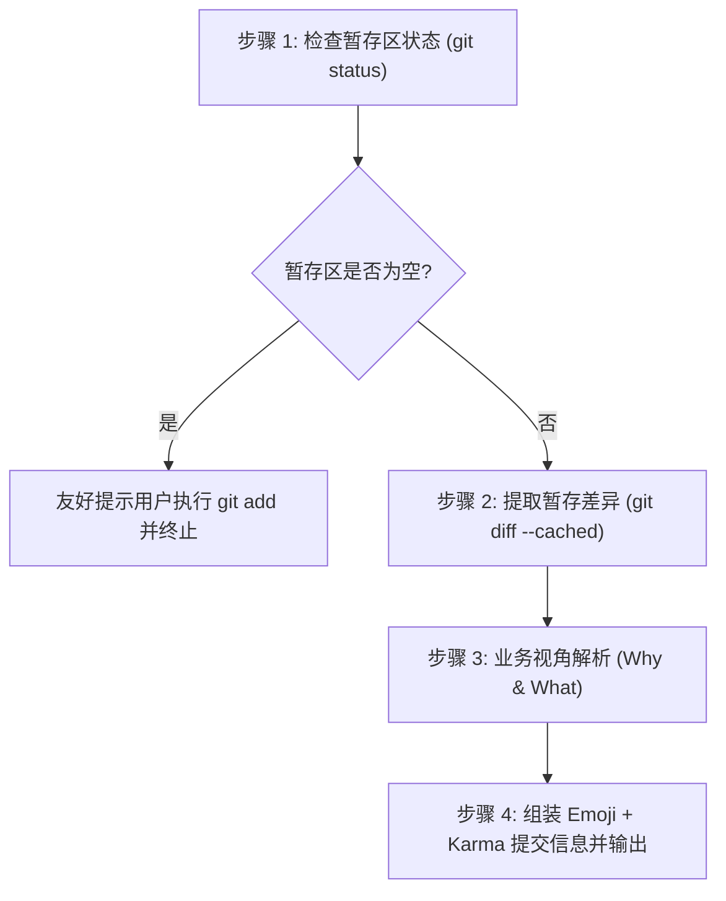

# 业务向 Emoji + Karma 提交信息生成指南 (Commit Message)

本技能用于对当前 Git **暂存区（Staged Changes）** 的改动进行智能分析，以**业务价值、功能表现与用户/玩家体验**为主重视角，生成严格符合 **Emoji + Karma (Angular) 规范** 的 Git Commit Message。

其核心目标是让**人类程序员实习生、产品新人与业务小白**都能在 3 秒内完全看懂“这次提交究竟为了什么业务目的、带来了什么实际改变”。

---

## 核心执行流程 (Workflow)



### 步骤 1：检查 Git 暂存区状态
执行命令检查暂存区概况：
```bash
git status --porcelain
git diff --cached --stat
```
- **若暂存区为空**（无任何 staged 文件）：
  提示用户当前没有已暂存的更改，建议用户使用 `git add <file>` 暂存目标文件，或询问是否需要协助暂存。此时**不生成**伪造的提交信息。
- **若暂存区非空**：继续下一步。

### 步骤 2：提取暂存区代码差异
执行命令提取已暂存的具体改动内容：
```bash
git diff --cached
```
> [!NOTE]
> 如果 Diff 篇幅过长（超过 300 行），应重点关注新增与修改的核心业务逻辑、UI 交互事件以及数据流变更，过滤掉格式化等纯噪音行。

### 步骤 3：业务视角翻译与深度解析（说人话）
在生成提交信息前，必须在内部回答以下三个核心业务问题：
1. **背景痛点 (Why)**：为什么要改？之前有什么 Bug、体验缺陷，或者缺少什么业务能力？
2. **实际表现 (What)**：改了之后，在游戏界面/玩家操作/系统行为上有何直观变化？
3. **实现要点 (How)**：以通俗语言概括核心做法（杜绝生硬贴 AST/内部私有变量名）。

### 步骤 4：生成并呈现 Emoji + Karma 提交信息
按照下述规范生成结构化的提交信息并呈现给用户。

---

## Emoji + Karma 规范字典（小白速查版）

标题格式严格遵循：`<emoji> <type>(<scope>): <业务角度一句话摘要>`

| Emoji + Type | 业务场景解释（新手小白一秒懂） | 典型 Scope 示例 |
| :--- | :--- | :--- |
| `✨ feat` | **新功能/新能力**：玩家/用户能感受到的全新玩法、操作或交互 | `ui`, `trade`, `network`, `card` |
| `🐛 fix` | **缺陷修复**：修好了报错、崩溃、显示错位、卡死等不爽的 Bug | `map`, `avatar`, `sync`, `dialog` |
| `💄 style` | **视觉与外观**：界面变好看了、边框圆角了、图标对齐了，逻辑没变 | `avatar`, `panel`, `theme`, `layout` |
| `♻️ refactor` | **代码重构**：代码结构理顺理清、模块拆分，功能表现与原来一致 | `server`, `client`, `route`, `handler` |
| `⚡️ perf` | **性能提升**：减少卡顿、降低内存占用、提升加载速度 | `sync`, `render`, `cache`, `network` |
| `📝 docs` | **文档补充**：补充说明书、开发文档、规范指南或注释说明 | `readme`, `agents`, `docs`, `skill` |
| `✅ test` | **测试保障**：新增单元测试、集成测试或回归验证用例 | `trade-test`, `patch-test`, `core` |
| `🔧 chore` | **日常杂务**：修改构建脚本、依赖配置、工具链配置等辅助事项 | `build`, `deps`, `config`, `script` |
| `🚑 hotfix` | **紧急修补**：线上突发重大致命故障的紧急修复 | `crash`, `login`, `packet` |
| `⏪ revert` | **版本回滚**：撤销之前的某次提交 | `commit-sha`, `feature-name` |

---

## 业务视角转化三大法则（小白友好准则）

### 法则 1：杜绝“机械翻译代码”，坚持“讲清楚业务场景”
- ❌ **机器视角**：`fix(map): 将 _selfPlayerId 的初始化逻辑移到 EnsureSelfPlayer 之前`
- ✅ **业务视角**：`🐛 fix(map): 修复地图加载时本地玩家头像偶尔丢失的问题`

### 法则 2：正文拆解为“痛点背景”与“核心改动”
正文（Body）必须包含清晰的条目，结构如下：
- **背景痛点**：用通俗口语说明为什么会有这次改动。
- **核心改动**：用要点列出 2~4 条核心功能变化。
- **关联影响（可选）**：是否涉及破坏性改动（Breaking Change）或需特别注意的事项。

### 法则 3：严禁生僻黑话与未解释缩写
遇到底层架构术语，使用生动的比喻或补充一句话解释（例如：“Addressables 资源加载（游戏内置资源包读取机制）”）。

---

## 标准输出模板

为用户输出时，请统一采用以下三段式结构：

````markdown
### 📋 推荐 Git 提交信息

```gitcommit
<emoji> <type>(<scope>): <业务角度一句话摘要（50字以内）>

- 背景痛点：<通俗说明为什么改/解决了什么体验痛点>
- 核心改动：
  - <业务效果 1>
  - <业务效果 2>
  - <业务效果 3>
```

---

### 🚀 一键执行命令
```bash
git commit -m "<emoji> <type>(<scope>): <业务角度一句话摘要>" -m "- 背景痛点：<背景说明>" -m "- 核心改动：`n  - <改动1>`n  - <改动2>"
```

---

### 💡 实习生/小白导读
> **一句话总结**：<用最轻松、生活化的语言一句话解释这次改动的价值。例如：“这次提交给地图上的玩家头像加上了金色/白色圆角相框，并且修好了自己头像可能变白块的尴尬 Bug！”>
````

---

## 真实示范案例 (Examples)

### 案例 1：UI 视觉与缺陷混合修复
```gitcommit
💄 style(map): 优化地图玩家头像视觉表现并补充兜底机制

- 背景痛点：地图上的玩家头像之前显示为普通矩形色块，且本地玩家在弱网或极端情况下会出现白块，视觉突兀且难以辨识自己与队友。
- 核心改动：
  - 头像引入圆形遮罩 (AvatarMask) 与边框修饰，本地玩家使用金色边框、远程队友使用白色边框。
  - 增加头像图片宽高最小有效性校验，过滤 1x1 异常占位图。
  - 完善本地玩家默认头像回退链路，避免角色未就绪时出现空白方块。
```

### 案例 2：联机交易新功能
```gitcommit
✨ feat(trade): 新增玩家间卡牌交易二次确认弹窗

- 背景痛点：多人联机时偶发误触导致直接将高价值卡牌赠送给队友，缺少防手抖的确认环节。
- 核心改动：
  - 点击“确认交易”后弹出模态二次确认对话框，清晰展示双方出价与卡牌列表。
  - 任意一方修改出价时自动重置双方确认状态，保障交易安全性。
```
