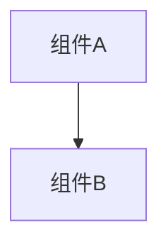

# 变更提案: {feature}

## 元信息
```yaml
类型: 新功能/修复/重构/优化
方案类型: {pkg_type}
优先级: P0/P1/P2/P3
状态: 草稿
创建: {YYYY-MM-DD}
```

---

## 1. 需求

### 背景
{为什么需要这个变更}

### 目标
{要达成什么目标}

### 约束条件
```yaml
时间约束: {如有}
性能约束: {如有}
兼容性约束: {如有}
业务约束: {如有}
```

### 验收标准
- [ ] {标准1}
- [ ] {标准2}

---

## 2. 方案

### 技术方案
{简要描述实现方式}

### 影响范围
```yaml
涉及模块:
  - {模块1}: {影响说明}
预计变更文件: {数量}
```

### 风险评估
| 风险 | 等级 | 应对 |
|------|------|------|
| {风险} | 高/中/低 | {措施} |

---

## 3. 技术设计（可选）

> 涉及架构变更、API设计、数据模型变更时填写

### 架构设计


### API设计
#### {METHOD} {路径}
- **请求**: {结构}
- **响应**: {结构}

### 数据模型
| 字段 | 类型 | 说明 |
|------|------|------|
| {字段} | {类型} | {说明} |

---

## 4. 核心场景

> 执行完成后同步到对应模块文档

### 场景: {场景名称}
**模块**: {所属模块}
**条件**: {前置条件}
**行为**: {操作描述}
**结果**: {预期结果}

---

## 5. 技术决策

> 本方案涉及的技术决策，归档后成为决策的唯一完整记录

### {feature}#D001: {决策标题}
**日期**: {YYYY-MM-DD}
**状态**: ✅采纳 / ❌废弃 / ⏸搁置
**背景**: {为什么需要这个决策}
**选项分析**:
| 选项 | 优点 | 缺点 |
|------|------|------|
| A: {方案A} | {优点} | {缺点} |
| B: {方案B} | {优点} | {缺点} |
**决策**: 选择方案{X}
**理由**: {详细理由}
**影响**: {对哪些模块有影响}
