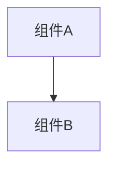

# 变更提案: remote_target_card

## 元信息
```yaml
类型: 功能
方案类型: implementation
优先级: P2
状态: 归档(已完成)
创建: 2026-01-09
```

---

## 1. 需求

### 背景
## 需求背景
支持“对远端队友出牌”的联机体验：选择远端队友作为目标、所有客户端播放动画、目标端结算并同步结果。

本次聚焦完善：
1. 网络失败回退（避免消耗资源/丢卡）。
2. `OnRemoteCardResolved` 乱序丢弃（避免状态回滚）。
3. 动画一致性（远端也能看到本地玩家施法动作）。

## 变更内容
- 未连接时阻止对远端队友出牌，并提示。
- 发送失败时 best-effort 回退：提示、尝试退还法力、尝试回收卡牌到手牌/弃牌堆。
- `OnRemoteCardResolved` 增加 `ResolveSeq`，并在接收端按 `ResolveSeq/Timestamp/RequestId` 去重与乱序丢弃。
- 接收端播放施法者动画；发送端补目标预动画（发送者不会收到服务端回显事件）。

### 目标
完成 remote_target_card 的方案归档，并保证资料在新版知识库结构中可追溯。

### 约束条件
```yaml
时间约束: 无
性能约束: 无
兼容性约束: 无
业务约束: 无
```

### 验收标准
- [√] 资料已迁移并可追溯
- [√] 归档包包含 proposal.md + tasks.md

---

## 2. 方案

### 技术方案
## 关键链路
1. 目标选择：远端队友在 UI 上被鼠标指向时返回 `RemotePlayerProxyEnemy`，满足 `TargetType.SingleEnemy` 的目标系统。
2. 发送端出牌：在 `Card.GetActions` 拦截到目标为 `RemotePlayerProxyEnemy` 时，生成动作蓝图并发送 `OnRemoteCardUse`，本地只做动画不结算。
3. 全员播动画：所有客户端收到 `OnRemoteCardUse` 先播放施法者/受击动画；目标端再执行结算。
4. 目标端结算：按动作蓝图在目标端执行，并发送 `OnRemoteCardResolved`（状态快照）。
5. 全员更新：所有客户端收到 `OnRemoteCardResolved` 更新目标远端 UnitView 的 HP/格挡/护盾/状态。

## 失败回退
- 未连接：在 `BattleController.RequestUseCard` 入口直接阻止（保证主要出牌路径不扣费）。
- 发送失败：在 `Card.GetActions` 拦截内 best-effort 回退（提示、退法力、回收卡牌）。

## 乱序丢弃
- `OnRemoteCardResolved`：增加 `ResolveSeq`（目标端本地单调递增）。
- 接收端按 per-target 维护 last seq/timestamp，并用 `RequestId` 去重，丢弃旧包避免状态回滚。

### 影响范围
```yaml
涉及模块:
  - networkplugin: 方案/实现/文档更新
预计变更文件: 已完成（归档）
```

### 风险评估
| 风险 | 等级 | 应对 |
|------|------|------|
| 资料迁移遗漏 | 低 | 原始文件保留 + 生成新版归档 |

---

## 3. 技术设计（可选）

> 涉及架构变更、API设计、数据模型变更时填写

### 架构设计


### API设计
#### 无 无
- **请求**: 无
- **响应**: 无

### 数据模型
| 字段 | 类型 | 说明 |
|------|------|------|
| 无 | 无 | 无 |

---

## 4. 核心场景

> 执行完成后同步到对应模块文档

### 场景: 无
**模块**: 无
**条件**: 无
**行为**: 无
**结果**: 无

---

## 5. 技术决策

> 本方案涉及的技术决策，归档后成为决策的唯一完整记录

### remote_target_card#D001: 采用现有方案并按新版模板归档
**日期**: 2026-01-09
**状态**: ✅采纳 / ❌废弃 / ⏸搁置
**背景**: 需要将历史方案迁移到统一结构，便于检索与后续维护。
**选项分析**:
| 选项 | 优点 | 缺点 |
|------|------|------|
| A: 直接归档（推荐） | 成本低 | 可能保留历史表述风格 |
| B: 重写方案后归档 | 成本低 | 可能保留历史表述风格 |
**决策**: 选择方案无
**理由**: 保留原文以避免信息丢失，同时补齐索引与结构。
**影响**: networkplugin
