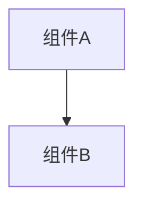

# 变更提案: remote_carduse_finalize

## 元信息
```yaml
类型: 修复
方案类型: implementation
优先级: P2
状态: 归档(已完成)
创建: 2026-01-09
```

---

## 1. 需求

### 背景
## 需求背景
当前已实现“远端队友作为代理目标出牌”，并采用“目标端结算 + OnRemoteCardResolved 广播状态快照”的方式同步结果。

仍需补齐三个可靠性/一致性点：
1. **失败回退**：未连接/发送失败时需要阻止或回退，避免资源被消耗或卡牌异常流转。
2. **Resolved 防回滚**：OnRemoteCardResolved 乱序到达会导致远端状态回滚，需要丢弃旧包。
3. **动画一致性**：所有客户端都应看到施法者（包括本地玩家在他人视角）播放施法动作。

## 变更内容
1. 未连接时在 `BattleController.RequestUseCard` 入口直接阻止对远端队友出牌并提示。
2. 发送失败时在 `Card.GetActions` 拦截内 best-effort 回退（提示、尝试退还法力、尝试把卡移回手牌/弃牌堆）。
3. `OnRemoteCardResolved` 增加 `ResolveSeq`，接收端按 `ResolveSeq` 优先、`Timestamp` 兜底，并结合 `RequestId` 去重，丢弃旧包防止状态回滚。
4. `OnRemoteCardUse` 接收端播放施法者动画；发送端补目标预动画（因服务端不会回显给发送者）。

## 影响范围
- `networkplugin/Patch/Network/RemoteCardUsePatch.cs`

## 风险评估
- 回退是 best-effort：不同出牌路径（Play/Use）在不同阶段移动卡牌，回退无法保证 100% 复原；但在 RequestUseCard 入口阻止未连接场景可覆盖主要路径。

### 目标
完成 remote_carduse_finalize 的方案归档，并保证资料在新版知识库结构中可追溯。

### 约束条件
```yaml
时间约束: 无
性能约束: 无
兼容性约束: 无
业务约束: 无
```

### 验收标准
- [√] 资料已迁移并可追溯
- [√] 归档包包含 proposal.md + tasks.md

---

## 2. 方案

### 技术方案
## 失败回退
### 未连接阻止（主路径）
- 在 `BattleController.RequestUseCard(Card, UnitSelector, ManaGroup, bool)` 前置补丁中检测：
  - `selector.Type == SingleEnemy && selector.SelectedEnemy is RemotePlayerProxyEnemy`
  - `INetworkClient` 未连接
- 命中则 `ShowTopMessage` 提示并 `return false` 阻止出牌流程，避免扣法力/移动卡牌。

### 发送失败回退（best-effort）
- 在 `Card.GetActions` 拦截中发送 `OnRemoteCardUse` 后检查发送是否成功：
  - 若失败：提示，尝试退还法力（仅当卡已进入 PlayArea），并尝试将卡移回手牌（手满则丢弃）。

## OnRemoteCardResolved 防回滚
### 发送端
- 目标端结算完成后广播：
  - `ResolveSeq = Interlocked.Increment(ref _resolvedSeq)`
  - `Timestamp`
  - `RequestId`（沿用 OnRemoteCardUse）
  - 目标端状态快照（Hp/Block/Shield/StatusEffects）

### 接收端
- 按 `TargetPlayerId` 维度维护：
  - `LastResolveSeq`
  - `LastTimestamp`
  - `ProcessedRequestIds`（上限 256，避免内存增长）
- 到达时：
  - `RequestId` 已处理 → 丢弃
  - `ResolveSeq <= LastResolveSeq` → 丢弃
  - 否则更新 last 并应用快照
- 断线时清空上述缓存。

## 动画一致性
- 接收端：`OnRemoteCardUse` 中根据 `SenderPlayerId` 找到远端施法者 `UnitView` 播放动画。
- 发送端：由于服务端不会回显事件给发送者，本地补一次对目标的预动画（hit/spell）。

### 影响范围
```yaml
涉及模块:
  - networkplugin: 方案/实现/文档更新
预计变更文件: 已完成（归档）
```

### 风险评估
| 风险 | 等级 | 应对 |
|------|------|------|
| 资料迁移遗漏 | 低 | 原始文件保留 + 生成新版归档 |

---

## 3. 技术设计（可选）

> 涉及架构变更、API设计、数据模型变更时填写

### 架构设计


### API设计
#### 无 无
- **请求**: 无
- **响应**: 无

### 数据模型
| 字段 | 类型 | 说明 |
|------|------|------|
| 无 | 无 | 无 |

---

## 4. 核心场景

> 执行完成后同步到对应模块文档

### 场景: 无
**模块**: 无
**条件**: 无
**行为**: 无
**结果**: 无

---

## 5. 技术决策

> 本方案涉及的技术决策，归档后成为决策的唯一完整记录

### remote_carduse_finalize#D001: 采用现有方案并按新版模板归档
**日期**: 2026-01-09
**状态**: ✅采纳 / ❌废弃 / ⏸搁置
**背景**: 需要将历史方案迁移到统一结构，便于检索与后续维护。
**选项分析**:
| 选项 | 优点 | 缺点 |
|------|------|------|
| A: 直接归档（推荐） | 成本低 | 可能保留历史表述风格 |
| B: 重写方案后归档 | 成本低 | 可能保留历史表述风格 |
**决策**: 选择方案无
**理由**: 保留原文以避免信息丢失，同时补齐索引与结构。
**影响**: networkplugin
