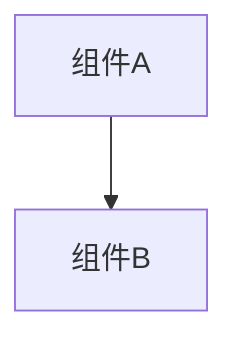

# 变更提案: remote_carduse_closedloop_unified

## 元信息
```yaml
类型: 功能
方案类型: implementation
优先级: P2
状态: 归档(已完成)
创建: 2026-01-09
```

---

## 1. 需求

### 背景
# 变更提案: 远端队友目标出牌闭环（目标端结算 + 结算后快照广播）

## 需求背景
联机中希望“对远端队友使用可选目标的牌”（典型为 `TargetType.SingleEnemy`）时：
- 发送端不在本地结算（避免双算/状态不一致），而是发送网络事件。
- 所有客户端都能看到施法/受击等动画。
- 被选中的目标玩家（目标端）在自己客户端完成结算，然后把结算后的状态（HP/护盾/格挡/状态等）广播给所有人同步显示。

前提更新：**敌人已被同步且是共享对象**，不存在“那边的敌人”。因此本闭环仅处理“把远端队友当作可选目标”，结算目标固定为目标端自身 `battle.Player`。

## 推荐方案（已执行）
方案（已执行的推荐方案）: “目标端结算 + 结算后快照广播”闭环
- 发送端：选中队友 → 拦截 `Card.GetActions` → 生成动作蓝图 → 发 `OnRemoteCardUse` → 本地播放施法动画（并补目标预动画）
- 接收端（全员）：收到 `OnRemoteCardUse` → 播放施法者/受击动画
- 目标端：按蓝图结算 → 发 `OnRemoteCardResolved`（带 `RequestId + ResolveSeq + Timestamp + 状态快照`）
- 全员：收到 `OnRemoteCardResolved` → 按序/去重丢弃旧包 → 更新目标远端 `UnitView` 状态

## 必须收尾点（可靠性与一致性）
1. **失败回退**：未连接/发送失败时，入口阻断或 best-effort 回退，避免扣费/移卡后卡死。
2. **Resolved 乱序丢弃**：按 `ResolveSeq`/`Timestamp`/`RequestId` 去重与丢弃旧包，避免状态回滚。
3. **施法动画一致**：远端玩家也能看到“本地玩家在他人视角的施法动作”，发送端也能看到目标预动画（因服务端可能不回显给发送者）。

## 影响范围
- `networkplugin/Patch/Network/RemoteCardUsePatch.cs`
- `networkplugin/Patch/UI/PlayerTargeterPatch.cs`
- `networkplugin/Patch/UI/RemotePlayerProxyEnemy.cs`
- `networkplugin/Patch/UI/OtherPlayersOverlayPatch.cs`

## 风险评估
- 动作蓝图覆盖面：当前仅支持部分 Action 类型（伤害/治疗/上状态），遇到更复杂的牌需要扩展蓝图或改为“发送端直接发送最终数值”。
- 回退逻辑 best-effort：发送失败时不能保证 100% 复原卡牌位置/资源，但通过入口阻断可覆盖主要路径。
- 非确定性：若卡牌伤害依赖更多上下文（遗物/被动/临时数值），需要补充序列化字段或改成“发送端算完发结果”。

### 目标
完成 remote_carduse_closedloop_unified 的方案归档，并保证资料在新版知识库结构中可追溯。

### 约束条件
```yaml
时间约束: 无
性能约束: 无
兼容性约束: 无
业务约束: 无
```

### 验收标准
- [√] 资料已迁移并可追溯
- [√] 归档包包含 proposal.md + tasks.md

---

## 2. 方案

### 技术方案
# 技术设计: 远端队友目标出牌闭环（目标端结算 + 快照广播）

## 总览
### 关键约束
- `TargetType.SingleEnemy` 的目标类型要求目标为 `EnemyUnit`（`UnitSelector.SelectedEnemy`）。
- 联机模型中敌人是共享已同步对象，因此“远端队友目标出牌”仅表示：把远端玩家当作目标，不存在“那边的敌人”。
- 因此本闭环的结算目标固定为目标端自身 `battle.Player`。

### 组件与职责
- `RemotePlayerProxyEnemy : EnemyUnit`
  - 仅作为选目标管线的类型适配器，内部持有 `RemotePlayerId`。
- `PlayerTargeterPatch`
  - 在 `TargetSelector` 中让指向远端队友 `UnitView` 时返回/设置 `RemotePlayerProxyEnemy`。
- `OtherPlayersOverlayPatch`
  - 提供通过 `playerId` 查找远端角色 `UnitView` 的能力，用于播动画与应用快照到 UI。
- `RemoteCardUsePatch`
  - 发送端：拦截 `Card.GetActions`，目标为 `RemotePlayerProxyEnemy` 时仅发送 `OnRemoteCardUse`。
  - 接收端：全员播动画；目标端结算并广播 `OnRemoteCardResolved`；全员按序/去重应用快照。

## 协议设计
### OnRemoteCardUse（使用事件）
- `RequestId`: string
- `Timestamp`: long（ticks）
- `SenderPlayerId`: string
- `TargetPlayerId`: string
- `CardId`: string
- `Upgraded`: bool
- `CardType`: string（用于动画选择）
- `SenderStatusEffects`: []（用于目标端计算 buff/debuff 影响）
- `Actions`: 动作蓝图（JSON array；每项包含 kind + 参数）

### OnRemoteCardResolved（结算快照）
- `RequestId`: string（沿用 use）
- `ResolveSeq`: long（目标端本地单调递增；用于乱序丢弃）
- `Timestamp`: long（兜底排序）
- `TargetPlayerId`: string
- `Hp/MaxHp/Block/Shield`: number
- `StatusEffects`: []（目标端结算后的最终状态）

## 执行流程
1. 发送端选中远端队友：`TargetSelector` 指向远端 `UnitView` → 返回 `RemotePlayerProxyEnemy`。
2. 发送端出牌：拦截 `Card.GetActions` → 生成原始 actions → 转换为动作蓝图 → `SendGameEventData(OnRemoteCardUse)`。
3. 全员播动画：收到 `OnRemoteCardUse` 后，定位 `SenderPlayerId` 的远端 `UnitView` 播放施法动画；定位目标远端 `UnitView` 播放受击/预动画。
4. 发送端补动画：发送端额外补播放目标预动画（避免服务端不回显给发送端）。
5. 目标端结算：若 `TargetPlayerId == selfId`，按蓝图在 `battle.Player` 上执行伤害/治疗/上状态，随后广播 `OnRemoteCardResolved` 快照。
6. 全员应用快照：收到 `OnRemoteCardResolved` 后按 `RequestId/ResolveSeq/Timestamp` 去重与丢弃旧包，更新目标远端 `UnitView` HUD/状态显示。

## 可靠性与一致性设计
### 未连接阻断（主路径）
- 在 `BattleController.RequestUseCard` 前置补丁中，当目标为 `RemotePlayerProxyEnemy` 且网络未连接时 `return false` 阻断并提示，避免扣费/移卡。

### 发送失败回退（best-effort）
- 在 `Card.GetActions` 拦截发送 `OnRemoteCardUse` 后若失败：提示；仅在卡已进入 PlayArea 时尝试返还法力；尝试移回手牌（手满则弃牌）。

### Resolved 防回滚（乱序/重复丢弃）
- 目标端发 `OnRemoteCardResolved` 时携带 `RequestId + ResolveSeq + Timestamp`。
- 全员按 `TargetPlayerId` 维护：`LastResolveSeq`、`LastTimestamp`、`ProcessedRequestIds(上限256)`。
- 到达时：
  - `RequestId` 已处理 → 丢弃
  - `ResolveSeq <= LastResolveSeq` → 丢弃
  - 否则更新 last 并应用快照
- 断线/重连时清空上述缓存，避免新会话误丢弃。

## 安全与性能
- 输入校验：JSON 缺字段/非法值时跳过动画/应用，不能崩溃。
- 去重集合上限：每个 target 的 `RequestId` 集合上限 256；超限清理。

## 验收
- 单机：模拟 `OnRemoteCardUse/Resolved`，验证乱序丢弃与去重不会回滚。
- 联机（推荐）：A 对 B 出牌；A/B/旁观者均看到 A 施法与 B 受击；B 结算后快照同步到所有人；断线重连后不回滚。

### 影响范围
```yaml
涉及模块:
  - networkplugin: 方案/实现/文档更新
预计变更文件: 已完成（归档）
```

### 风险评估
| 风险 | 等级 | 应对 |
|------|------|------|
| 资料迁移遗漏 | 低 | 原始文件保留 + 生成新版归档 |

---

## 3. 技术设计（可选）

> 涉及架构变更、API设计、数据模型变更时填写

### 架构设计


### API设计
#### 无 无
- **请求**: 无
- **响应**: 无

### 数据模型
| 字段 | 类型 | 说明 |
|------|------|------|
| 无 | 无 | 无 |

---

## 4. 核心场景

> 执行完成后同步到对应模块文档

### 场景: 无
**模块**: 无
**条件**: 无
**行为**: 无
**结果**: 无

---

## 5. 技术决策

> 本方案涉及的技术决策，归档后成为决策的唯一完整记录

### remote_carduse_closedloop_unified#D001: 采用现有方案并按新版模板归档
**日期**: 2026-01-09
**状态**: ✅采纳 / ❌废弃 / ⏸搁置
**背景**: 需要将历史方案迁移到统一结构，便于检索与后续维护。
**选项分析**:
| 选项 | 优点 | 缺点 |
|------|------|------|
| A: 直接归档（推荐） | 成本低 | 可能保留历史表述风格 |
| B: 重写方案后归档 | 成本低 | 可能保留历史表述风格 |
**决策**: 选择方案无
**理由**: 保留原文以避免信息丢失，同时补齐索引与结构。
**影响**: networkplugin
