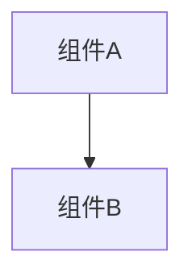

# 变更提案: fix_midgamejoin_getroomstatus

## 元信息
```yaml
类型: 修复
方案类型: implementation
优先级: P2
状态: 归档(已完成)
创建: 2026-01-09
```

---

## 1. 需求

### 背景
## 需求背景
- `networkplugin/Network/MidGameJoin/MidGameJoinManager.cs` 存在编译错误：CS0103 - 当前上下文中不存在名称 `GetRoomStatus`。
- 目标：以最小变更恢复 `networkplugin` 编译通过，避免引入新的运行时行为变更。

## 变更内容
1. 将 `ApproveJoin(...)` 中对 `GetRoomStatus(...)` 的调用改为已存在的 `GetRoomInfo(...)`（两者语义一致：查询房间状态/房间信息）。

## 影响范围
- 模块：`networkplugin`
- 文件：`networkplugin/Network/MidGameJoin/MidGameJoinManager.cs`
- 预期影响：仅影响编译通过；`GetRoomInfo` 当前仍为 stub（返回 `null`），因此运行时逻辑不改变现状。

## 风险评估
- 风险：低（仅修复方法名引用，未改变数据结构与对外接口）。
- 缓解：修复后执行 `dotnet build .\networkplugin\NetWorkPlugin.csproj -c Debug --no-restore` 验证。

### 目标
完成 fix_midgamejoin_getroomstatus 的方案归档，并保证资料在新版知识库结构中可追溯。

### 约束条件
```yaml
时间约束: 无
性能约束: 无
兼容性约束: 无
业务约束: 无
```

### 验收标准
- [√] 资料已迁移并可追溯
- [√] 归档包包含 proposal.md + tasks.md

---

## 2. 方案

### 技术方案
## 构建错误清单（本次问题）
- `Network/MidGameJoin/MidGameJoinManager.cs`: CS0103 - 当前上下文中不存在名称 `GetRoomStatus`。

## 推荐修复方案（最小变更）
### 方案1（最小改动-推荐）：改用已存在方法
- 将 `ApproveJoin(...)` 内 `GetRoomStatus(request.RoomId)` 改为 `GetRoomInfo(request.RoomId)`。
- 理由：
  - 当前文件中只有这一处引用 `GetRoomStatus`，且同文件已存在 `GetRoomInfo`（同样返回 `RoomStatus?`）。
  - 避免增加额外别名方法，减少未来维护歧义。

### 方案2（备选）：补齐 `GetRoomStatus` 作为别名
- 新增 `private RoomStatus? GetRoomStatus(string roomId) => GetRoomInfo(roomId);`
- 仅在希望保留 `GetRoomStatus` 命名时采用。

## 风险与回滚
- 风险：极低；本次仅为引用修复。
- 回滚：若后续需要保留 `GetRoomStatus` 命名，可改用“方案2”在本文件补齐别名。

## 验证
- `dotnet build .\networkplugin\NetWorkPlugin.csproj -c Debug --no-restore`

### 影响范围
```yaml
涉及模块:
  - networkplugin: 方案/实现/文档更新
预计变更文件: 已完成（归档）
```

### 风险评估
| 风险 | 等级 | 应对 |
|------|------|------|
| 资料迁移遗漏 | 低 | 原始文件保留 + 生成新版归档 |

---

## 3. 技术设计（可选）

> 涉及架构变更、API设计、数据模型变更时填写

### 架构设计


### API设计
#### 无 无
- **请求**: 无
- **响应**: 无

### 数据模型
| 字段 | 类型 | 说明 |
|------|------|------|
| 无 | 无 | 无 |

---

## 4. 核心场景

> 执行完成后同步到对应模块文档

### 场景: 无
**模块**: 无
**条件**: 无
**行为**: 无
**结果**: 无

---

## 5. 技术决策

> 本方案涉及的技术决策，归档后成为决策的唯一完整记录

### fix_midgamejoin_getroomstatus#D001: 采用现有方案并按新版模板归档
**日期**: 2026-01-09
**状态**: ✅采纳 / ❌废弃 / ⏸搁置
**背景**: 需要将历史方案迁移到统一结构，便于检索与后续维护。
**选项分析**:
| 选项 | 优点 | 缺点 |
|------|------|------|
| A: 直接归档（推荐） | 成本低 | 可能保留历史表述风格 |
| B: 重写方案后归档 | 成本低 | 可能保留历史表述风格 |
**决策**: 选择方案无
**理由**: 保留原文以避免信息丢失，同时补齐索引与结构。
**影响**: networkplugin
