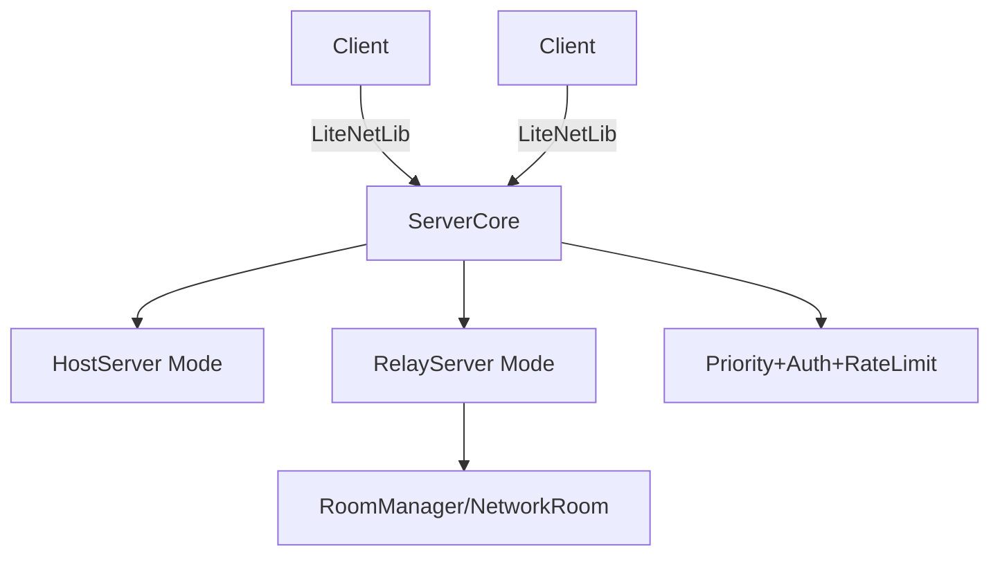
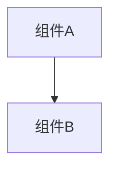

# 变更提案: unify_server_core_two_modes

## 元信息
```yaml
类型: 功能
方案类型: implementation
优先级: P2
状态: 归档(已完成)
创建: 2026-01-09
```

---

## 1. 需求

### 背景
# 变更提案: 抽取 ServerCore + 双模式服务器（Host/Relay）

## 需求背景
- 目前存在两套服务器实现：`NetworkServer`（房主直连/局域网）与 `RelayServer`（房间/中继/打洞辅助）。两者在“连接管理/会话/收发消息/心跳”等基础能力上重叠，但协议与功能分叉，维护成本高。
- 现状：`RelayServer` 具备房间、中继转发、配置化、线程/锁等“服务化”能力；但 `NetworkServer` 具备客户端/补丁已依赖的游戏层协议（例如 `PlayerListUpdate`、`GetSelf_REQUEST`、`UpdatePlayerLocation`、`OnGameEventReceived` 等）。
- 目标：在不牺牲“房主=权威（Host/Client）”模式可用性的前提下，把房间/中继转发/断线重连/打洞/权限/消息优先级等能力沉淀为可复用模块，形成“公共内核 + 两种模式”。

## 变更内容
1. 抽取公共内核 `ServerCore`：统一 LiteNetLib 生命周期、连接鉴权、会话管理、心跳/超时、消息编解码与分发管线。
2. 保留两种运行模式：
   - Host 模式：等价于现有 `NetworkServer` 的语义（房主直连、单房间隐式、兼容现有消息类型/事件上抛）。
   - Relay 模式：等价于现有 `RelayServer` 的语义（多房间、中继转发、NAT 协调），并补齐 Host 模式依赖的系统消息以实现协议兼容（按房间作用域）。
3. 将高级能力模块化下沉：
   - 房间/中继转发（Relay 模式启用；Host 模式为“单隐式房间”）
   - 断线重连（Token + 会话恢复钩子，配合现有 `ReconnectionManager`）
   - NAT/打洞协调（NAT 信息交换/Token 校验/可选开启）
   - 权限与角色（Host/管理员/成员；限制踢人、开局等敏感操作）
   - 消息优先级与限流（复用 `MessagePriorities`，支持高优先级抢占/队列上限）

## 影响范围
- 模块：`networkplugin/Network/Server/`、`networkplugin/Network/Room/`、`networkplugin/Network/Messages/`（可能需要拆分 client/server 侧的连接抽象）。
- 协议：以“兼容现有客户端/补丁”为第一原则，新增能力通过新消息类型或 capability 协商渐进引入。

## 核心场景
### 需求 1: 房主直连（局域网/同网段）
- Host 启动 Host 模式服务端；客机直连；能正常收到 `PlayerListUpdate/HostChanged/PlayerJoined` 等事件；位置同步与 GetSelf 可用。

### 需求 2: 多房间与中继转发
- 客户端连接 Relay；创建/加入房间；房间内广播/定向消息正常；房主权限按“房间 Host”判定。

### 需求 3: NAT/打洞协助 + P2P 优先
- Relay 用于交换 NAT 信息/候选端点；优先尝试 P2P；失败时降级走 Relay 转发。

### 需求 4: 断线重连
- 客机掉线后在配置窗口内重连，能恢复会话并补齐必要状态/事件。

## 风险评估
- 风险：协议兼容性破坏（客户端补丁依赖的消息缺失/字段变化）。
  - 缓解：以消息类型/字段“向后兼容”为约束；引入 adapter 层；逐步替换而非一次性重写。
- 风险：并发与线程模型复杂化（锁竞争/死锁/时序 bug）。
  - 缓解：优先单线程 `PollEvents()`；仅在需要后台服务化时启用线程，并把共享状态改为“事件队列 + 单线程消费”。
- 风险：安全输入面扩大（来自网络的 JSON/字符串负载）。
  - 缓解：限制消息大小/频率；严格校验消息类型与权限；避免对 `object` 直接反序列化为任意类型。

### 目标
完成 unify_server_core_two_modes 的方案归档，并保证资料在新版知识库结构中可追溯。

### 约束条件
```yaml
时间约束: 无
性能约束: 无
兼容性约束: 无
业务约束: 无
```

### 验收标准
- [√] 资料已迁移并可追溯
- [√] 归档包包含 proposal.md + tasks.md

---

## 2. 方案

### 技术方案
# 技术设计: 抽取 ServerCore + 双模式服务器（Host/Relay）

## 技术方案
### 核心技术
- C# / LiteNetLib / System.Text.Json
- 复用现有：`PlayerSession`、`NetworkMessage`、`MessagePriorities`、`NatTraversal`、`NetworkRoom`

### 实现要点
1. **抽公共内核（ServerCore）**
   - 统一：`EventBasedNetListener` 事件注册、连接鉴权、Peer 生命周期、心跳与超时剔除。
   - 提供：
     - `Start/Stop/Poll`（或后台线程 `RunLoop`）
     - `Send(peer, messageType, payload)` / `Broadcast(scope, ...)`
     - `OnPeerConnected/OnPeerDisconnected/OnMessageReceived` 事件钩子

2. **统一消息编解码与兼容层**
   - 统一内部消息模型：`NetworkMessage 无`。
   - 保持对现有两种编码的兼容：
     - `NetworkServer` 风格：先读 `messageType`，再按类型读 JSON 或字段。
     - `RelayServer` 风格：`messageType + jsonPayload`。
   - 建议新增 `IServerMessageCodec`（可插拔），并在迁移期保留 legacy codec。

3. **消息分发管线：优先级队列 + 权限检查 + 限流**
   - 以 `MessagePriorities.GetPriority(type)` 为默认优先级来源。
   - 每个 Peer/房间维度可配置队列上限与丢弃策略（Low 丢弃优先）。
   - 敏感消息必须通过权限检查（房间 Host/管理员）。

4. **两种模式（Mode）
   - Host 模式（HostServer）
     - “单隐式房间”：复用房间广播/权限模型但不暴露多房间 API。
     - 对外兼容：继续产出 `PlayerListUpdate/PlayerJoined/HostChanged/GetSelf_REQUEST/UpdatePlayerLocation` 等消息语义。
   - Relay 模式（RelayServer）
     - 多房间：按 `roomId` 作用域广播；房主语义为 `NetworkRoom.HostPlayerId`。
     - 补齐 Host 模式依赖消息：在“加入房间/离开房间/房主变更/位置更新”等节点广播 `PlayerListUpdate`、响应 `GetSelf_REQUEST`。

5. **断线重连（Server 支撑）**
   - 服务端维护 `playerId -> session` 的可恢复索引与短期状态缓存（如最后心跳、房间归属、必要游戏状态索引）。
   - 通过 `ReconnectToken` 完成身份恢复（与 `ReconnectionManager` 的 token 机制对齐）。

6. **NAT/打洞协助**
   - Relay 模式负责 NAT 信息收集/分发、候选端点交换、token 校验；Host 模式可选支持 UPnP 映射与本地端点暴露。
   - 复用 `NatTraversal` 的 NAT 信息结构，并通过消息类型明确传输边界。

## 架构设计


## 架构决策 ADR
### ADR-202601091556: 抽取 ServerCore 作为 Host/Relay 共用底座
**上下文:** `NetworkServer` 与 `RelayServer` 产生能力分叉且协议不一致，导致维护成本与兼容风险上升。
**决策:** 提取 `ServerCore` 统一底层网络与分发；在其上保留 Host/Relay 两种模式；高级能力（房间/中继/重连/打洞/权限/优先级）模块化下沉。
**理由:** 复用率高、可渐进迁移、能保留 Host 模式语义并让 Relay 模式补齐兼容消息。
**替代方案:** 直接把 `RelayServer` 高级能力“搬进”`NetworkServer`（拒绝原因：耦合与复杂度失控，难以维护）。
**影响:** 需要对 server 侧的连接/房间抽象进行一次清理（尤其是 `NetworkConnection` 的 client/server 混用）。

## 安全与性能
- 安全：限制入站消息大小与频率；校验消息类型白名单；敏感操作按房间/Host 权限校验；避免把任意 JSON 反序列化成 `object` 并下沉到游戏逻辑。
- 性能：优先单线程驱动；必要时采用“收包线程 -> 入队 -> 主线程消费”模型，避免大范围 `lock`。

## 测试与验证
- 编译：`dotnet build .\networkplugin\NetWorkPlugin.csproj -c Debug --no-restore`
- 手动联机验证：
  - Host 模式：2 人局域网直连，验证 PlayerListUpdate/HostChanged/UpdatePlayerLocation。
  - Relay 模式：创建房间/加入房间/踢人/断线重连基础流程。

### 影响范围
```yaml
涉及模块:
  - networkplugin: 方案/实现/文档更新
预计变更文件: 已完成（归档）
```

### 风险评估
| 风险 | 等级 | 应对 |
|------|------|------|
| 资料迁移遗漏 | 低 | 原始文件保留 + 生成新版归档 |

---

## 3. 技术设计（可选）

> 涉及架构变更、API设计、数据模型变更时填写

### 架构设计


### API设计
#### 无 无
- **请求**: 无
- **响应**: 无

### 数据模型
| 字段 | 类型 | 说明 |
|------|------|------|
| 无 | 无 | 无 |

---

## 4. 核心场景

> 执行完成后同步到对应模块文档

### 场景: 无
**模块**: 无
**条件**: 无
**行为**: 无
**结果**: 无

---

## 5. 技术决策

> 本方案涉及的技术决策，归档后成为决策的唯一完整记录

### unify_server_core_two_modes#D001: 采用现有方案并按新版模板归档
**日期**: 2026-01-09
**状态**: ✅采纳 / ❌废弃 / ⏸搁置
**背景**: 需要将历史方案迁移到统一结构，便于检索与后续维护。
**选项分析**:
| 选项 | 优点 | 缺点 |
|------|------|------|
| A: 直接归档（推荐） | 成本低 | 可能保留历史表述风格 |
| B: 重写方案后归档 | 成本低 | 可能保留历史表述风格 |
**决策**: 选择方案无
**理由**: 保留原文以避免信息丢失，同时补齐索引与结构。
**影响**: networkplugin
