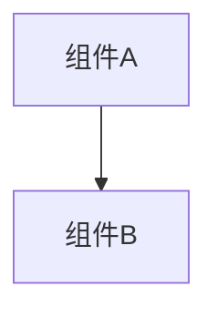

# 变更提案: reconnection_manager_todos

## 元信息
```yaml
类型: 功能
方案类型: implementation
优先级: P2
状态: 归档(待定)
创建: 2026-01-12
```

---

## 1. 需求

### 背景
## 需求背景
当前项目已具备服务端侧的会话恢复能力（`ReconnectToken` + `Reconnect_REQUEST/RESPONSE`，Host/Relay 两种服务器均已实现），但 `networkplugin/Network/Reconnection/ReconnectionManager.cs` 仍处于“框架 + TODO”状态，且与现有的客户端连接事件、全量状态同步/追赶链路未完全对齐，导致断线后的体验仍不完整（重连后缺少可靠的状态恢复与事件追赶触发点）。

本变更目标是在尽量不破坏现有协议/结构的前提下：
- 补齐 `ReconnectionManager` 的 TODO（快照、事件历史、心跳/超时、令牌生成等）
- 把它与现有 `NetworkServer/RelayServer` 的重连令牌机制、以及客户端侧 `SynchronizationManager` 的“重连后全量同步请求”串起来，形成可验证的最小闭环。

## 变更内容
1. 补齐 `ReconnectionManager` 内的快照生成、快照存储限制、事件历史维护、令牌生成等 TODO，实现可被服务器侧调用的“重连数据准备”能力。
2. 打通重连后的同步链路：客户端在重连成功后触发（或继续沿用）全量同步请求；服务端能够响应并下发全量快照与必要的追赶事件。
3. 统一 Host/Relay 两种模式下的行为：断线标记、会话恢复、通知广播、以及重连后数据下发的消息类型/负载结构尽量一致。

## 影响范围
- **模块:** `networkplugin/Network/Reconnection/`、`networkplugin/Network/Server/`、`networkplugin/Network/Client/`、`networkplugin/Core/`
- **文件:**
  - `networkplugin/Network/Reconnection/ReconnectionManager.cs`
  - `networkplugin/Network/Client/NetworkClient.cs`（识别/接收重连与全量同步响应）
  - `networkplugin/Network/Server/NetworkServer.cs`（Host 模式：重连/全量同步请求处理）
  - `networkplugin/Network/Server/RelayServer.cs`（Relay 模式：重连/全量同步请求处理）
  - `networkplugin/Core/SynchronizationManager.cs`（重连后全量同步触发/消费）
  - `networkplugin/Network/Messages/NetworkMessageTypes.cs`（如需补齐消息白名单/优先级）
- **API:** 网络消息类型（仅在必要时新增/补齐；优先保持兼容）
- **数据:** 无持久化数据结构变更（以内存快照/事件历史为主）

## 核心场景

### 需求: Host 模式断线重连
**模块:** `NetworkServer` + `ReconnectionManager`
客户端掉线后在宽限期内重连，恢复到原 `PlayerId` 会话，并能触发状态恢复。

#### 场景: 客户端掉线后重连
前置条件：Host 已启动本地服务器，至少 2 名玩家在局内；客户端断网或主动断开后重新连接。
- 预期结果：服务端接受 `Reconnect_REQUEST` 并回复成功；`PlayerId` 不变；其他玩家收到“该玩家已重连”的通知；重连玩家收到全量状态/必要追赶事件。

### 需求: Relay 模式断线重连
**模块:** `RelayServer` + `ReconnectionManager`
Relay 多房间模式下，断线重连后玩家仍归属原房间并恢复会话。

#### 场景: 房间内客户端掉线后重连
前置条件：玩家已加入房间且房间处于游戏中；客户端掉线后在宽限期内重连。
- 预期结果：会话恢复成功，玩家仍在原 `roomId` 作用域；其他玩家看到该玩家重新上线；重连玩家收到快照与追赶事件。

### 需求: 重连后的全量同步与追赶
**模块:** `SynchronizationManager` + `ReconnectionManager`
重连后确保本地状态与房主权威状态一致，并补齐断线期间的关键事件。

#### 场景: 重连后自动发起 FullSync
前置条件：客户端完成重连并收到会话恢复成功响应。
- 预期结果：客户端自动发起 `FullStateSyncRequest`（或等效机制）；服务端回应 `FullStateSyncResponse`，包含快照与事件索引；客户端应用快照并从 `lastKnownEventIndex` 起追赶事件。

## 风险评估
- **风险:** 协议兼容性破坏（新增/改动消息类型导致旧逻辑无法处理）。
  - **缓解:** 优先复用既有消息管道与常量；新增消息加入白名单/判定分支且保持字段向后兼容。
- **风险:** 断线窗口/并发时序问题（重连与广播交错、快照与事件索引不一致）。
  - **缓解:** 以服务端会话恢复成功作为唯一“重连完成”判定点；快照与事件索引同源生成；共享结构加锁。
- **风险:** 安全性（重连令牌可预测、重连请求伪造）。
  - **缓解:** 使用 `RandomNumberGenerator` 生成高熵 token；服务端严格校验 token + 过期窗口；避免把任意 `object` 直接反序列化为可执行类型。

### 目标
完成 reconnection_manager_todos 的方案归档，并保证资料在新版知识库结构中可追溯。

### 约束条件
```yaml
时间约束: 无
性能约束: 无
兼容性约束: 无
业务约束: 无
```

### 验收标准
- [√] 资料已迁移并可追溯
- [√] 归档包包含 proposal.md + tasks.md

---

## 2. 方案

### 技术方案
## 技术方案
### 核心技术
- C# / LiteNetLib / System.Text.Json
- 现有基础设施复用：`NetworkServer`、`RelayServer`、`PlayerSession`、`ReconnectToken`、`SynchronizationManager`、`GameEventManager`

### 实现要点
- **定位与职责收敛：** 将 `ReconnectionManager` 定位为“服务器侧断线重连数据管理器”，负责：
  - 断线时保存玩家快照（最小必要字段 + 事件索引）
  - 维护有限长度的事件历史用于追赶
  - 重连成功后向重连玩家准备“快照 + missed events”的负载
  - 广播重连通知（通过服务器侧的既有广播通道完成）
- **对齐现有重连机制：**
  - Host/Relay 服务器已具备 `Reconnect_REQUEST` 校验与会话恢复；`ReconnectionManager` 只在“断线记录/重连后数据下发”环节介入，避免重复校验逻辑。
- **对齐现有同步机制：**
  - 客户端侧 `SynchronizationManager.OnConnectionRestored()` 已会触发 `FullStateSyncRequest`；本次补齐服务端对 `FullStateSyncRequest` 的处理与 `FullStateSyncResponse` 的下发，并在客户端补齐对 `FullStateSyncResponse` 的识别与消费。
- **快照生成策略（最小闭环优先）：**
  - 先实现“可用于 UI/基础恢复”的快照字段（生命/护盾/格挡/金币/位置/是否战斗等），其余卡牌/宝物/药水/状态效果保持可扩展点（不在本次强行一次性做完所有细节）。
- **存储与性能：**
  - 玩家快照字典限制容量（按时间戳淘汰最旧）。
  - 事件历史 `SortedList<long, GameEvent>` 已有上限（`MaxHistoryEvents`），继续沿用并确保写入在锁内完成。
- **安全：**
  - `ReconnectToken` 生成使用 `System.Security.Cryptography.RandomNumberGenerator`，替换 `Guid.NewGuid()`。
  - 服务端对请求的 `PlayerId/Token/窗口期` 继续使用现有逻辑；`ReconnectionManager` 不下沉不可信反序列化。

## 架构设计
```mermaid
flowchart TD
    Client[NetworkClient] -->|Reconnect_REQUEST| Server[NetworkServer/RelayServer]
    Server -->|Reconnect_RESPONSE| Client
    Client -->|FullStateSyncRequest| Server
    Server -->|FullStateSyncResponse(snapshot+events)| Client
    Server --> RM[ReconnectionManager]
    RM -->|snapshot/events| Server
```

## 架构决策 ADR
### ADR-202601121443: ReconnectionManager 服务器侧化并与 FullSync 对齐
**上下文:** 现有 `ReconnectionManager.cs` 的 TODO 以“主机权威/中继服务器”为依赖前提，但当前实现未接入任一服务器，且客户端侧已存在“重连后请求 FullSync”的逻辑。
**决策:** 将 `ReconnectionManager` 作为服务器侧组件使用（Host/Relay 共用），在断线与重连成功节点被服务器调用；补齐服务端对 `FullStateSyncRequest` 的响应，客户端补齐 `FullStateSyncResponse` 的识别/消费。
**理由:** 与现有 `ReconnectToken` 校验点一致；不引入额外服务端状态来源；让“重连→FullSync”形成最小闭环。
**替代方案:** 将 ReconnectionManager 做成纯客户端自动重连器 → 拒绝原因: 服务端仍需要快照/追赶数据来源，且当前会话恢复校验已在服务端实现，客户端化会造成职责重复与协议不一致风险上升。
**影响:** 会涉及 3-5 个文件的改动与消息类型白名单调整，需要手动联机验证。

## 安全与性能
- **安全:** token 高熵生成；严格校验 playerId/token/过期窗口；限制快照/事件负载大小（避免异常大 JSON）。
- **性能:** 快照/事件结构使用锁保护；限制内存上限（快照数量、历史事件数量）；避免频繁分配大对象。

## 测试与部署
- **测试:**
  - Host 模式：本机开服 2 客户端连接 → 断线 → 重连 → 观察 PlayerListUpdate/重连通知/FullSync 响应。
  - Relay 模式：加入房间后断线重连 → 验证仍在房间，能收到 FullSync 响应。
- **部署:** 仅代码变更，无额外部署步骤；需在游戏内联机手动验证。

### 影响范围
```yaml
涉及模块:
  - networkplugin: 方案/实现/文档更新
预计变更文件: 已完成（归档）
```

### 风险评估
| 风险 | 等级 | 应对 |
|------|------|------|
| 资料迁移遗漏 | 低 | 原始文件保留 + 生成新版归档 |

---

## 3. 技术设计（可选）

> 涉及架构变更、API设计、数据模型变更时填写

### 架构设计


### API设计
#### 无 无
- **请求**: 无
- **响应**: 无

### 数据模型
| 字段 | 类型 | 说明 |
|------|------|------|
| 无 | 无 | 无 |

---

## 4. 核心场景

> 执行完成后同步到对应模块文档

### 场景: 无
**模块**: 无
**条件**: 无
**行为**: 无
**结果**: 无

---

## 5. 技术决策

> 本方案涉及的技术决策，归档后成为决策的唯一完整记录

### reconnection_manager_todos#D001: 采用现有方案并按新版模板归档
**日期**: 2026-01-12
**状态**: ✅采纳 / ❌废弃 / ⏸搁置
**背景**: 需要将历史方案迁移到统一结构，便于检索与后续维护。
**选项分析**:
| 选项 | 优点 | 缺点 |
|------|------|------|
| A: 直接归档（推荐） | 成本低 | 可能保留历史表述风格 |
| B: 重写方案后归档 | 成本低 | 可能保留历史表述风格 |
**决策**: 选择方案无
**理由**: 保留原文以避免信息丢失，同时补齐索引与结构。
**影响**: networkplugin
