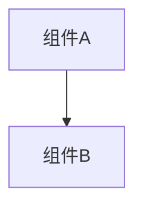

# 变更提案: networkmanager_todos

## 元信息
```yaml
类型: 修复
方案类型: implementation
优先级: P2
状态: 归档(已完成)
创建: 2026-01-12
```

---

## 1. 需求

### 背景
## 需求背景
`networkplugin/Network/Client/NetworkManager.cs` 中存在多处 `TODO` 注释，但代码已在后续重构中部分实现（例如：玩家同步已由 `NetworkIdentityTracker` + `OnGameEventReceived` 事件驱动完成），导致 TODO 与实际实现不一致，容易误导维护与二次开发。

本变更目标是：以当前代码架构为准，清理已完成/过期的 TODO，并补齐仍然缺失但对外可能有价值的能力（例如内部 `UpdatePlayerInfo` 的兼容入口）。

## 变更内容
1. 清理/改写已过期的 TODO（不改变现有行为）：
   - `GetPlayer`：移除不可达的 TODO 占位注释，保留现有输入校验与字典查询逻辑。
   - `GetSelf`：确认当前实现与 `LocalNetworkPlayer.userName`/`NetworkIdentityTracker` 的职责划分一致，移除误导性的旧注释。
   - `RegisterPlayer` / `RemovePlayer`：保留现有线程安全与快照脏标记逻辑，移除“未实现”类注释或改为对当前实现的说明。
2. 补齐仍未实现且可能被内部调用的逻辑：
   - `UpdatePlayerInfo(object playerInfo)`：实现为“兼容入口”，将输入解析为 `JsonElement` 并复用现有 `UpdateSinglePlayer/UpdatePlayersFromArray` 更新逻辑（或在确认无引用后改为删除/标记废弃）。

## 影响范围
- **模块:** `networkplugin/Network/Client`、`networkplugin/Utils`（仅依赖关系说明，不改动 tracker）
- **文件:**
  - `networkplugin/Network/Client/NetworkManager.cs`
  - （可选）若需要对外暴露事件/行为约束：`networkplugin/Network/Client/INetworkManager.cs` 的注释
- **API:** 无对外 API 变更（以“清理注释 + 补齐内部方法”为主）
- **数据:** 无

## 核心场景

### 需求: 完成 NetworkManager TODO
对 `NetworkManager` 中标注为 TODO 的位置进行“与当前架构对齐”的实现/清理。

#### 需求: 完成 NetworkManager TODO - 场景: GetPlayer 按 PlayerId 查询
条件：传入 `id` 为 `null/空白/合法字符串`。
- 预期结果：
  - `null/空白` 返回 `null`；
  - 合法 `id` 返回 `_players` 中对应 `INetworkPlayer` 或 `null`；
  - 不引入不可达代码与误导性 TODO 注释。

#### 需求: 完成 NetworkManager TODO - 场景: GetSelf 获取本地玩家实例
条件：单机/未连接/已连接（已收到 `Welcome` 或 `PlayerListUpdate`）。
- 预期结果：
  - 返回 `_selfPlayer`；
  - 说明“身份来源”以 `NetworkIdentityTracker.GetSelfPlayerId()` + `LocalNetworkPlayer.userName` 为准，而不是旧的 `ClientData.username`/请求式获取。

#### 需求: 完成 NetworkManager TODO - 场景: RegisterPlayer 注册/覆盖玩家
条件：传入 `player` 为 `null`/合法实例；`player.userName` 为空或重复。
- 预期结果：
  - `null` 抛出 `ArgumentNullException`；
  - `userName` 为空时生成稳定的 fallback id（如 `Guid`）；
  - 重复注册时覆盖引用但仅在发生“结构变化”时触发快照脏标记。

#### 需求: 完成 NetworkManager TODO - 场景: RemovePlayer 移除玩家
条件：传入 `id` 为 `null/空白/自身/其他玩家`。
- 预期结果：
  - `null/空白` 直接返回；
  - 不允许移除自身映射；
  - 移除成功后刷新快照。

#### 需求: 完成 NetworkManager TODO - 场景: UpdatePlayerInfo 接收玩家信息更新
条件：传入 `playerInfo` 可能为 `JsonElement`、`string(json)` 或其他动态对象。
- 预期结果：
  - 能解析为 JSON 时复用现有 `UpdateSinglePlayer/UpdatePlayersFromArray` 更新玩家属性（名称、角色、位置等）；
  - 解析失败或字段缺失时安全降级为 no-op，不抛异常影响网络线程；
  - 线程安全（使用现有 `_playersLock`）。

## 风险评估
- **风险:** 清理注释时误删仍在使用的内部入口/行为约束不一致（例如 `UpdatePlayerInfo` 虽未被引用但可能被未来补丁调用）。
- **缓解:** 先全局检索引用点；将 `UpdatePlayerInfo` 实现为薄封装以保持兼容；以 `dotnet build` 验证编译通过；避免更改现有同步逻辑与锁策略。

### 目标
完成 networkmanager_todos 的方案归档，并保证资料在新版知识库结构中可追溯。

### 约束条件
```yaml
时间约束: 无
性能约束: 无
兼容性约束: 无
业务约束: 无
```

### 验收标准
- [√] 资料已迁移并可追溯
- [√] 归档包包含 proposal.md + tasks.md

---

## 2. 方案

### 技术方案
## 技术方案

### 核心技术
- C# / .NET（现有解决方案 `simplesolution.sln`）
- `System.Text.Json`（复用 `NetworkManager` 内既有解析辅助方法）
- 线程安全：复用 `_playersLock` + “快照脏标记”机制

### 实现要点
- 以“当前架构”为准：玩家身份与玩家列表来源由 `NetworkIdentityTracker`（从 `Welcome/PlayerListUpdate/...` 提取）驱动；`NetworkManager` 在 `OnGameEventReceived` 中同步并按 payload 更新玩家信息。
- 对 `TODO` 分两类处理：
  1. **已实现但未清理的 TODO**：移除/改写注释与 XML 文档（不改变逻辑）。
  2. **仍缺失的 TODO**：补齐实现，尽量复用现有私有方法，避免引入新的同步路径。

### TODO 对齐策略（逐项）
1. `GetPlayer(string id)`
   - 现状：已有 `id` 校验 + `SyncPlayersFromIdentityTracker()` + `_players.TryGetValue`。
   - 动作：删除不可达的 TODO 占位注释；将 XML 文档中 “NotImplementedException” 描述改为实际行为说明。
2. `GetSelf()`
   - 现状：直接返回 `_selfPlayer`；本地玩家的 `userName` 已优先使用 `NetworkIdentityTracker.GetSelfPlayerId()`（见 `LocalNetworkPlayer.userName`）。
   - 动作：移除/改写 TODO 注释与“旧实现思路（ClientData.username）”的误导性描述；（可选）在返回前调用 `SyncPlayersFromIdentityTracker()` 以确保 `_selfKey` 在刚连上时完成从 `"self"` 到 `PlayerId` 的切换。
3. `RegisterPlayer(INetworkPlayer player)`
   - 现状：已有 `null` 校验、id 兜底、字典写入与 `MarkPlayersDirty_NoLock()`。
   - 动作：将 TODO 注释改为“当前实现说明”；确认不会因为重复注册导致不必要的快照重建（已通过 `changed` 判断）。
4. `RemovePlayer(string id)`
   - 现状：已有输入校验、禁止移除 self、移除并标记 dirty。
   - 动作：将 TODO 注释改为“当前实现说明”；补充注释解释“资源清理/事件通知”由上层补丁或网络事件驱动处理（本类保持轻量）。
5. `UpdatePlayerInfo(object playerInfo)`
   - 现状：未实现且无引用点。
   - 推荐实现：作为兼容入口，支持以下输入：
     - `JsonElement`：直接处理
     - `string`：按 JSON 解析
     - 其他：尝试 `ToString()` 作为 JSON 再解析，失败则 no-op
   - 处理策略：
     - 若为单个玩家对象：调用 `UpdateSinglePlayer(JsonElement)`
     - 若包含 `Players` 数组或本身为数组：调用 `UpdatePlayersFromArray(JsonElement)`
   - 失败策略：捕获异常并忽略，避免影响网络事件线程。

## 架构设计
不新增模块、不改动网络协议。`NetworkManager` 继续作为“玩家列表/数量”轻量维护层，真实同步由各 `*SyncPatch` 与服务器事件驱动完成。

## 架构决策 ADR
### ADR-001: 以现有事件驱动同步为准，清理陈旧 TODO 并提供兼容入口
**上下文:** `NetworkManager.cs` 中多处 TODO 与现状不一致；旧注释提到的 `ClientData.username`/请求式获取已不存在。
**决策:** 清理已完成 TODO；`UpdatePlayerInfo` 实现为薄封装并复用 `OnGameEventReceived` 既有解析/更新逻辑。
**替代方案:** 重新引入请求式 `GetSelf`/独立玩家更新通道 → 拒绝原因：与当前事件驱动同步重复且易造成状态分叉。
**影响:** 维护成本下降；兼容性更好；风险集中在注释清理与输入解析边界。

## API设计
无

## 数据模型
无

## 安全与性能
- **安全:**
  - 对外输入（`id`、`playerInfo`）保持输入校验与异常吞噬策略，防止恶意 payload 触发崩溃。
  - JSON 解析使用 `System.Text.Json`，不引入反射式动态绑定。
- **性能:**
  - 不引入额外的全量扫描；复用现有 `NetworkIdentityTracker` 与 `GetPlayersSnapshot()` 快照缓存机制。
  - `UpdatePlayerInfo` 仅在被调用时解析，失败快速返回。

## 测试与部署
- **验证建议:**
  - `dotnet build simplesolution.sln`
  - 在联机/断线重连场景下观察 `GetPlayerCount/GetAllPlayers/GetSelf` 行为保持一致（手动验证即可）。

### 影响范围
```yaml
涉及模块:
  - networkplugin: 方案/实现/文档更新
预计变更文件: 已完成（归档）
```

### 风险评估
| 风险 | 等级 | 应对 |
|------|------|------|
| 资料迁移遗漏 | 低 | 原始文件保留 + 生成新版归档 |

---

## 3. 技术设计（可选）

> 涉及架构变更、API设计、数据模型变更时填写

### 架构设计


### API设计
#### 无 无
- **请求**: 无
- **响应**: 无

### 数据模型
| 字段 | 类型 | 说明 |
|------|------|------|
| 无 | 无 | 无 |

---

## 4. 核心场景

> 执行完成后同步到对应模块文档

### 场景: 无
**模块**: 无
**条件**: 无
**行为**: 无
**结果**: 无

---

## 5. 技术决策

> 本方案涉及的技术决策，归档后成为决策的唯一完整记录

### networkmanager_todos#D001: 采用现有方案并按新版模板归档
**日期**: 2026-01-12
**状态**: ✅采纳 / ❌废弃 / ⏸搁置
**背景**: 需要将历史方案迁移到统一结构，便于检索与后续维护。
**选项分析**:
| 选项 | 优点 | 缺点 |
|------|------|------|
| A: 直接归档（推荐） | 成本低 | 可能保留历史表述风格 |
| B: 重写方案后归档 | 成本低 | 可能保留历史表述风格 |
**决策**: 选择方案无
**理由**: 保留原文以避免信息丢失，同时补齐索引与结构。
**影响**: networkplugin
