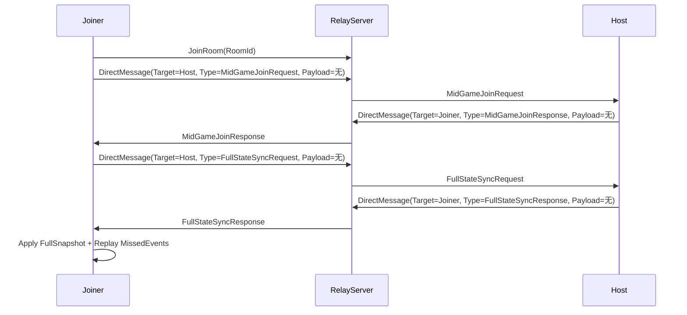
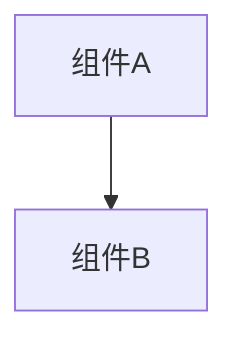

# 变更提案: midgamejoin_todo

## 元信息
```yaml
类型: 功能
方案类型: implementation
优先级: P2
状态: 归档(已完成)
创建: 2026-01-12
```

---

## 1. 需求

### 背景
## 需求背景
`networkplugin/Network/MidGameJoin/MidGameJoinManager.cs` 当前仍包含多处 TODO 与 Stub（房间信息获取、请求/批准/执行加入、进度/补偿计算、追赶事件回放、网络事件订阅等），导致“中途加入”能力无法端到端工作，也难以与现有的断线重连（`ReconnectionManager`）与状态同步（`SynchronizationManager`）能力复用。

这是一个局域网/虚拟局域网联机 Mod。本变更按“Mod 可用优先”的标准：优先把 MidGameJoin 跑通（能用、好调试、尽量少改动面），不追求严格的服务端权威与对抗性安全。

## 变更内容
1. 完成 `MidGameJoinManager` 的 TODO 与 Stub，实现房间事件订阅、请求/批准/执行加入、进度/补偿、事件追赶回放等关键逻辑。
2. 复用现有网络能力（尤其是 Relay 的 `DirectMessage`）实现点对点的加入请求/响应与 FullSync 请求/响应，避免把服务端路由 TODO 作为前置依赖。
3. 与 `ReconnectionManager` 的能力“能复用就复用”：优先复用快照/事件历史；若集成成本过高则先做最小可用实现（以可跑通为目标）。

## 影响范围
- **模块:** `networkplugin/Network/MidGameJoin`、`networkplugin/Network/Reconnection`、`networkplugin/Core`、`networkplugin/Plugin`
- **文件(预期):**
  - `networkplugin/Network/MidGameJoin/MidGameJoinManager.cs`
  - `networkplugin/Plugin.cs`
  - `networkplugin/Network/Reconnection/ReconnectionManager.cs`（如需对外暴露快照/事件接口）
  - `networkplugin/Core/SynchronizationManager.cs`（用于 FullSyncResponse 落地/事件回放）
- **API:** 新增/补齐 MidGameJoin 与 FullSync 的消息载荷结构（基于 `DirectMessage` 包装）
- **数据:** 无（仅内存态队列/缓存）

## 核心场景

### 需求: 初始化订阅与状态维护
**模块:** networkplugin

#### 场景: MidGameJoinManager 随插件启动初始化
条件描述：插件 Awake 后服务注册完成；网络可能未连接/稍后连接。
- 预期结果：`MidGameJoinManager.Initialize()` 能安全订阅 `INetworkClient.OnGameEventReceived`，并在断线重连后保持可用（幂等、可重复调用）。

### 需求: 中途加入请求与审批
**模块:** networkplugin

#### 场景: Joiner 进入房间后申请加入进行中的对局
条件描述：Joiner 已 `JoinRoom` 成功进入同一房间；房间已开始游戏；Joiner 仍未获得对局状态。
- 预期结果：Joiner 发送 `MidGameJoinRequest` 给 Host；Host 记录请求并能在超时/拒绝时给出明确原因；通过则返回 `JoinToken + BootstrappedState`。

#### 场景: Host 权限校验与限流
条件描述：非 Host 试图批准请求；或同房间请求数超过 `MaxJoinRequestsPerRoom`。
- 预期结果：请求被拒绝并返回可诊断错误；不会污染 Host 端的 pending 队列。

### 需求: 执行加入与完整同步
**模块:** networkplugin

#### 场景: Joiner 使用 JoinToken 执行加入
条件描述：Joiner 已收到 Host 下发的 JoinToken 与 BootstrappedState。
- 预期结果：先进行快速落地（FastSync/本地基础状态），再向 Host 发起 FullSync 请求；Joiner 收到 FullSyncResponse 后完成状态落地并进入可操作状态。

### 需求: 进度计算与补偿生成
**模块:** networkplugin

#### 场景: 根据对局进度给 Joiner 生成起始资源
条件描述：Host 能获得当前 `FullStateSnapshot`（含 `GameStateSnapshot`）。
- 预期结果：`CalculateGameProgress` 与卡牌/宝物/药水补偿逻辑可配置、可测试、不会生成非法内容（空ID/负数数量/超过上限）。

### 需求: 追赶事件回放
**模块:** networkplugin

#### 场景: Joiner 在 FullSnapshot 落地后回放 MissedEvents
条件描述：Host 在 FullSyncResponse 中携带 MissedEvents；Joiner 尚未处理这些事件。
- 预期结果：Joiner 按顺序应用事件（失败可降级/停止回放并提示），避免把控制消息（FullSyncRequest/Response）写入回放队列造成循环。

## 风险评估
- **风险:** MidGameJoin 与 Reconnection/Sync 的口径不一致导致状态分叉/偶发不同步。
  - **缓解:** 优先走“FullSnapshot + 少量 MissedEvents”这条最直观路径；不强行覆盖所有事件类型，先保证常见场景可用。
- **风险:** 大快照/长事件回放带来卡顿或调试困难。
  - **缓解:** `CatchUpBatchSize` 分批回放；失败时允许降级为“只落地快照、跳过回放”，并输出可诊断日志。
- **风险:** JoinToken/RequestId 仅作为流程协作标识，缺乏“对抗性安全”防护。
  - **缓解:** 本项目为局域网/虚拟局域网联机 Mod 场景，安全威胁模型较弱；仍建议保留超时与单次消费，主要用于避免误操作/重复触发导致的逻辑污染与资源泄露。

### 目标
完成 midgamejoin_todo 的方案归档，并保证资料在新版知识库结构中可追溯。

### 约束条件
```yaml
时间约束: 无
性能约束: 无
兼容性约束: 无
业务约束: 无
```

### 验收标准
- [√] 资料已迁移并可追溯
- [√] 归档包包含 proposal.md + tasks.md

---

## 2. 方案

### 技术方案
## 技术方案
### 核心技术
- `INetworkClient.OnGameEventReceived`：订阅网络事件（参照 `ReconnectionManager.Initialize()` 的用法）。
- Relay `DirectMessage`：点对点发送（参照 `networkplugin/Network/Server/RelayServer.cs` 的 `HandleDirectMessage` 协议）。
- `ReconnectionManager`（可选复用）：用于 Host 侧生成 FullSnapshot 与 MissedEvents。
- `SynchronizationManager`（按需接入）：用于 Joiner 侧“落地快照/回放事件”。若接入成本过高，允许先做最小落地（仅快照/关键事件），以跑通为主。

### 实现要点
- MidGameJoin 采用“房间内旁观者”模型：Joiner 先 `JoinRoom` 成为房间成员（不等价于进入对局），然后通过 `DirectMessage` 与 Host 完成申请/批准/同步。
- 请求/响应均携带 `RequestId/JoinToken/TargetPlayerId` 等关联字段，避免广播噪音与误消费。
- 事件追赶索引不追求“统一标准”，按 Mod 可用优先：先用 `ReconnectionManager.GetMissedEvents()` 的参数语义跑通；必要时在实现中写日志辅助定位。

### TODO 清单（来自 `MidGameJoinManager.cs`）
- `Initialize()`：订阅 `GameStarted` / `PlayerJoined`（建议统一用 `INetworkClient.OnGameEventReceived` 订阅，并同时兼容 `NetworkMessageTypes.OnGameStart`）。
- `RequestJoin()`：从 Relay 获取房间信息（优先策略：Joiner 先 `JoinRoom`，再从 `NetworkManager`/玩家列表推导 Host；兜底再走 `GetRoomList`）。
- `ApproveJoin()`：补齐批准逻辑（Host 校验、超时清理、生成 `BootstrappedState`、回包 Joiner）。
- `ExecuteJoin()`：补齐完整加入流程（快速落地 → FullSync → 进入对局/通知 → 追赶回放）。
- `CalculateGameProgress()`：实现进度计算（建议基于 `FullStateSnapshot.GameState` 的 `CurrentAct/CurrentFloor/GamePhase/TurnCount`）。
- `GenerateStartingCards/GenerateStartingExhibits/GenerateStartingPotions()`：按进度生成补偿（受 `EnableCompensation` 控制）。
- `ApplyCatchUpEvents()`：实现事件回放（消费 `MissedEvents`，避免回放 FullSync 控制消息）。
- Stub methods（需要落地或改造签名）：
  - `GetRoomInfo/JoinRoom/RequestFullStateSync/NotifyHostOfJoinRequest/NotifyPlayersOfNewPlayer/GetRoomGameState/GetMissedEvents/ReplayEvent`

## 架构设计


## 架构决策 ADR
（Mod 标准：不写 ADR，按最小可用推进。）

## API设计
### `DirectMessage` 外层
- `eventType`: `"DirectMessage"`
- `payload`:
  - `TargetPlayerId`: string
  - `Type`: string（内层消息类型，如 `MidGameJoinRequest` / `FullStateSyncRequest`）
  - `Payload`: object（内层载荷）

### `MidGameJoinRequest`（内层）
- `RequestId`: string
- `RoomId`: string
- `PlayerName`: string
- `ClientPlayerId`: string（必填）
- `ClientTimeUtcTicks`: long（可选；用于诊断）

### `MidGameJoinResponse`（内层）
- `RequestId`: string
- `Approved`: bool
- `Reason`: string（拒绝原因）
- `JoinToken`: string（批准时返回）
- `ExpiresAtUtcTicks`: long（JoinToken 过期时间）
- `HostPlayerId`: string（Host 的 PlayerId）
- `RoomId`: string
- `PlayerName`: string
- `BootstrappedState`: `PlayerBootstrappedState`（批准时返回）

### `FullStateSyncRequest`（内层）
- `RequestId`: string
- `RoomId`: string
- `TargetPlayerId`: string（Joiner 的 PlayerId）
- `LastKnownEventIndex`: long（Joiner 已知的最后事件索引；首次可为 0）
- `JoinToken`: string（Host 侧会消费并校验；避免被非批准玩家滥用 FullSync）

### `FullStateSyncResponse`（内层）
- `RequestId`: string
- `TargetPlayerId`: string
- `FullSnapshot`: `FullStateSnapshot`
- `MissedEvents`: `List<GameEvent>`
- `ErrorMessage`: string（可选；失败/拒绝原因）
- `ServerTimeUtcTicks`: long

## 数据模型
无持久化；仅在 `MidGameJoinManager` 内维护：
- `_pendingRequests`：Host 端待批准请求
- `_approvedJoins`：Joiner 端 JoinToken → ApprovedJoin 的短期映射（用于 `ExecuteJoin`）
- `Room/Host` 快照缓存：用于 GetRoomInfo/Host定位/游戏是否已开始

## 安全与性能
- **威胁模型说明:** 局域网/虚拟局域网联机 Mod 场景为主，不以“对抗性安全”作为设计目标。
- **最小健壮性:** 空值校验 + 超时清理（`JoinRequestTimeoutMinutes`）+ Host-only 校验（主要是避免误触/误消费）。
- **最小性能:** `CatchUpBatchSize` 分批回放；回放失败允许降级；关键路径加日志便于调试。

## 测试与部署
- **测试(手工/烟测):**
  1. Joiner 加入已开局房间：能申请 → Host 批准 → Joiner 收到快照后能进入可操作状态（以“能玩”为准）。
  2. 批准失败（Host 拒绝/不可用）：
     - 将 Host 侧 `AllowMidGameJoin=false` 或让 Joiner 在未收到 `PlayerListUpdate` 前直接请求。
     - 预期：Joiner 侧收到 `MidGameJoinResponse(Approved=false, Reason=...)` 或直接 `RequestJoin` 返回 Denied；日志包含 “Join denied”/“Host not found”。
  3. FullSync 失败降级：
     - 让 Host 不响应 `FullStateSyncRequest`（例如 Host 未初始化/未成为 Host），或网络不通导致 Joiner 超时。
     - 预期：Joiner 侧 `ExecuteJoin` 返回 Failed，并给出 `FullStateSyncResponse timeout` 等可诊断错误。
  4. 回放失败降级（尽力回放）：
     - 在回放过程中若订阅者抛异常导致注入失败（或出现多次回放异常）。
     - 预期：Joiner 侧出现 “Replay failed … degraded to snapshot-only” 日志，但不中断后续流程（以“能跑通/可诊断”为准）。
- **部署:** 无额外部署步骤；仅插件代码更新。

### 影响范围
```yaml
涉及模块:
  - networkplugin: 方案/实现/文档更新
预计变更文件: 已完成（归档）
```

### 风险评估
| 风险 | 等级 | 应对 |
|------|------|------|
| 资料迁移遗漏 | 低 | 原始文件保留 + 生成新版归档 |

---

## 3. 技术设计（可选）

> 涉及架构变更、API设计、数据模型变更时填写

### 架构设计


### API设计
#### 无 无
- **请求**: 无
- **响应**: 无

### 数据模型
| 字段 | 类型 | 说明 |
|------|------|------|
| 无 | 无 | 无 |

---

## 4. 核心场景

> 执行完成后同步到对应模块文档

### 场景: 无
**模块**: 无
**条件**: 无
**行为**: 无
**结果**: 无

---

## 5. 技术决策

> 本方案涉及的技术决策，归档后成为决策的唯一完整记录

### midgamejoin_todo#D001: 采用现有方案并按新版模板归档
**日期**: 2026-01-12
**状态**: ✅采纳 / ❌废弃 / ⏸搁置
**背景**: 需要将历史方案迁移到统一结构，便于检索与后续维护。
**选项分析**:
| 选项 | 优点 | 缺点 |
|------|------|------|
| A: 直接归档（推荐） | 成本低 | 可能保留历史表述风格 |
| B: 重写方案后归档 | 成本低 | 可能保留历史表述风格 |
**决策**: 选择方案无
**理由**: 保留原文以避免信息丢失，同时补齐索引与结构。
**影响**: networkplugin
