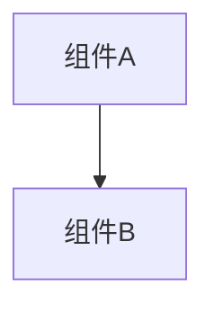

# 变更提案: todo_sweep

## 元信息
```yaml
类型: 维护
方案类型: implementation
优先级: P2
状态: 归档(已完成)
创建: 2026-01-12
```

---

## 1. 需求

### 背景
目录：`helloagents/plan/202601122206_todo_sweep/`

## 背景
- `networkplugin` 内存在多处 `TODO` 注释：一部分是“缺失实现/占位逻辑”（可通过编译与静态检查验证），另一部分需要进入游戏联机环境或依赖外部网络环境（UPnP/STUN）才能验证与落地。

## 目标
- 扫描并分类 `TODO` 注释。
- 将“无需手动验证即可安全落地”的 TODO 直接实现，并通过 `dotnet build` 验证可编译。
- 将“需要手动验证/外部依赖/大规模重构决策”的 TODO 统一记录并显式跳过（不在本批实现）。

## 非目标
- 不在本批完成需要真实联机/回放/场景 UI 才能验证的逻辑（仅记录）。
- 不引入新的第三方网络库来实现 UPnP/STUN。

## 相关方案
- `helloagents/history/2026-01/202601121639_midgamejoin_todo/` 已归档（MidGameJoin TODO 落地方案）。

### 目标
完成 todo_sweep 的方案归档，并保证资料在新版知识库结构中可追溯。

### 约束条件
```yaml
时间约束: 无
性能约束: 无
兼容性约束: 无
业务约束: 无
```

### 验收标准
- [√] 资料已迁移并可追溯
- [√] 归档包包含 proposal.md + tasks.md

---

## 2. 方案

### 技术方案
目录：`helloagents/plan/202601122206_todo_sweep/`

## 扫描范围
- `networkplugin/**/*.cs`

## 判定规则（无需手动验证 vs 需要手动验证）
- **可直接落地**：不改协议/不依赖真实联机环境；主要是补齐缺失实现、健壮性兜底、路由分流、日志与编译修复；以 `dotnet build` 可验证为准。
- **需要手动验证**：涉及真实联机/回放流程、游戏运行期对象与状态应用、UI 交互、UPnP/STUN 外部网络环境、或 `NetworkPlayer` 相关的大规模重构决策。

## 本批完成（无需手动验证）
- **聊天消息路由补齐**：将 `ChatMessage` 归类为 GameEvent 进行转发/分发，保证 UI 层能通过 `OnGameEventReceived` 接收。
  - `networkplugin/Network/Client/NetworkClient.cs`
  - `networkplugin/Network/Server/NetworkServer.cs`
  - `networkplugin/Network/Server/RelayServer.cs`
- **ChatUI 接收/发送对齐**：订阅 `NetworkClient.OnGameEventReceived` 并解析 `ChatMessage`；发送方 ID/昵称改为从 `NetworkIdentityTracker`/`GameStateUtils` 获取（含反射兜底）。
  - `networkplugin/UI/Components/ChatUI.cs`
- **NATTraversal 日志兜底**：补齐 logger 初始化（避免 `Plugin.Logger` 不可用时 NRE），UPnP/STUN 的真实交互仍保持 TODO（需要外部环境）。
  - `networkplugin/Network/Utils/NatTraversal.cs`
- **Save/Load 与事件同步：最小可用辅助实现**：补齐玩家 ID/Host 判断、最小快照构造（仅诊断/可序列化用途），并移除已实现的 TODO 注释。
  - `networkplugin/Patch/Network/SaveLoadSyncPatch.cs`
  - `networkplugin/Patch/Network/EventSyncPatch.cs`
- **ChatConsole：健壮性与 TODO 清理**：加入历史去重/限长/默认值处理，落地本地玩家信息获取；移除已过期的 TODO 占位区域与非必要 TODO 标记。
  - `networkplugin/Chat/ChatConsole.cs`
  - `networkplugin/Chat/ChatMessage.cs`
- **编译修复**：补齐缺失 `using`（`System.Linq`、`NetworkMessageTypes`），确保 Release 编译通过。

## 跳过项（需要手动验证/外部依赖/大规模重构）
- **UPnP/STUN**：真实端口映射与 STUN 交互依赖外部网络环境与实现库。
  - `networkplugin/Network/Utils/NatTraversal.cs`
- **FullStateSyncRequest（非 DirectMessage 路由）**：涉及服务端/Relay 的完整路由与响应语义，需要联机验证。
  - `networkplugin/Network/Server/NetworkServer.cs`
  - `networkplugin/Network/Server/RelayServer.cs`
- **事件入口点/投票/对话同步**：高度依赖游戏运行时与多人一致性验证。
  - `networkplugin/Patch/Network/EventSyncPatch.cs`
- **存档快照应用**：将 Host 存档状态应用到本地游戏需要游戏内验证。
  - `networkplugin/Patch/Network/SaveLoadSyncPatch.cs`
- **战斗/回合相关同步**：MaxMana 获取、服务端应用到 `INetworkPlayer`、请求补充用户 ID 等，需要联机验证与数据源对齐。
  - `networkplugin/Patch/Actions/TurnAction_Patch.cs`
  - `networkplugin/Patch/BattleController_Patch.cs`
- **UI 面板发送逻辑**：与实际 UI/网络架构耦合，需要场景与联机验证。
  - `networkplugin/UI/Panels/TradePanel.cs`
  - `networkplugin/UI/Panels/ResurrectPanel.cs`
- **NetworkPlayer 的 SyncVar/字段重构**：属于结构性改造，需要明确同步模型与联机验证。
  - `networkplugin/Network/NetworkPlayer/*`
- **私聊（Whisper）**：协议与 UI 交互需要明确约束与验证。
  - `networkplugin/Chat/ChatMessage.cs`
- **AI 角色**：低优先级功能，需联机玩法验证。
  - `networkplugin/Network/MidGameJoin/AIPlayerController.cs`

## 验证
- 编译：`dotnet build networkplugin/NetWorkPlugin.csproj -c Release`（通过，存在历史告警但无新增错误）。
- TODO 扫描：剩余 `TODO` 均归类为“需要手动验证/外部依赖/重构决策”（详见 `task.md` 的跳过清单）。

### 影响范围
```yaml
涉及模块:
  - networkplugin: 方案/实现/文档更新
预计变更文件: 已完成（归档）
```

### 风险评估
| 风险 | 等级 | 应对 |
|------|------|------|
| 资料迁移遗漏 | 低 | 原始文件保留 + 生成新版归档 |

---

## 3. 技术设计（可选）

> 涉及架构变更、API设计、数据模型变更时填写

### 架构设计


### API设计
#### 无 无
- **请求**: 无
- **响应**: 无

### 数据模型
| 字段 | 类型 | 说明 |
|------|------|------|
| 无 | 无 | 无 |

---

## 4. 核心场景

> 执行完成后同步到对应模块文档

### 场景: 无
**模块**: 无
**条件**: 无
**行为**: 无
**结果**: 无

---

## 5. 技术决策

> 本方案涉及的技术决策，归档后成为决策的唯一完整记录

### todo_sweep#D001: 采用现有方案并按新版模板归档
**日期**: 2026-01-12
**状态**: ✅采纳 / ❌废弃 / ⏸搁置
**背景**: 需要将历史方案迁移到统一结构，便于检索与后续维护。
**选项分析**:
| 选项 | 优点 | 缺点 |
|------|------|------|
| A: 直接归档（推荐） | 成本低 | 可能保留历史表述风格 |
| B: 重写方案后归档 | 成本低 | 可能保留历史表述风格 |
**决策**: 选择方案无
**理由**: 保留原文以避免信息丢失，同时补齐索引与结构。
**影响**: networkplugin
