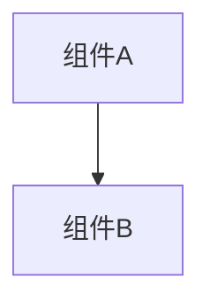

# 变更提案: networkplayer_dto_visitingnode_nullfix

## 元信息
```yaml
类型: 修复
方案类型: implementation
优先级: P2
状态: 归档(已完成)
创建: 2026-01-16
```

---

## 1. 需求

### 背景
## 背景
`networkplugin/Network/NetworkPlayer/dto/NetWorkPlayer.cs` 的构造函数在未确保 `VisitingNode` 被赋值的情况下，直接读取 `VisitingNode.X/Y`。

## 问题
- `VisitingNode` 默认值为 `null`，因此构造函数可能触发 `NullReferenceException`。
- 该异常与是否使用 `SyncVar` 无关，但会导致联机流程在初始化阶段不稳定（例如：玩家数据创建/序列化前就崩溃）。

## 目标与成功标准
- 构造 `NetworkPlugin.Network.NetworkPlayer.dto.NetWorkPlayer` 时不再依赖 `VisitingNode` 非空。
- 不引入 `SyncVar`，保持该类型作为纯 DTO/序列化载体的定位。
- 不改变现有 JSON 字段协议（`location_X`/`location_Y` 仍为整数）。
- 行为可预测：当无法从访问节点取坐标时，坐标回退到稳定的默认值（例如 0）。

### 目标
完成 networkplayer_dto_visitingnode_nullfix 的方案归档，并保证资料在新版知识库结构中可追溯。

### 约束条件
```yaml
时间约束: 无
性能约束: 无
兼容性约束: 无
业务约束: 无
```

### 验收标准
- [√] 资料已迁移并可追溯
- [√] 归档包包含 proposal.md + tasks.md

---

## 2. 方案

### 技术方案
## 设计原则
- DTO 只负责承载可序列化数据；同步机制/运行时对象放在其他层（例如 `PlayerEntity`）。
- 初始化时不要读取可能为 `null` 的外部引用。
- 兼容现有数据协议：不改字段名、不改字段类型。

## 方案对比

### 方案 A（推荐）：构造函数内对 `VisitingNode` 做空值回退
在构造函数设置 `location_X`/`location_Y` 时：
- 若 `VisitingNode != null`：使用 `VisitingNode.X/Y`。
- 否则：将 `location_X`/`location_Y` 设为 0（或保留已有默认值）。

优点：
- 改动最小，风险最低。
- 不改变外部调用方式；任何地方 `new NetWorkPlayer()` 都不再崩溃。

缺点：
- 坐标默认值可能不是业务最优（但至少稳定）。

### 方案 B：移除构造函数对 `VisitingNode` 的依赖，提供显式初始化入口
将坐标初始化逻辑从构造函数移出：
- 构造函数只做纯默认值。
- 新增 `InitializeLocationFromVisitingNode(MapNode node)` 或类似方法，由调用者在拿到 `VisitingNode` 后调用。

优点：
- 职责更清晰，避免“隐式读取外部状态”。

缺点：
- 需要改动所有调用方，容易漏改；与“快速修复稳定性”目标不匹配。

## 推荐决策
采用方案 A。

## 注意事项
- `networkplugin/Network/NetworkPlayer/NetWorkPlayer.cs` 也存在类似注释提示（该文件也在构造函数末尾访问 `VisitingNode.X/Y`）。需要在执行阶段确认是否同样需要修复，以免出现“修了 dto 但运行时用的是另一个同名类”的情况。

### 影响范围
```yaml
涉及模块:
  - networkplayer: 方案/实现/文档更新
预计变更文件: 已完成（归档）
```

### 风险评估
| 风险 | 等级 | 应对 |
|------|------|------|
| 资料迁移遗漏 | 低 | 原始文件保留 + 生成新版归档 |

---

## 3. 技术设计（可选）

> 涉及架构变更、API设计、数据模型变更时填写

### 架构设计


### API设计
#### 无 无
- **请求**: 无
- **响应**: 无

### 数据模型
| 字段 | 类型 | 说明 |
|------|------|------|
| 无 | 无 | 无 |

---

## 4. 核心场景

> 执行完成后同步到对应模块文档

### 场景: 无
**模块**: 无
**条件**: 无
**行为**: 无
**结果**: 无

---

## 5. 技术决策

> 本方案涉及的技术决策，归档后成为决策的唯一完整记录

### networkplayer_dto_visitingnode_nullfix#D001: 采用现有方案并按新版模板归档
**日期**: 2026-01-16
**状态**: ✅采纳 / ❌废弃 / ⏸搁置
**背景**: 需要将历史方案迁移到统一结构，便于检索与后续维护。
**选项分析**:
| 选项 | 优点 | 缺点 |
|------|------|------|
| A: 直接归档（推荐） | 成本低 | 可能保留历史表述风格 |
| B: 重写方案后归档 | 成本低 | 可能保留历史表述风格 |
**决策**: 选择方案无
**理由**: 保留原文以避免信息丢失，同时补齐索引与结构。
**影响**: networkplayer
