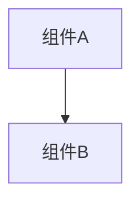

# 变更提案: networkplayer_inetworkplayer_docfix

## 元信息
```yaml
类型: 文档
方案类型: overview
优先级: P2
状态: 归档(已完成)
创建: 2026-01-16
```

---

## 1. 需求

### 背景
## 目标
为 `INetworkPlayer` 接口补齐/修正注释，重点“完成 TODO 注释”与消除语义歧义，使联机同步字段、资源系统与地图节点参数在阅读层面可被准确理解。

## 现状与问题
- `INetworkPlayer.cs` 存在 `TODO:`（例如 `stance` 命名可能要改、`GetMyself` 预计弃用），当前缺少明确的迁移/语义说明。
- 顶部出现重复的 `<summary>` 块，且存在“玩家终极能量”说明后未跟随任何成员的残留注释段，容易造成文档生成/阅读困惑。
- 接口字段采用 lowerCamelCase（如 `userName`, `endturn`, `location_X`），与常规 C# 约定不同；需要在注释中明确这是协议/序列化一致性选择，避免后续误改。
- `mana` 在插件侧以 `int[4]` 使用（见 `networkplugin` 现有实现/DTO），但原游戏法力系统更复杂（见 `LBoL.Base.ManaColor`/`ManaGroup`），需要在注释中明确“当前同步协议的简化映射”。
- `UpdateLocation(MapNode visitingnode, ...)` 依赖原游戏 `LBoL.Core.MapNode`（含 `X/Y/Act/StationType` 等），注释应引用其语义，避免把它当成纯坐标对。

## 约束与边界
- 本次目标聚焦“注释完善”，不改变接口签名、命名或行为。
- 若要彻底清理重复 `<summary>` 与残留注释段（涉及删除/重排注释），需要用户明确允许“删除/调整现有注释行”；否则仅采用“追加说明”的方式规避风险。

## 成功标准
- `INetworkPlayer.cs` 中所有公开成员（属性/方法）拥有准确的 XML 文档注释。
- 所有 `TODO:` 旁给出可执行的解释（为何存在、何时改、风险）。
- 对 `mana`、`stance`、`ultimatePower`、`MapNode` 的语义在注释层面达成一致，降低误用与后续重构成本。

### 目标
完成 networkplayer_inetworkplayer_docfix 的方案归档，并保证资料在新版知识库结构中可追溯。

### 约束条件
```yaml
时间约束: 无
性能约束: 无
兼容性约束: 无
业务约束: 无
```

### 验收标准
- [√] 资料已迁移并可追溯
- [√] 归档包包含 proposal.md + tasks.md

---

## 2. 方案

### 技术方案
## 策略
1. 以“最小风险”的方式完善注释：优先追加 `<remarks>` / 行注释说明现状与约束，不触碰接口签名。
2. 注释内容以“网络同步语义”为中心：明确每个字段是否参与同步、更新时机、`updateServer` 的含义（客户端本地更新 vs 通知服务器）。
3. 对原游戏类型做语义对齐：
   - `UpdateLocation(MapNode visitingnode, ...)` 明确 `MapNode` 来自 `LBoL.Core`，并解释 `X/Y` 与章节 `Act` 的含义。
   - `mana` 明确当前协议使用 `int[4]` 的简化表示（常见四色），并提示与 `LBoL.Base.ManaColor`/`ManaGroup` 的差异。

## 重点修订点（按风险从低到高）
- `TODO:stance名称可能要改`
  - 保持属性名不变，在注释中说明：该字段是“战斗姿态/架势标识”的字符串；协议/序列化已依赖该字段名；若未来要更名需同步 DTO 与网络协议字段。
  - 结合插件内 DTO 的现状（`dto/NetWorkPlayer.cs` 仍有 `stance` TODO），在注释中明确“当前仍以字符串传输”。

- `ultimatePower` / `UpdateUltimatePower`
  - 统一措辞为“终极技能可用/充能状态（bool）”，避免与“终极能量（数值）”混淆。
  - 如果确实存在“数值型终极能量”，在注释里指出当前接口未建模（仅同步布尔状态），后续需扩展协议。

- 顶部重复 `<summary>` 与残留注释段
  - 默认采用“追加说明”而不删除：在接口注释尾部加一段 `<remarks>` 标识“历史遗留的重复摘要/残留段”，避免后续再叠加。
  - 若用户允许清理（删除/合并注释行），再执行“结构化清理”方案：合并为单一 `<summary>` + `<remarks>`，移除未绑定成员的注释段。

## 验证方式（执行阶段）
- 编译层面：保证仅新增注释不会引入语法错误。
- 文档层面：生成 XML 注释时不应新增明显的结构性报错（若现有重复 `<summary>` 已导致报错，则记录为历史问题并给出可选清理方案）。

### 影响范围
```yaml
涉及模块:
  - networkplayer: 方案/实现/文档更新
预计变更文件: 已完成（归档）
```

### 风险评估
| 风险 | 等级 | 应对 |
|------|------|------|
| 资料迁移遗漏 | 低 | 原始文件保留 + 生成新版归档 |

---

## 3. 技术设计（可选）

> 涉及架构变更、API设计、数据模型变更时填写

### 架构设计


### API设计
#### 无 无
- **请求**: 无
- **响应**: 无

### 数据模型
| 字段 | 类型 | 说明 |
|------|------|------|
| 无 | 无 | 无 |

---

## 4. 核心场景

> 执行完成后同步到对应模块文档

### 场景: 无
**模块**: 无
**条件**: 无
**行为**: 无
**结果**: 无

---

## 5. 技术决策

> 本方案涉及的技术决策，归档后成为决策的唯一完整记录

### networkplayer_inetworkplayer_docfix#D001: 采用现有方案并按新版模板归档
**日期**: 2026-01-16
**状态**: ✅采纳 / ❌废弃 / ⏸搁置
**背景**: 需要将历史方案迁移到统一结构，便于检索与后续维护。
**选项分析**:
| 选项 | 优点 | 缺点 |
|------|------|------|
| A: 直接归档（推荐） | 成本低 | 可能保留历史表述风格 |
| B: 重写方案后归档 | 成本低 | 可能保留历史表述风格 |
**决策**: 选择方案无
**理由**: 保留原文以避免信息丢失，同时补齐索引与结构。
**影响**: networkplayer
