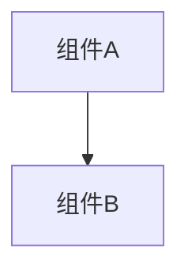

# 变更提案: turnend_receive_and_buildfix

## 元信息
```yaml
类型: 功能
方案类型: implementation
优先级: P2
状态: 归档(已完成)
创建: 2026-01-20
```

---

## 1. 需求

### 背景
## 背景
当前已实现“回合边界发送端”的基础能力：
- 在 `EndPlayerTurnAction.Execute` 的 Harmony Postfix 中发送 `OnTurnEnd`（payload 为 `TurnEndStateSnapshot`）。

但仍存在两个缺口：
1. `OnTurnEnd` 事件的接收端尚未落地（订阅/解析/写入远端玩家状态）。
2. `networkplugin` 当前 `dotnet build` 失败（多处引用 `INetworkPlayer.mana`，接口中不存在该成员），导致无法进行基础编译验证与迭代。

## 目标
- 让 `OnTurnEnd` 成为“可用的同步链路”：发送端 -> 网络广播 -> 接收端消费并更新远端玩家状态缓存（至少用于 UI/调试/一致性验证）。
- 修复 `INetworkPlayer.mana` 相关编译错误，使 `networkplugin/NetWorkPlugin.csproj` 可以通过编译（不要求清零历史 warning）。

## 非目标
- 不在本次方案中实现完整的“远端状态强制回放/权威回滚”。
- 不改变 `EndTurnSyncPatch` 的协商策略（EndTurnRequest/Confirm）与 UI 锁定行为。

## 成功标准（验收）
- `OnTurnEnd` 到达客户端时能被一个明确的接收模块处理，并把关键字段写入到远端玩家对象/缓存。
- `dotnet build networkplugin/NetWorkPlugin.csproj -c Release` 不再因为 `mana` 缺失而失败。

## 风险与约束
- `INetworkPlayer` 可能只提供最小接口；对远端状态的写入应优先走现有 `RemoteNetworkPlayer` / `NetworkManager` 可用的扩展点，避免强耦合。
- `EndTurnSyncPatch` 在允许本地真正结束回合前会重置 `_localEndedTurn`；因此接收端与发送端应以“事件本身”作为事实来源，而非依赖协商标志。

### 目标
完成 turnend_receive_and_buildfix 的方案归档，并保证资料在新版知识库结构中可追溯。

### 约束条件
```yaml
时间约束: 无
性能约束: 无
兼容性约束: 无
业务约束: 无
```

### 验收标准
- [√] 资料已迁移并可追溯
- [√] 归档包包含 proposal.md + tasks.md

---

## 2. 方案

### 技术方案
## A. OnTurnEnd 接收落地

### A1. 事件来源与通道
- `OnTurnEnd` 属于 GameEvent（`NetworkClient.IsGameEvent` 规则：`On*`）。
- 发送端当前使用 `INetworkClient.SendRequest(NetworkMessageTypes.OnTurnEnd, json)`，服务端会将 messageType 识别为 GameEvent 并广播给其他玩家（不含发送方）。

### A2. 接收端挂载点
推荐实现一个“轻量接收补丁/管理器”，模式参考：
- `networkplugin/Patch/Network/EndTurnSyncPatch.cs` 的订阅方式：在 `GameDirector.Update` 中 EnsureSubscribed 到 `INetworkClient.OnGameEventReceived`。

拟新增文件：
- `networkplugin/Patch/Network/TurnEndSnapshotReceivePatch.cs`

核心职责：
- 订阅 `INetworkClient.OnGameEventReceived`。
- 过滤 `eventType == NetworkMessageTypes.OnTurnEnd`。
- 将 payload 解析为 `TurnEndStateSnapshot`（考虑 payload 可能是 `Dictionary<string,object>` 或 `JsonElement` 的情况）。
- 根据 payload 中的 `UserName` / `PlayerId`（如有）定位远端玩家对象。
- 将关键字段写入远端玩家状态缓存（优先写入已有结构，若没有则记录到 `NetworkManager` 的扩展缓存字典）。

### A3. 状态落地策略（不侵入）
优先级从“最小侵入”到“更强一致性”：
1) **最小侵入（推荐）**：维护一个 `Dictionary<string, TurnEndStateSnapshot>` 缓存（key = playerId 或 userName），供 UI/调试读取。
2) **中等侵入**：如果 `RemoteNetworkPlayer` 有可写的状态字段（例如 `StateSnapshot`/`LastKnownHp` 等），则同步写入。
3) **高侵入（本次不做）**：直接对 LBoL 的本地 Battle 状态施加变更。

### A4. 与 EndTurnSyncPatch 的边界
- `EndTurnSyncPatch`：负责“什么时候允许结束回合”（协商与 UI 锁定）。
- `OnTurnEnd`：负责“回合已结束后的状态快照”（供远端对齐/展示/核对）。
二者互不依赖：接收端不应根据 `_localEndedTurn` 做过滤。

---

## B. 修复 INetworkPlayer.mana 编译错误

### B1. 问题定位
编译错误表明：`INetworkPlayer` 接口不包含 `mana`，但以下位置直接访问了该属性：
- `networkplugin/Patch/Actions/PlayCardAction_Patch.cs`
- `networkplugin/Network/Reconnection/ReconnectionManager.cs`

### B2. 修复策略选项

**方案 B-1（推荐）：引入扩展方法/兼容层**
- 新增 `NetworkPlugin/Utils/NetworkPlayerManaCompat.cs`（或类似）
- 通过 `as` / `dynamic` / 反射尝试读取实际实现类上的 mana 字段/属性；不存在则返回默认 `ManaGroup.Empty` 或 int[] 全 0。
- 替换所有直接 `.mana` 访问为 `GetManaOrDefault()`。
优点：不修改接口，兼容历史实现；风险较小。

**方案 B-2：扩展 INetworkPlayer 接口**
- 直接给 `INetworkPlayer` 增加 `ManaGroup`/`int[]` 属性。
优点：类型安全；缺点：需要修改所有实现类，破坏面较大。

本次建议采用 **B-1**。

---

## 验证计划
- `dotnet build networkplugin/NetWorkPlugin.csproj -c Release` 通过（允许已有 warning）。
- 手动联机验证：两客户端同一战斗中结束回合，非发送方能收到 `OnTurnEnd` 并更新缓存（日志中可观察）。

### 影响范围
```yaml
涉及模块:
  - networkplugin: 方案/实现/文档更新
预计变更文件: 已完成（归档）
```

### 风险评估
| 风险 | 等级 | 应对 |
|------|------|------|
| 资料迁移遗漏 | 低 | 原始文件保留 + 生成新版归档 |

---

## 3. 技术设计（可选）

> 涉及架构变更、API设计、数据模型变更时填写

### 架构设计


### API设计
#### 无 无
- **请求**: 无
- **响应**: 无

### 数据模型
| 字段 | 类型 | 说明 |
|------|------|------|
| 无 | 无 | 无 |

---

## 4. 核心场景

> 执行完成后同步到对应模块文档

### 场景: 无
**模块**: 无
**条件**: 无
**行为**: 无
**结果**: 无

---

## 5. 技术决策

> 本方案涉及的技术决策，归档后成为决策的唯一完整记录

### turnend_receive_and_buildfix#D001: 采用现有方案并按新版模板归档
**日期**: 2026-01-20
**状态**: ✅采纳 / ❌废弃 / ⏸搁置
**背景**: 需要将历史方案迁移到统一结构，便于检索与后续维护。
**选项分析**:
| 选项 | 优点 | 缺点 |
|------|------|------|
| A: 直接归档（推荐） | 成本低 | 可能保留历史表述风格 |
| B: 重写方案后归档 | 成本低 | 可能保留历史表述风格 |
**决策**: 选择方案无
**理由**: 保留原文以避免信息丢失，同时补齐索引与结构。
**影响**: networkplugin
