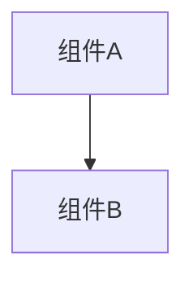

# 变更提案: event_dialog_sync_v1

## 元信息
```yaml
类型: 功能
方案类型: implementation
优先级: P2
状态: 归档(已完成)
创建: 2026-01-21
```

---

## 1. 需求

### 背景
## 背景
`networkplugin/Patch/Network/EventSyncPatch.cs` 通过 Harmony 钩子拦截跑图过程中的 Adventure 事件与 VN 对话选择，并把关键决策同步到多人联机的其他客户端。

当前实现已具备发送/接收的消息类型：
- `OnEventStart`
- `OnEventSelection`
- `OnDialogText`
- `OnDialogOptions`
- `OnEventVoteCast`
- `OnEventVotingResult`

但其中存在多处“仅诊断/断线重连占位”的处理逻辑，尚不能为断线重连/中途加入提供确定性的追赶（catch-up）。

## 问题
多人联机下，事件/对话必须保持所有客户端的进度一致，不能出现分叉。
现状：
- 仅 Host 允许确认选择（权威推进是对的），但
- 非 Host 在断线重连/中途加入时缺少可靠的追赶手段。
- 部分消息在接收端仅记录日志/直接忽略；部分本地落地依赖时序（协程/私有字段），脆弱。

## 目标
1. 确定性推进：所有客户端最终进入同一事件分支。
2. 防回环：远端落地触发的本地 UI/逻辑不应再次广播造成“回声”。
3. 复用现有 `networkplugin/Network` 基础设施（消息类型、客户端事件总线、服务器转发），避免冗余。
4. 在不引入新子系统的前提下，为重连/中途加入扩展“最小可用追赶能力”。

补充边界（按需求定义）：
- “中途加入”指玩家在地图上加入后，应回到其上次退出时的地图节点；进入节点对应关卡及关卡内同步由其他代码负责，本方案不展开。
- 事件触发允许来自非 Host，但最终分支选择与推进仍由 Host 仲裁并广播。

## 非目标（v1）
- 完整序列化每个事件的全部内部状态。
- 保证可回放任意 Yarn 节点的所有副作用。
- 重写网络协议/整体联机架构。
- 处理“进入关卡/关卡内战斗同步”的逻辑（由其他模块负责）。

## 验收标准
- Host 做出对话/事件选择后，所有客户端都能推进到相同分支。
- 当某个 `eventId` 启用投票模式时，所有客户端本地都不能直接推进，只能在 Host 结算并广播最终选择后统一推进。
- 客户端在“对话选项阶段”断线后重连，能够恢复足够上下文继续运行（至少包含：当前 `eventId` + 最新选项 + 最终选择/待落地选择）。

一致性要求（权威模型 B）：
- 非 Host 触发事件时，允许发起“事件开始/请求”，但不允许本地确认导致分叉；最终仍以 Host 广播的 `OnEventSelection` 为准。

## 风险
- UI/Harmony 钩子对时序敏感（协程/私有字段）。
- Yarn 对话阶段可能多次请求本地化文本，需要去重。
- 追赶/回放可能需要新增或复用快照消息（应优先复用 MidGameJoin 能力）。

### 目标
完成 event_dialog_sync_v1 的方案归档，并保证资料在新版知识库结构中可追溯。

### 约束条件
```yaml
时间约束: 无
性能约束: 无
兼容性约束: 无
业务约束: 无
```

### 验收标准
- [√] 资料已迁移并可追溯
- [√] 归档包包含 proposal.md + tasks.md

---

## 2. 方案

### 技术方案
## 设计总览
保持权威模型（B：允许非 Host 触发，但 Host 仲裁）：
- 非 Host 允许触发“事件开始/对话开始”的上报（例如进入某个事件对话），但不允许在本地确认选项推进。
- Host 是唯一会确认并广播 `OnEventSelection` 的一端（投票模式除外：所有人只投票，不直接推进）。
- 非 Host 只负责“应用 Host 的最终选择”，以 Host 广播为准，避免分叉。

中途加入边界（按需求定义）：
- 玩家中途加入后回到其上次退出时的地图节点；进入节点对应关卡以及关卡内同步不在本方案范围内。

复用现有基础设施：
- `INetworkClient.OnGameEventReceived` 作为统一订阅/分发入口。
- `NetworkMessageTypes` 已包含所需消息键。

## 关键改进点（实施口径）

### 1) 统一入站 payload 解析与校验
- 事件/对话消息以 JSON object 为准，按消息类型提取必需字段（`EventId`/`Options`/`OptionId`/`OptionIndex` 等）。
- 允许 `OptionId` 缺失时用 `OptionIndex` 作为补偿，并在本地 phase/options 存在时映射回 `OptionId`。

### 2) 确定性的本地落地（apply）路径
- 收到 `OnEventSelection`：按 `eventId` 写入 pending。
- 仅在 `VnPanel` 运行且处于 `DialogOptionsPhase` 时落地。
- 幂等去重：同一 `eventId` 若已应用同一 `OptionId`，直接清理 pending。
- 落地后清理 pending，避免重复推进。

### 3) 断线重连/中途加入追赶（v1 最小可用）
- Host 缓存当前 `eventId` 的最近 options 与最近确认 selection。
- Host 在 options 阶段周期性重发 `OnDialogOptions`（包含 `OptionId`），便于重连/中途加入追赶。
- Host 在 `PlayerJoined/Welcome/PlayerListUpdate` 到来时限频重发最小快照：`OnEventStart` + `OnDialogOptions` +（如存在）`OnEventSelection`。

### 4) 投票模式完善
- 仅手动注册 `eventId` 才启用投票模式。
- 非 Host 收到 `OnEventVotingResult` 仅用于诊断/等待后续 `OnEventSelection`，真正推进仍以 `OnEventSelection` 为准。

## 验证口径
- 编译通过：`dotnet build networkplugin/NetWorkPlugin.csproj -c Release`
- 手工验证：Host/Client Adventure 对话选择一致；投票事件一致；options 阶段断线重连后能追赶。

### 影响范围
```yaml
涉及模块:
  - networkplugin: 方案/实现/文档更新
预计变更文件: 已完成（归档）
```

### 风险评估
| 风险 | 等级 | 应对 |
|------|------|------|
| 资料迁移遗漏 | 低 | 原始文件保留 + 生成新版归档 |

---

## 3. 技术设计（可选）

> 涉及架构变更、API设计、数据模型变更时填写

### 架构设计


### API设计
#### 无 无
- **请求**: 无
- **响应**: 无

### 数据模型
| 字段 | 类型 | 说明 |
|------|------|------|
| 无 | 无 | 无 |

---

## 4. 核心场景

> 执行完成后同步到对应模块文档

### 场景: 无
**模块**: 无
**条件**: 无
**行为**: 无
**结果**: 无

---

## 5. 技术决策

> 本方案涉及的技术决策，归档后成为决策的唯一完整记录

### event_dialog_sync_v1#D001: 采用现有方案并按新版模板归档
**日期**: 2026-01-21
**状态**: ✅采纳 / ❌废弃 / ⏸搁置
**背景**: 需要将历史方案迁移到统一结构，便于检索与后续维护。
**选项分析**:
| 选项 | 优点 | 缺点 |
|------|------|------|
| A: 直接归档（推荐） | 成本低 | 可能保留历史表述风格 |
| B: 重写方案后归档 | 成本低 | 可能保留历史表述风格 |
**决策**: 选择方案无
**理由**: 保留原文以避免信息丢失，同时补齐索引与结构。
**影响**: networkplugin
