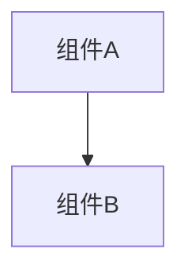

# 变更提案: tradepanel_trade_sync_v1

## 元信息
```yaml
类型: 功能
方案类型: implementation
优先级: P2
状态: 归档(已完成)
创建: 2026-01-21
```

---

## 1. 需求

### 背景
目标：把 TradePanel 的 TODO 从“本地演示”升级为可用的联机交易。

- 采用 Host 权威裁决 + 广播，避免并发/分叉。
- 支持任意两玩家发起交易（v1 默认选择一个远端玩家，后续可加 UI 选择）。
- 完成后各自客户端只落地自己的 deck（模型A）。

### 目标
完成 tradepanel_trade_sync_v1 的方案归档，并保证资料在新版知识库结构中可追溯。

### 约束条件
```yaml
时间约束: 无
性能约束: 无
兼容性约束: 无
业务约束: 无
```

### 验收标准
- [√] 资料已迁移并可追溯
- [√] 归档包包含 proposal.md + tasks.md

---

## 2. 方案

### 技术方案
- 新增 Trade v1 消息类型：`OnTradeStartRequest/OnTradeOfferUpdateRequest/OnTradeConfirmRequest/OnTradeCancelRequest/OnTradeSnapshotRequest/OnTradeStateUpdate`。
- 新增 `TradeSyncPatch`：Host 维护会话状态并广播；Host 自己不收广播则本地补 Apply。
- `TradePanel` 订阅 `TradeSyncPatch.OnTradeStateUpdated` 刷新 UI，并在 Completed 时本地落地交易。
- 交易落地期间抑制部分 deck 同步补丁以避免冗余广播。

### 影响范围
```yaml
涉及模块:
  - networkplugin: 方案/实现/文档更新
预计变更文件: 已完成（归档）
```

### 风险评估
| 风险 | 等级 | 应对 |
|------|------|------|
| 资料迁移遗漏 | 低 | 原始文件保留 + 生成新版归档 |

---

## 3. 技术设计（可选）

> 涉及架构变更、API设计、数据模型变更时填写

### 架构设计


### API设计
#### 无 无
- **请求**: 无
- **响应**: 无

### 数据模型
| 字段 | 类型 | 说明 |
|------|------|------|
| 无 | 无 | 无 |

---

## 4. 核心场景

> 执行完成后同步到对应模块文档

### 场景: 无
**模块**: 无
**条件**: 无
**行为**: 无
**结果**: 无

---

## 5. 技术决策

> 本方案涉及的技术决策，归档后成为决策的唯一完整记录

### tradepanel_trade_sync_v1#D001: 采用现有方案并按新版模板归档
**日期**: 2026-01-21
**状态**: ✅采纳 / ❌废弃 / ⏸搁置
**背景**: 需要将历史方案迁移到统一结构，便于检索与后续维护。
**选项分析**:
| 选项 | 优点 | 缺点 |
|------|------|------|
| A: 直接归档（推荐） | 成本低 | 可能保留历史表述风格 |
| B: 重写方案后归档 | 成本低 | 可能保留历史表述风格 |
**决策**: 选择方案无
**理由**: 保留原文以避免信息丢失，同时补齐索引与结构。
**影响**: networkplugin
