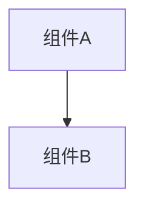

# 变更提案: resurrect_panel_sync_v1

## 元信息
```yaml
类型: 功能
方案类型: implementation
优先级: P2
状态: 归档(已完成)
创建: 2026-01-21
```

---

## 1. 需求

### 背景
## 背景
`networkplugin/UI/Panels/ResurrectPanel.cs` 最初存在“发送复活网络事件”的 TODO，导致复活只能在本地 UI 层完成，无法让联机房间内其他客户端一致。
同时项目已有“假死/复活”补丁（`DeathPatches`/`DeathStateSyncPatch`）与网络身份追踪（`NetworkIdentityTracker`），适合复用而不是重新设计。

## 目标
1. 完成 Gap 场景的“复活他人”联机闭环：发起者请求 -> Host 广播结果 -> 目标本人落地复活。
2. 使用服务端分配的 PlayerId 作为唯一标识（`INetworkPlayer.playerId` / `NetworkIdentityTracker.GetSelfPlayerId()`）。
3. 费用规则：复活后目标 HP = Cost/2；扣费归属为发起者；失败提示（等价退款/延迟扣费）。
4. 避免冗余：复用 `#file:Network` 的 GameEvent 通道与订阅机制。

## 非目标
- v1 不做完整的权威经济系统对账（仅在成功广播后由发起者扣费）。
- v1 不扩展到战斗中复活，仅限 Gap 面板。

## 成功标准
- Gap 复活请求可被 Host 处理并广播；目标玩家客户端可落地复活；发起者成功后扣费、失败提示。
- 不产生回环广播（从网络落地复活会抑制再次同步）。

### 目标
完成 resurrect_panel_sync_v1 的方案归档，并保证资料在新版知识库结构中可追溯。

### 约束条件
```yaml
时间约束: 无
性能约束: 无
兼容性约束: 无
业务约束: 无
```

### 验收标准
- [√] 资料已迁移并可追溯
- [√] 归档包包含 proposal.md + tasks.md

---

## 2. 方案

### 技术方案
## 总体链路
- 数据源：`DeathRegistry` 汇总 `OnPlayerDeathStatusChanged`，供 Gap UI 展示。
- UI 发起：`ResurrectPanel` 选择目标（用 PlayerId），发送 `OnResurrectRequest`。
- Host 仲裁：`ResurrectSyncPatch` 仅 Host 处理请求，校验目标仍在 `DeathRegistry`，计算 `ResurrectionHp = clamp(Cost/2, 1, TargetMaxHp)`，广播 `OnPlayerResurrected`；失败广播 `OnResurrectFailed`。
- 客户端落地：所有人接收广播，但只有 `TargetPlayerId == selfId` 的客户端执行 `DeathPatches.ResurrectPlayer(..., hp)`。
- 扣费：发起者（`RequesterPlayerId == selfId`）在成功回调后 `ConsumeMoney(cost)`；失败提示即等价退款。

## 关键实现点
- PlayerId：服务端分配并在 Welcome/PlayerListUpdate 中下发，客户端通过 `NetworkIdentityTracker` 获取 selfId。
- 防回环：目标端从广播落地复活时将 `DeathPatches.SuppressNetworkSync = true`，避免复活再触发网络同步。
- Host 不会收到自身广播：`DeathPatches` 在发送死亡/复活同步时同时更新本地 `DeathRegistry`，确保 Host 也能看到“死者列表”。

## 复用点（避免冗余）
- `INetworkClient.SendGameEventData(...)` / `OnGameEventReceived`。
- `NetworkIdentityTracker` 维护 PlayerId/Host 标志。
- 既有 `DeathPatches` 的复活落地入口。

### 影响范围
```yaml
涉及模块:
  - networkplugin: 方案/实现/文档更新
预计变更文件: 已完成（归档）
```

### 风险评估
| 风险 | 等级 | 应对 |
|------|------|------|
| 资料迁移遗漏 | 低 | 原始文件保留 + 生成新版归档 |

---

## 3. 技术设计（可选）

> 涉及架构变更、API设计、数据模型变更时填写

### 架构设计


### API设计
#### 无 无
- **请求**: 无
- **响应**: 无

### 数据模型
| 字段 | 类型 | 说明 |
|------|------|------|
| 无 | 无 | 无 |

---

## 4. 核心场景

> 执行完成后同步到对应模块文档

### 场景: 无
**模块**: 无
**条件**: 无
**行为**: 无
**结果**: 无

---

## 5. 技术决策

> 本方案涉及的技术决策，归档后成为决策的唯一完整记录

### resurrect_panel_sync_v1#D001: 采用现有方案并按新版模板归档
**日期**: 2026-01-21
**状态**: ✅采纳 / ❌废弃 / ⏸搁置
**背景**: 需要将历史方案迁移到统一结构，便于检索与后续维护。
**选项分析**:
| 选项 | 优点 | 缺点 |
|------|------|------|
| A: 直接归档（推荐） | 成本低 | 可能保留历史表述风格 |
| B: 重写方案后归档 | 成本低 | 可能保留历史表述风格 |
**决策**: 选择方案无
**理由**: 保留原文以避免信息丢失，同时补齐索引与结构。
**影响**: networkplugin
