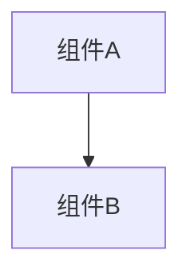

# 变更提案: tradepanel_trade_sync_v2

## 元信息
```yaml
类型: 功能
方案类型: implementation
优先级: P2
状态: 归档(已完成)
创建: 2026-01-21
```

---

## 1. 需求

### 背景
## 背景
当前 `networkplugin/UI/Panels/TradePanel.cs` 中仍存在一个 TODO：
- `ExecuteTrade()` 的单机分支里，对玩家2的卡牌只做了本地 `AddDeckCard`，缺少“从对方卡组移除”的真实多玩家卡组操作。

与此同时，联机分支已经基本改造为：
- Host 权威裁决 + 广播状态（`networkplugin/Patch/Network/TradeSyncPatch.cs`）。
- 客户端在交易完成后，仅对“自己本地 GameRun 的 deck”落地（remove 自己报价，create+add 对方报价）。

因此 v2 的目标不是再造一套体系，而是：
1) 明确 TODO 的真实含义与范围（单机演示 vs 联机交易）。
2) 补齐 v1 方案的安全性/一致性/可维护性，完善“补丁方法”（TradeSyncPatch / UI Patch / 校验策略）。
3) 将设计沉淀到方案库，供你调整后再进入实施。

## v2 目标
- 明确并收敛 TradePanel 在“非联机”时的行为：仅联机可用（未连接则禁用并提示）。
- 扩展交易范围：卡牌、道具（Tool 卡）、金币、Exhibit 都可交易。
- 强化状态机规则与错误语义：找不到/不满足前置条件则直接视为失败（不做模糊匹配）。
- 复用 `networkplugin/Network` 现有通用设施（身份、玩家列表、消息类型等），避免冗余实现。

## 成功标准
- 联机：两端(或多端旁观)看到一致的 TradeSessionState；参与者能正常 offer/confirm/cancel；完成后双方 deck 对齐。
- 安全：Host 能拒绝明显非法请求（如非参与者发起、Offer 数量超限、重复/异常请求）。
- 维护：TradeSyncPatch 的职责边界清晰；TradePanel 的 TODO 不再“指向不存在的联机能力”。

## 约束（由你确认）
- 仅联机可用；不提供“旁观者发起交易”（仅参与者可发起与确认）。
- 不在 Host 侧校验 `InstanceId` 是否属于请求者；但客户端落地仍会用 `InstanceId` 做“移除自己报价”的精确定位。
- 不做模糊匹配：移除卡/道具、移除 exhibit、扣金币任一失败，视为交易失败（并在 UI 给出明确提示）。

### 目标
完成 tradepanel_trade_sync_v2 的方案归档，并保证资料在新版知识库结构中可追溯。

### 约束条件
```yaml
时间约束: 无
性能约束: 无
兼容性约束: 无
业务约束: 无
```

### 验收标准
- [√] 资料已迁移并可追溯
- [√] 归档包包含 proposal.md + tasks.md

---

## 2. 方案

### 技术方案
## 1. 范围界定：单机 TODO 的处理策略
`TradePanel.ExecuteTrade()` 的 TODO 位于“非联机分支”。在联机模式下已经走 `ApplyNetworkTradeAndClose()`，并不会执行该 TODO。

v2 决策（你已确认）：
- TradePanel 的“交易”仅作为联机功能；若未连接网络，则 UI 提示并禁用确认/执行交易。

理由：项目架构中每个客户端只有自己的 `GameRun`；远端玩家的 deck 不在本机可被直接移除，因此“单机分支实现多玩家卡组操作”在架构上不成立。

## 2. 联机交易：状态机与职责边界
### 2.1 Host 权威状态机（TradeSyncPatch）
- 会话状态：`TradeSessionState`
  - 参与者：`PlayerAId/PlayerBId`
  - 报价：`OfferA/OfferB` (List<CardRef>)
  - 确认：`AConfirmed/BConfirmed`
  - 状态：`Open/Completed/Canceled/Failed`

- 核心规则：
  1) 只有 Host 处理请求（Start/Offer/Confirm/Cancel/SnapshotRequest）。
  2) Offer 更新必须重置双方确认，避免确认后偷改报价。
  3) 达成 Completed 的条件：AConfirmed && BConfirmed。
  4) SnapshotRequest：仅参与者可请求；Host 回 `OnTradeStateUpdate`。

### 2.1.1 参与者约束（你已确认）
- 不提供“旁观者发起交易”：只有 A/B 参与者才允许 Start/Offer/Confirm/Cancel/Snapshot。

### 2.1.2 扩展为多物品交易（v2 新增）
现有 `TradeSessionState` 只包含 `OfferA/OfferB`（卡牌引用）。v2 需要扩展为：
- 卡牌（含 Tool 卡）：仍使用 `CardRef` 列表表达（Tool 即 `CardType.Tool`）。
- 金币：新增 `MoneyA/MoneyB`（int）。
- Exhibit：新增 `ExhibitA/ExhibitB`（列表，元素至少包含 `ExhibitId`）。

建议的最小字段（广播态）示意：
- `OfferA/OfferB`: List<CardRef>
- `MoneyA/MoneyB`: int
- `ExhibitsA/ExhibitsB`: List<ExhibitRef>

其中 `ExhibitRef` 最小可用字段：
- `ExhibitId`（string）
- （可选）`LosableType`（用于 UI 提示/前置校验）

失败语义（你已确认）：
- 任何一类物品在落地时“找不到/不可移除/金币不足/重复 exhibit”等，直接判为交易失败（不做模糊匹配与自动修复）。

### 2.2 Client UI（TradePanel）
- player1 固定代表本地玩家（可交互：Add/Remove 卡牌；填写金币；选择 exhibit）。
- player2 代表远端玩家（只读展示）：
  - 卡牌：UI 通过 `TryCreateDisplayCard(CardRef)` 构造临时卡用于显示。
  - 金币：显示对方的出价数值。
  - exhibit：显示对方 exhibit 列表。
  - 需要确保对方区域锁定后无法触发移除（依赖 `TradeSlotWidget.SetLocked(true)` 或新的 exhibit slot lock 实现）。

- 订阅：
  - `TradeSyncPatch.OnTradeStateUpdated` -> `TradePanel.OnTradeStateUpdated()`。
  - 面板关闭时取消订阅，避免重复回调。

### 2.2.1 选择玩家 UI（你已确认：需要）
v2 需要新增一个“选择交易对象”的 UI 流程：
- 数据来源：房间内玩家列表（优先复用 `NetworkManager` 的缓存查询能力；次选使用 `NetworkIdentityTracker` 的 player id 列表快照）。
- 行为：打开 TradePanel 时若 `payload.Player2Id` 为空，则弹出选择列表；选择后设置 `_playerBId` 并发起 `RequestStartTrade`。
- 约束：不提供旁观者发起交易，因此发起者必须是 A 或 B。

## 3. v2 “完善补丁方法”的具体改进点
### 3.1 请求幂等与乱序处理（建议增强）
现状：TradeSyncPatch 发送请求包含 `RequestId`，但 Host 侧没有去重。
建议：
- Host 维护 per-trade 的最近 N 个 RequestId 集合（或 Timestamp+Requester 的窗口去重），拒绝重复请求。
- Host 对过期 Timestamp/明显乱序的请求可直接忽略（轻度保护，避免回滚）。

### 3.2 Host 侧“参与者与权限”校验（建议增强）
- StartTrade：拒绝 a/b 为空、相同、或不在房间玩家列表中的情况。
- OfferUpdate/Confirm/Cancel/Snapshot：拒绝非参与者。

可复用：
- `NetworkIdentityTracker`（自我是否 Host、自我 PlayerId）。
- `NetworkManager`（如存在可用 API：查询房间玩家列表/数量；参考 `helloagents/wiki/modules/networkplugin.md` 的说明）。

### 3.3 Offer 合法性校验（按你确认的取舍）
现状：Host 接收 Offer 仅做 MaxTradeSlots 截断 + 简单去重。
v2 约束：不做 `InstanceId` 归属校验。
建议：保留 L1 结构校验即可：
- 卡牌：CardId 非空、数量<=MaxTradeSlots、去重、字段范围合理。
- 金币：>=0，且可选设置上限（防止极端值）。
- Exhibit：ExhibitId 非空、去重。

### 3.4 Completed 后的落地一致性
现状：`TradePanel.ApplyNetworkTradeAndClose()`：
- remove 自己报价：优先按 InstanceId 查找 deck card。
- add 对方报价：按 CardId/Upgrade 创建新卡加入 deck。

v2 决策（你已确认）：
- 不做模糊匹配：如果 InstanceId 找不到对应卡牌，视为交易失败。
- 交易落地期间使用 `TradeSyncPatch.EnterApplyingTradeScope()`，并保证所有相关 deck 同步补丁都尊重该标记（目前 `PotionToolSyncPatch` 已有处理点）。

### 3.4.1 金币落地（LBoL API 锚点）
LBoL 的金币入口在 `lbol/LBoL.Core/GameRunController.cs`：
- `GainMoney(int money, ...)`
- `ConsumeMoney(int cost)`（不足会抛异常）
- `LoseMoney(int money)`（不会小于 0）

交易落地建议：
- 自己出金币：使用 `ConsumeMoney(amount)`（不足=失败）。
- 获得对方金币：使用 `GainMoney(amount, triggerVisual: true, sourceData: ...)`。

### 3.4.2 Exhibit 落地（LBoL API 锚点）
Exhibit 入口同样在 `lbol/LBoL.Core/GameRunController.cs`：
- 获得：`GainExhibitRunner` / `GainExhibitInstantly`
- 失去：`LoseExhibit(Exhibit exhibit, ...)`

交易落地建议：
- 移除自己给出的 Exhibit：先在 `Player.Exhibits` 中按 `Id` 找到实例，再调用 `GameRun.LoseExhibit(exhibit, ...)`；找不到=失败。
- 获得对方 Exhibit：按 `ExhibitId` 调用 `Library.CreateExhibit(exhibitId)` 创建，再 `GainExhibitRunner/Instantly`；若已拥有同种 Exhibit 会抛异常，视为失败。

### 3.4.4 Exhibit 可交易过滤规则（你已确认的额外约束）
你希望 Exhibit 交易满足两条：
1) 默认只允许 `LosableType == Losable` 的 Exhibit。
2) 另有一个“不可交易清单”，其中列出的 Exhibit 即使是 Losable 也不能交易。

实现建议（基于你已确认的前提）：
- 你确认所有 `Exhibit.Id` 都是“纯英文字母”，因此可以直接用 C# 枚举值名来表达 ExhibitId。
- 我们将实现一个黑名单枚举，例如 `NonTradableExhibits`，其枚举值名称与 ExhibitId 完全一致。
- 判断逻辑：当 `exhibit.Id` 命中该枚举（字符串解析/哈希集合）时，禁止交易。

这样你后续维护黑名单时，只需要在枚举里新增一个同名条目即可。

### 3.4.3 Tool（道具卡）落地
定义：LBoL 中“道具/药水”是 `CardType.Tool` 的卡牌，相关同步补丁参考：`networkplugin/Patch/Network/PotionToolSyncPatch.cs`。
交易落地：与普通卡牌一致（remove 自己报价 / create+add 对方报价）。

### 3.5 UI Patch 的稳健性
现状：`GapOptionsPanel_Patch.GetOrCreateTradePanel()` 已避免裸创建 TradePanel（序列化字段会为空）。
v2 建议：
- 明确 TradePanel 的“可用性判定”：若场景中找不到预制体实例，直接提示不可用。
- 对 ShopTradeIconPatch 同样统一提示语，避免两个入口行为不一致。

## 4. 需要你确认/补充的信息（影响设计选择）
已确认：
1) 仅联机可用。
2) 增加 UI 让玩家选择 Player2。
3) 不需要旁观发起交易。
4) 不需要 Host 校验 InstanceId。
5) 不做模糊匹配，找不到即失败。
6) 卡牌/道具/金币/Exhibit 都需要可交易。

### 影响范围
```yaml
涉及模块:
  - networkplugin: 方案/实现/文档更新
预计变更文件: 已完成（归档）
```

### 风险评估
| 风险 | 等级 | 应对 |
|------|------|------|
| 资料迁移遗漏 | 低 | 原始文件保留 + 生成新版归档 |

---

## 3. 技术设计（可选）

> 涉及架构变更、API设计、数据模型变更时填写

### 架构设计


### API设计
#### 无 无
- **请求**: 无
- **响应**: 无

### 数据模型
| 字段 | 类型 | 说明 |
|------|------|------|
| 无 | 无 | 无 |

---

## 4. 核心场景

> 执行完成后同步到对应模块文档

### 场景: 无
**模块**: 无
**条件**: 无
**行为**: 无
**结果**: 无

---

## 5. 技术决策

> 本方案涉及的技术决策，归档后成为决策的唯一完整记录

### tradepanel_trade_sync_v2#D001: 采用现有方案并按新版模板归档
**日期**: 2026-01-21
**状态**: ✅采纳 / ❌废弃 / ⏸搁置
**背景**: 需要将历史方案迁移到统一结构，便于检索与后续维护。
**选项分析**:
| 选项 | 优点 | 缺点 |
|------|------|------|
| A: 直接归档（推荐） | 成本低 | 可能保留历史表述风格 |
| B: 重写方案后归档 | 成本低 | 可能保留历史表述风格 |
**决策**: 选择方案无
**理由**: 保留原文以避免信息丢失，同时补齐索引与结构。
**影响**: networkplugin
