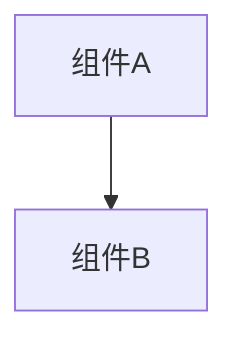

# 变更提案: saveload_sync_apply_host_snapshot_v1

## 元信息
```yaml
类型: 功能
方案类型: implementation
优先级: P2
状态: 归档(已完成)
创建: 2026-01-21
```

---

## 1. 需求

### 背景
## 背景
当前补丁文件里有一个 TODO：需要把“来自主机的同步数据”真正应用到本地游戏。

但你已经明确了：
这次要解决的不是“把所有人强行拉回同一条进度/同一个节点”，而是解决 **房间/战斗残局同步**。

用通俗的话说：
- 大家可以各走各的节点。
- 如果客机进入了主机没走过的节点：就用已经同步过、和主机一致的随机种子来本地生成怪物/内容。
- 关键是“同一个房间/同一场战斗”：谁先进去，就把这个房间里怪物的真实状态（血量/格挡/护盾/状态/意图等）上传给主机；主机再同步给其他人。
- 其他人后来进入这个房间：要能直接看到并应用残局；如果战斗已经结束，就应该直接领取奖励（不再重打一遍）。

## 需求（你刚刚拍板的规则）
1) 主机不主动“推全局存档同步”来统一路线；大家可以分线探索。
2) 房间/战斗以“先进入的人”为权威来源：先进入的人把房间信息上传到主机，主机作为中枢转发给其他人。
3) 客机遇到“主机/他人没走过”的节点：按同步过的随机种子在本地生成。
4) 存档槽位编号从 1 开始算（如仍保留存档相关请求）。
5) 需要同时覆盖直连与 Relay。

## 问题与根因（为什么需要做这一套）
1) 没有“房间状态中枢”，其他人进入同一房间时只能重新生成/重新开战
- 结果就是：同一房间在不同玩家那里出现不同的怪物、不同的血量，甚至出现“别人已经打完了你还要再打一遍”。

2) 仅同步随机种子不够
- 随机种子只能保证“没走过的房间怎么生成”。
- 一旦房间已经开战/战斗进行中/战斗结束，关键就变成“残局状态与奖励结果”，这必须靠房间快照同步。

3) 需要一个稳定的“房间标识”（RoomKey）
- 主机要能知道你说的是哪个房间；其他人也要能用同一个标识去查询/应用。
- RoomKey 怎么取（地图节点坐标/索引/路径/层数等），必须在实现阶段从原游戏代码（lbol/）里找一个稳定、可复现的口径。

4) 网络路由必须可靠
- 新的房间同步消息需要在直连与 Relay 都能正确到达“主机中枢”和目标客户端，否则同步会丢。

## 目标（成功标准）
- 任意玩家进入某房间并触发战斗：
  - 生成阶段：把该房间的怪物列表（种类/数量）与初始状态上传到主机。
  - 战斗阶段：把怪物的血量/格挡/护盾/状态/意图等关键变化上传到主机（可按回合节流）。
  - 结束阶段：把“战斗已结束 + 奖励结果”上传到主机。
- 其他玩家进入同一房间：
  - 若战斗进行中：应用残局（生成对应怪物并把状态改到一致）。
  - 若战斗已结束：直接应用“已清房”状态并领取对应奖励。

## 约束与原则
- 不追求 100% 完美，但要做到：不崩溃、可诊断、同步失败可降级（例如退回到本地生成/提示不同步）。
- 事件尽量单播（请求/响应定向），避免状态风暴。
- SaveSlot 若继续沿用（存档相关）：槽位编号从 1 开始算。

### 目标
完成 saveload_sync_apply_host_snapshot_v1 的方案归档，并保证资料在新版知识库结构中可追溯。

### 约束条件
```yaml
时间约束: 无
性能约束: 无
兼容性约束: 无
业务约束: 无
```

### 验收标准
- [√] 资料已迁移并可追溯
- [√] 归档包包含 proposal.md + tasks.md

---

## 2. 方案

### 技术方案
## 总体思路
把 TODO 的“应用主机同步数据”按你最新规则拆成三件事：
1) **房间标识层（RoomKey）**：让主机与所有客户端能一致地指向“同一个房间/节点”。
2) **房间状态中枢层（主机缓存与分发）**：谁先进入房间（或先开战）就把房间信息上传到主机；主机把最新房间状态同步给其他人。
3) **客户端应用层（生成 + 奖励/残局应用）**：其他人进入该房间时，按主机提供的怪物清单生成对应怪物，并把血量/格挡/护盾/状态/意图等改到一致；若战斗已结束则直接应用“已清房”并领取奖励。

## 协议与数据契约

### 事件类型
统一使用 `NetworkMessageTypes` 常量（避免硬编码字符串）。

建议新增/复用的事件类型（名称可在实现时对齐项目已有风格）：
- `RoomStateRequest`：玩家即将进入/已进入某房间时，向主机请求该房间的最新状态。
- `RoomStateResponse`：主机把该房间的状态回给请求方（单播）。
- `RoomStateUpload`：先进入的人把该房间“当前权威状态”上传给主机（单播到主机）。
- `RoomStateBroadcast`（可选）：主机把更新推给所有人（广播或按订阅推送）。

仍可保留：
- `SaveSyncRequest/SaveSyncResponse`（如果你还想保留“按存档槽编号请求”的入口），但它的语义应当转为“请求房间/节点快照”，而不是恢复整局存档。

### RoomStateRequest Payload（建议，LAN 简化，不做防刷）
字段（平铺，便于现有 JSON 反序列化逻辑）：
- `Timestamp` (long)
- `RequesterId` (string)  // 客户端 PlayerId
- `RoomKey` (string)      // 房间唯一标识（关键）
- `SaveSlot` (int, optional) // 若仍挂在存档槽入口下：槽位编号从 1 开始
- `RequestType` (string)  // "RoomState" | "RoomOutcome" 等
- `RoomSeed` (long, optional) // 若该房间未同步过，可用于本地生成一致怪物
- `RoomVersion` (long, optional) // 乐观并发控制：请求方已知的版本号

### RoomStateResponse Payload（建议，满足“残局应用/已清房领奖励”）
- `Timestamp` (long)
- `RequesterId` (string)
- `HostId` (string)
- `RoomKey` (string)
- `RoomVersion` (long) // 主机侧递增版本
- `RoomPhase` (string) // "NotVisited" | "InBattle" | "BattleFinished" | "RewardClaimed" 等
- `RoomSeed` (long, optional)
- `Enemies` (list)
  - 每个敌人至少需要：
    - `EnemyId`/`EnemyName`（用于生成）
    - `Index`（同类多只时稳定排序）
    - `Hp`/`MaxHp`/`Block`/`Shield`
    - `StatusEffects`（可简化：只同步关键状态）
    - `Intention`（可选，尽力）
- `RoomOutcome` (object, optional)
  - 用于战斗结束后“直接拿奖励”的信息（例如奖励类型、数量、已领取标记）。
- `ErrorMessage` (string, optional)

重点：
- 本方案不再依赖 `RestoreGameRun(GameRunSaveData)` 来“重建整局进度”。
- 进入房间时，客户端按 `Enemies` 清单生成对应怪物，再把状态调到一致。

## 可靠收发层设计（关键）

### 1) 客户端 IsGameEvent 白名单
`NetworkClient.IsGameEvent(...)` 需要把“房间同步”相关消息纳入 GameEvent 处理，否则会被丢弃。
至少包括：
- `RoomStateRequest/RoomStateResponse/RoomStateUpload`（以及可选 `RoomStateBroadcast`）
若继续沿用 `SaveSync*` 名称，也需要纳入。

### 2) 直连/Host 模式：NetworkServer 路由
`NetworkServer.IsGameEvent(...)` 同样需要纳入以上类型。
并在 `HandleGameEvent(...)` 中实现路由策略（核心就是“主机是中枢”）：
- `RoomStateRequest`：定向转发给房主/主机逻辑处理后单播回应。
- `RoomStateUpload`：只允许上传到主机，由主机更新缓存版本后再响应/广播。
- `RoomStateResponse`：仅单播给请求方。

### 3) Relay 模式：RelayServer 识别与路由
Relay 也需要识别并转发上述房间同步事件：
- Request -> host
- Upload -> host
- Response -> requester/target
确保直连与 Relay 行为一致。

## 落地应用层设计（实现 TODO）

### A) 房间状态缓存（主机侧）
目标：主机作为中枢，缓存每个 RoomKey 的“最新权威状态”。

主机侧维护：
- `Dictionary<RoomKey, RoomStateSnapshot>`（含 RoomVersion）

更新来源：
- `RoomStateUpload`：由先进入的人上传。
- 主机可做校验：同一 RoomKey 只接受更高版本/更新的 Timestamp。

对外服务：
- `RoomStateRequest`：主机查缓存 -> 回 `RoomStateResponse`。
- 可选：当主机缓存更新时，广播 `RoomStateBroadcast` 给其他人（减少请求等待）。

### B) 房间进入时请求与应用（客户端侧）
目标：进入房间时，能“应用残局”或“直接领奖励”。

流程（建议）：
1. 客户端检测到即将进入/已进入房间（实现阶段从 lbol/ 找到合适的 Hook 点）。
2. 发送 `RoomStateRequest(RoomKey, RoomVersion)` 给主机。
3. 收到 `RoomStateResponse`：
   - `RoomPhase == NotVisited`：按 `RoomSeed`/同步 RNG 规则本地生成。
   - `RoomPhase == InBattle`：按 `Enemies` 清单生成对应怪物，并把状态改到一致（残局）。
   - `RoomPhase == BattleFinished`：直接应用“战斗结束”并发放/展示奖励（不再开战）。

说明：你要求“看起来像同一只怪”，本方案按“种类+序号+状态”重建，不依赖唯一 SpawnId。

### C) 战斗过程上传（先进入者 -> 主机）
目标：先进入的人持续把战斗状态上报，保证后来者进来能接上残局。

建议上报时机（实现时可按性能调整）：
- 战斗开始：上传一次完整初始敌人列表。
- 每回合开始/结束：上传一次（推荐），包含敌人状态与 RoomPhase。
- 战斗结束：上传一次 RoomOutcome（奖励信息）并标记 RoomPhase。

### 核心映射策略（建议）
- PlayerId 统一使用 `NetworkIdentityTracker` 分配的 playerId。
- RoomKey 必须稳定且可复现：需要从 lbol/ 里找到“地图节点唯一信息”的正确口径（例如层数+节点索引+路径）。
- 敌人对齐采用“EnemyId/类型 + Index + 状态”，避免依赖唯一 SpawnId。

## 并发、幂等、节流
- LAN 环境下不做防刷；但主机缓存与客户端应用仍建议按 `RoomVersion/Timestamp` 做幂等，只接受更“新”的状态。
- Request/Response 尽量单播；Broadcast 可选，避免状态风暴。

## 观测与日志
建议输出关键字段：
- RoomKey、RoomPhase、RoomVersion、上传者/请求者/主机 Id
- 应用阶段：生成了多少敌人、是否应用了残局、是否直接发放奖励
- 降级原因：无缓存/解析失败/RoomKey 不一致/敌人生成失败等

## 与现有模块的关系
本方案将主要复用：
- 现有网络事件收发与路由（直连与 Relay）。
- 现有玩家身份与房主判断（`NetworkIdentityTracker` 等）。

本方案将主要新增：
- RoomKey 的提取逻辑（来自 lbol/ 的地图/房间信息）。
- 房间状态快照的数据结构与主机缓存。
- 客户端“房间进入时请求 + 残局/奖励应用器”。

### 影响范围
```yaml
涉及模块:
  - networkplugin: 方案/实现/文档更新
预计变更文件: 已完成（归档）
```

### 风险评估
| 风险 | 等级 | 应对 |
|------|------|------|
| 资料迁移遗漏 | 低 | 原始文件保留 + 生成新版归档 |

---

## 3. 技术设计（可选）

> 涉及架构变更、API设计、数据模型变更时填写

### 架构设计


### API设计
#### 无 无
- **请求**: 无
- **响应**: 无

### 数据模型
| 字段 | 类型 | 说明 |
|------|------|------|
| 无 | 无 | 无 |

---

## 4. 核心场景

> 执行完成后同步到对应模块文档

### 场景: 无
**模块**: 无
**条件**: 无
**行为**: 无
**结果**: 无

---

## 5. 技术决策

> 本方案涉及的技术决策，归档后成为决策的唯一完整记录

### saveload_sync_apply_host_snapshot_v1#D001: 采用现有方案并按新版模板归档
**日期**: 2026-01-21
**状态**: ✅采纳 / ❌废弃 / ⏸搁置
**背景**: 需要将历史方案迁移到统一结构，便于检索与后续维护。
**选项分析**:
| 选项 | 优点 | 缺点 |
|------|------|------|
| A: 直接归档（推荐） | 成本低 | 可能保留历史表述风格 |
| B: 重写方案后归档 | 成本低 | 可能保留历史表述风格 |
**决策**: 选择方案无
**理由**: 保留原文以避免信息丢失，同时补齐索引与结构。
**影响**: networkplugin
