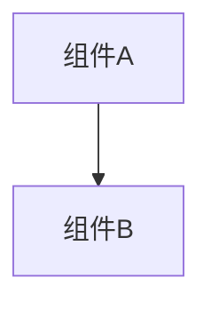

# 变更提案: fix_endturn_gameevent_routing

## 元信息
```yaml
类型: 修复
方案类型: implementation
优先级: P0
状态: 草稿
创建: 2026-01-28
```

---

## 1. 需求

### 背景
`LogOutput.log` 显示在 Host 单人（只有房主一人连接到本地 127.0.0.1:7777）情况下，点击结束回合后客户端会发送 `EndTurnRequest/EndTurnStatus/EndTurnConfirm`，但服务器侧打印 `未知系统消息类型` 并丢弃这些消息，导致回合结束协商无法完成。

同样，`CardStateChanged` 也会被服务器打印为未知系统消息，说明服务器端 GameEvent 分类规则遗漏了部分事件名。

### 目标
修复服务器端对 GameEvent 的分类，使 `EndTurnRequest/EndTurnStatus/EndTurnConfirm` 与 `CardStateChanged` 进入 GameEvent 通道进行转发/广播，从而保证 EndTurnSyncPatch 的确认链路能走完，单房主也可以正常结束回合。

### 约束条件
```yaml
时间约束: 无
性能约束: 不增加热路径开销（仅增加少量 string 比较）
兼容性约束: 不改变协议字段与事件名（只修正服务器端分类）
业务约束: 不引入破坏性操作
```

### 验收标准
- [ ] 服务器不再打印 `未知系统消息类型: EndTurnRequest/EndTurnStatus/EndTurnConfirm`
- [ ] 服务器不再打印 `未知系统消息类型: CardStateChanged`
- [ ] Host 单人模式下点击结束回合可以正常进入敌方回合（或下一回合），无卡死

---

## 2. 方案

### 技术方案
在服务器消息分发的 `IsGameEvent(string messageType)` 判定中补充白名单：将 `NetworkMessageTypes.EndTurnRequest/EndTurnStatus/EndTurnConfirm/CardStateChanged` 视为 GameEvent。

Host/直连模式修改 `NetworkServer`，Relay 模式修改 `RelayServer`。

### 影响范围
```yaml
涉及模块:
  - networkplugin/Network/Server: 修复消息分类与转发
预计变更文件: 2
```

### 风险评估
| 风险 | 等级 | 应对 |
|------|------|------|
| 错误将 SystemMessage 误判为 GameEvent | 低 | 仅对明确的 4 个类型加入白名单，并保持其他规则不变 |
| Relay/Host 行为不一致 | 中 | 同步修改 `NetworkServer` 与 `RelayServer` 的判定 |

---

## 3. 技术设计（可选）

> 涉及架构变更、API设计、数据模型变更时填写

### 架构设计


### API设计
#### {METHOD} {路径}
- **请求**: {结构}
- **响应**: {结构}

### 数据模型
| 字段 | 类型 | 说明 |
|------|------|------|
| {字段} | {类型} | {说明} |

---

## 4. 核心场景

> 执行完成后同步到对应模块文档

### 场景: {场景名称}
**模块**: {所属模块}
**条件**: {前置条件}
**行为**: {操作描述}
**结果**: {预期结果}

---

## 5. 技术决策

> 本方案涉及的技术决策，归档后成为决策的唯一完整记录

### fix_endturn_gameevent_routing#D001: {决策标题}
**日期**: 2026-01-28
**状态**: ✅采纳 / ❌废弃 / ⏸搁置
**背景**: 当前服务器端 `IsGameEvent` 主要按前缀判断（On/Mana/Gap/Battle），未覆盖 EndTurn*/CardStateChanged，导致它们落入系统消息处理并被丢弃。
**选项分析**:
| 选项 | 优点 | 缺点 |
|------|------|------|
| A: 在 server `IsGameEvent` 增加白名单（推荐） | 改动小、风险低、快速修复 | 需要维护白名单 |
| B: 改为完全基于 `NetworkMessageTypes` 自动判定 | 一致性更强 | 改动面大，容易引入回归 |
**决策**: 选择方案A
**理由**: 目标是修复卡回合的阻断问题，优先选择最小改动并保持协议不变。
**影响**: networkplugin/Network/Server 下的 Host/Relay 分发逻辑
