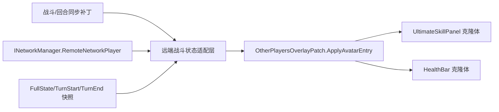

# 变更提案: otherplayers-overlay-native-ui

## 元信息
```yaml
类型: 新功能 + UI重构
方案类型: implementation
优先级: P1
状态: 草稿（AUTO_PLAN）
创建: 2026-03-07
复杂度: 标准开发
来源: `~plan` - OtherPlayersOverlay 原生化 UI 改造
```

---

## 0. 执行前范围确认

```yaml
用户目标:
  - 将 `NetworkPlugin_OtherPlayersOverlay` 做成游戏内原生 UI 风格
  - 复用 `UltimateSkillPanel` 作为头像条主体
  - 将图标替换为在线玩家角色头像
  - 将原 Ultimate Spell 充能区替换为对应在线玩家的符卡积攒能量
  - 在右侧增加与战斗中 spine 小人立绘下方一致的血条
本方案覆盖:
  - 战斗场景中的 `OtherPlayersOverlay` 卡片外观与数据绑定
  - 为远端玩家补足“当前符卡积攒能量”数值同步链路
  - 复用原生血条组件并保持 `BaseMana` 锚定逻辑
本方案不覆盖:
  - 地图头像图标 UI 改造
  - `TradePanel` 选择器 UI 改造
  - 观战模式、局外界面或房间列表样式重做
```

---

## 1. 需求

### 背景
当前 `OtherPlayersOverlay` 虽然已经借用了 `UltimateSkillPanel` 作为运行时模板，但实际只保留了头像壳子，主动隐藏了 `powerText`、`gauge1-3` 与粒子效果；同时只显示玩家名/在线状态，没有原生战斗血条，也没有远端玩家的实时符卡积攒能量。

现状与目标之间存在两个关键落差：

1. **视觉层落差**：当前 UI 更像“简化版头像条”，不是游戏内原生战斗控件。
2. **数据层落差**：`PlayerSummary` 只缓存房间/位置/角色等轻量信息，无法直接支撑 HP/Shield/Block 与“当前符卡积攒能量”显示；而 `INetworkPlayer.ultimatePower` 现有语义是 `bool`（终极技能可用/充能完成状态），并不能表示当前积攒进度。

### 目标
1. 在不破坏现有 `OtherPlayersOverlayPatch` 门面和 `BaseMana` 锚定逻辑的前提下，将战斗中的远端玩家卡片替换为“原生 Ultimate Spell + 原生血条”组合。
2. 头像区域显示远端玩家角色头像，而不是本地 Ultimate Skill 图标。
3. 充能区域显示远端玩家的**当前符卡积攒能量数值与三段进度条**，语义与本地 `UltimateSkillPanel` 保持一致。
4. 右侧血条显示远端玩家的 HP/Shield/Block，视觉上与战斗中立绘下方血条一致。
5. 多人联机时仍保留房主标记、名字统一解析、离线置灰、横向排布与现有 overlay 生命周期行为。

### 约束条件
```yaml
兼容性约束:
  - 保持 `networkplugin/Patch/UI/OtherPlayersOverlayPatch.cs` 现有静态 façade 与 Harmony 入口稳定
  - 保持 `NetworkPlugin_OtherPlayersOverlay` 挂在 `BaseMana` 的同级容器，不能回退为 `BaseMana` 子节点
UI约束:
  - 优先复用运行时原生控件，不手写“仿制版” Ultimate Spell 或血条皮肤
  - 头像、充能条、血条都必须支持离线置灰/隐藏回退
数据约束:
  - 不能复用 `INetworkPlayer.ultimatePower` 的 bool 语义冒充“当前充能数值”
  - 需要为远端玩家补足可持续读取的 `CurrentPower/PowerPerLevel` 之类数值来源
性能约束:
  - 模板与血条控件应缓存复用，避免每帧实例化/销毁
  - UI 刷新应尽量只更新数值与 fillAmount，不反复重建节点
```

### 验收标准
- [ ] 战斗场景中，每个远端玩家条目以 `UltimateSkillPanel` 风格呈现，且图标显示角色头像。
- [ ] 原本被隐藏的 `powerText`、`gauge1-3` 恢复为远端玩家符卡积攒能量显示，数值不是本地玩家数据，也不是单纯 bool 状态。
- [ ] 每个远端玩家条目右侧显示与战斗中原生 `HealthBar` 一致的血条，并能反映 HP/Shield/Block。
- [ ] 仍保持 `ResolveDisplayName(...)`、房主标记、在线/离线状态、`BaseMana` 同级锚定与横向排布逻辑。
- [ ] `dotnet build networkplugin/NetWorkPlugin.csproj -v minimal` 通过；多人战斗场景下完成至少一轮“受伤/治疗/获得格挡/积攒符卡能量/使用符卡”回归。

---

## 2. 方案

### 2.1 推荐方案
采用“**原生控件运行时复用 + Overlay 专用战斗状态适配层**”方案：

1. **视觉骨架**：继续以 `UltimateSkillPanel` 作为头像条主体，但不再整体隐藏 `powerText` / `gauge1-3`，只关闭交互、Tooltip 与粒子效果。
2. **头像替换**：将 `skillImage` 的 sprite 改为角色头像（优先使用 `ResourcesHelper.LoadCharacterAvatarSprite(...)` 或现有角色头像缓存）。
3. **血条接入**：从战斗中已创建的玩家 `UnitStatusWidget` / `HealthBar` 运行时克隆一份原生血条子树，挂到条目右侧；只保留 HP/Shield/Block 本体，不携带 ScenePositionTier 与状态效果条。
4. **数据适配**：新增 overlay 专用的远端战斗状态读取层，统一汇总 `INetworkManager.GetPlayer(playerId)`、`TurnStart/TurnEnd` 快照以及完整状态同步结果，向 UI 输出 `HP/MaxHP/Block/Shield/CurrentPower/PowerPerLevel`。
5. **同步补强**：为“当前符卡积攒能量”新增明确的数值链路，避免继续依赖 `ultimatePower: bool`。

### 2.2 方案比选

| 方案 | 优点 | 缺点 | 结论 |
|------|------|------|------|
| A. 运行时克隆 `UltimateSkillPanel` + 原生 `HealthBar`（推荐） | 原生视觉一致；最大限度复用现有 LBoL 逻辑；后续维护成本低 | 需要补一层远端数值适配；需要反射/缓存原生字段 | ✅ 推荐 |
| B. 手写一套仿制控件 | 改动集中在插件内；不依赖运行时原生层级 | 容易与游戏版本漂移；血条/充能条细节要手工重做 | ❌ 不推荐 |
| C. 整体嵌入完整 `UnitStatusWidget` + `UltimateSkillPanel` | 最接近原生；复用逻辑最多 | 体积偏重，含多余 ScenePositionTier/状态效果逻辑；布局耦合较高 | ⚠️ 可作局部兜底，不作为首选 |

### 2.3 影响范围
```yaml
涉及模块:
  - `networkplugin/Patch/UI/OtherPlayersOverlayPatch.cs`: 条目创建、模板准备、布局与绑定入口
  - `networkplugin/Patch/UI/OtherPlayersOverlay/*.cs`: 新增远端战斗状态适配与快照导出
  - `networkplugin/Network/Snapshot/*.cs`: 补充远端玩家符卡充能数值快照
  - `networkplugin/Patch/Network/TurnStartSnapshotReceivePatch.cs`: 回合开始快照落地
  - `networkplugin/Patch/Network/TurnEndSnapshotReceivePatch.cs`: 回合结束快照落地
  - `networkplugin/Patch/Network/PlayerStateSyncPatch.cs` 或新增同步补丁: 中途 HP/Shield/Power 增量更新
预计变更文件: 8-12
新增文件:
  - `networkplugin/Patch/UI/OtherPlayersOverlay/OtherPlayersOverlayBattleState.cs`（建议）
```

### 2.4 风险评估
| 风险 | 等级 | 应对 |
|------|------|------|
| 当前公开接口只有 `ultimatePower: bool`，无法表示远端当前积攒能量 | 高 | 新增独立数值字段（如 `CurrentPower/PowerPerLevel`）到快照/适配层，避免复用旧 bool 语义 |
| 原生血条模板依赖战斗 HUD 生命周期，首帧可能尚未可克隆 | 中 | 优先从 `GameDirector.PlayerUnitView` / `UnitStatusHud` 取 live template；失败时延迟到下一帧重试 |
| 多个远端玩家并排后，头像条 + 血条宽度可能超出当前 overlay | 中 | 重算 `RootRect` 宽度与压缩比例，分离“头像卡片宽度”与“血条宽度” |
| 只靠回合开始/结束快照会导致中途受伤或充能变化不够实时 | 中 | 方案内补充战斗中的增量状态消息或复用现有 `OnDamageReceived` / `OnHealingReceived` / `OnPlayerStateUpdate` 链路 |

---

## 3. 技术设计

### 架构设计


### UI 结构设计
每个远端玩家条目拆为三部分：

1. **Left / CardRoot**
   - 基于 `UltimateSkillPanel` 克隆
   - 保留 `skillImage`、`powerText`、`gauge1-3`
   - 关闭 `UltimateSkillTooltipSource`、点击交互与粒子特效
2. **Center / Meta**
   - 保留玩家名、房主标记、在线/离线状态
   - 与当前 `ResolveDisplayName(...)` 逻辑继续共用
3. **Right / HealthBarRoot**
   - 基于原生 `HealthBar` 克隆
   - 只显示 HP/Shield/Block，不挂状态效果图标
   - 长度规则跟随 `SetPlayerHpBarLength(maxHp)` 对齐

### 数据模型
建议引入 overlay 专用读取结果（不要求暴露为公共协议类型）：

| 字段 | 类型 | 说明 |
|------|------|------|
| `PlayerId` | `string` | 远端玩家唯一标识 |
| `DisplayName` | `string` | 用于 UI 的显示名 |
| `CharacterId` | `string` | 角色头像定位 |
| `IsConnected` | `bool` | 在线状态 |
| `Health` | `int` | 当前生命 |
| `MaxHealth` | `int` | 最大生命 |
| `Shield` | `int` | 护盾 |
| `Block` | `int` | 格挡 |
| `CurrentPower` | `int` | 当前符卡积攒能量 |
| `PowerPerLevel` | `int` | 每段所需能量 |
| `MaxPowerLevel` | `int` | 最大段数/上限，用于 gauge 上限判断 |
| `HasFreshBattleState` | `bool` | 是否有可靠战斗快照 |

### 同步链路设计
1. **基础状态**：继续从 `INetworkManager.GetPlayer(playerId)` 读取 `HP/maxHP/block/shield/mana` 等轻量实时状态。
2. **符卡积攒能量**：新增数值字段进入 `PlayerStateSnapshot` / `TurnStartStateSnapshot` / `TurnEndStateSnapshot` / `FullStateSync` 链路。
3. **Overlay 读取**：`OtherPlayersOverlayBattleState` 统一将远端对象与快照汇总成 UI 需要的结构，避免 `OtherPlayersOverlayPatch` 直接散落读取多个来源。

### 兼容策略
- 不改变 `INetworkPlayer.ultimatePower` 现有 bool 语义；需要数值时新增独立字段名。
- 保持 `OtherPlayersOverlayPatch.ResolveDisplayName(...)`、`SnapshotPlayersDetailed()` 等现有外部调用面可继续工作。
- `TryAttachUiToBaseMana()` 的层级与定位逻辑保持不变，只调整条目内部布局与宽度计算。

---

## 4. 核心场景

### 场景: 远端玩家头像条原生化
**模块**: `networkplugin/Patch/UI/OtherPlayersOverlayPatch.cs`
**条件**: 战斗场景激活，且至少存在一个远端在线玩家
**行为**: overlay 使用 `UltimateSkillPanel` 克隆体渲染远端玩家头像、名字、房主标记和在线状态
**结果**: UI 观感与游戏原生 Ultimate Spell 控件保持一致

### 场景: 远端符卡积攒能量显示
**模块**: `networkplugin/Patch/UI/OtherPlayersOverlay/OtherPlayersOverlayBattleState.cs`
**条件**: 收到远端玩家的回合/完整状态同步，或战斗中收到增量资源同步
**行为**: 适配层输出 `CurrentPower/PowerPerLevel`，UI 将其映射到 `powerText` 和 `gauge1-3`
**结果**: 远端玩家当前符卡积攒能量可读，并与本地 `UltimateSkillPanel` 的三段规则一致

### 场景: 远端生命条同步
**模块**: `networkplugin/Patch/UI/OtherPlayersOverlayPatch.cs`
**条件**: 远端玩家受到伤害、治疗、获得格挡/护盾或回合切换
**行为**: 右侧原生 `HealthBar` 通过 `SetHp/SetShield/TweenHp` 更新显示
**结果**: 远端玩家生命变化可以在 overlay 中直观看到

---

## 5. 技术决策

### otherplayers-overlay-native-ui#D001: 复用运行时原生控件，而不是手写仿制 UI
**日期**: 2026-03-07
**状态**: ✅采纳
**背景**: 用户明确要求“做成游戏里面的 UI”，仅靠手写 Image/TMP 组合很难长期保持与原版视觉一致。
**选项分析**:
| 选项 | 优点 | 缺点 |
|------|------|------|
| A: 克隆 `UltimateSkillPanel` + 原生 `HealthBar` | 视觉一致；逻辑可复用；升级时更容易跟随原版 | 需要补齐远端数据适配 |
| B: 纯自定义 UI | 实现自由度高 | 漂移风险大；要手工重做 fill/颜色/长度/排版 |
**决策**: 选择方案 A
**理由**: 这是最贴近用户目标、且后续维护成本最低的方案。
**影响**: `OtherPlayersOverlayPatch`、`UnitStatusHud`/`HealthBar` 模板访问方式、资源缓存逻辑

### otherplayers-overlay-native-ui#D002: 为远端符卡积攒能量新增数值链路，不复用 `ultimatePower: bool`
**日期**: 2026-03-07
**状态**: ✅采纳
**背景**: 当前 `INetworkPlayer.ultimatePower` 文档语义是“终极可用/充能完成状态”，不是当前积攒数值，直接复用会导致 UI 只能显示真假值。
**选项分析**:
| 选项 | 优点 | 缺点 |
|------|------|------|
| A: 继续拿 bool 语义凑 UI | 修改少 | 无法显示进度，语义错误 |
| B: 新增 `CurrentPower/PowerPerLevel` 数值字段 | 语义正确；后续可复用到更多远端 UI | 需要补充同步与适配层 |
**决策**: 选择方案 B
**理由**: 这是满足用户“替换为在线玩家的符卡积攒能量”的唯一正确路径。
**影响**: `PlayerStateSnapshot`、回合快照接收补丁、overlay 适配层

### otherplayers-overlay-native-ui#D003: 保持 overlay 挂载层级与 façade 不变，只重做条目内部结构
**日期**: 2026-03-07
**状态**: ✅采纳
**背景**: `OtherPlayersOverlayPatch` 刚完成 partial 拆层和 `BaseMana` 同级修正，不适合为了 UI 样式重做再次扰动外部调用面。
**选项分析**:
| 选项 | 优点 | 缺点 |
|------|------|------|
| A: 只重做条目内部视图和数据绑定 | 风险低；不影响地图图标/目标选择等调用方 | 需要在现有框架内扩展条目结构 |
| B: 整体重写 overlay 容器与模块边界 | 自由度高 | 影响面过大，超出本次用户需求 |
**决策**: 选择方案 A
**理由**: 与当前仓库的“门面稳定、局部收敛”原则一致。
**影响**: `OtherPlayersOverlayPatch` 条目模型、布局算法与局部 helper 文件
