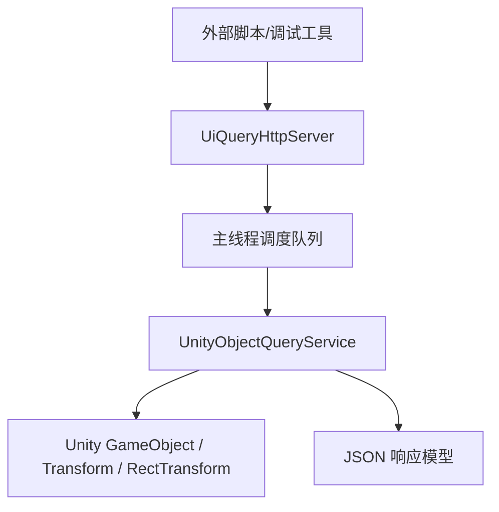

# 变更提案: ui-object-query-plugin

## 元信息
```yaml
类型: 新功能
方案类型: implementation
优先级: P1
状态: 已批准
创建: 2026-03-11
```

---

## 1. 需求

### 背景
当前仓库虽然已有多个 BepInEx 插件项目，但还缺少一个独立的调试型插件，能够在游戏运行时从外部接收请求，并按 Unity 对象名抓取场景内控件/对象的运行时属性。用户当前主要关注 UI 控件，希望快速拿到位置、缩放等 Transform/RectTransform 信息，辅助界面定位、联机 UI 对齐和后续自动化诊断。

### 目标
- 在仓库根目录新增一个可独立编译的 BepInEx 插件项目 `UiObjectQueryPlugin`。
- 插件启动后监听本地 HTTP 请求，并提供对象名精确匹配查询接口。
- 查询结果返回所有命中的对象，并覆盖普通 Transform 与 UI RectTransform 的核心布局信息。
- 保持实现与现有 LBoL/BepInEx 工程结构一致，便于后续继续扩展更多查询字段。

### 约束条件
```yaml
时间约束: 无特殊要求
性能约束: 第一版以调试用途为主，允许按请求扫描场景对象
兼容性约束: 运行于 LBoL 的 BepInEx 5 环境，进程限定为 LBoL.exe
业务约束: 第一版固定使用 HTTP、本地监听、按 name 精确匹配、返回全部命中对象
```

### 验收标准
- [√] 新增 `UiObjectQueryPlugin` 项目可在仓库中独立构建。
- [√] 插件启动后能暴露本地 HTTP 健康检查与对象查询接口。
- [√] 对象查询支持按 name 精确匹配并返回全部命中对象。
- [√] 返回结果至少包含 `position/localPosition/localScale/lossyScale/eulerAngles` 以及 `RectTransform` 的锚点/尺寸信息。

---

## 2. 方案

### 技术方案
新增独立 BepInEx 插件项目，使用 `HttpListener` 在 `127.0.0.1` 上提供轻量 HTTP 服务。后台线程负责收包与序列化，真正的 Unity 对象检索通过主线程调度执行，避免跨线程读取 Unity 对象。查询时使用 `Resources.FindObjectsOfTypeAll<GameObject>()` 扫描所有场景对象，按对象名精确匹配后组装 JSON 响应，普通对象返回 `TransformSnapshot`，UI 控件额外返回 `RectTransformSnapshot`。

### 影响范围
```yaml
涉及模块:
  - UiObjectQueryPlugin: 新增独立调试插件项目与 HTTP 查询逻辑
  - helloagents: 新增方案包、模块文档和变更记录
  - simplesolution.sln: 纳入新插件项目，便于统一打开和构建
预计变更文件: 11
```

### 风险评估
| 风险 | 等级 | 应对 |
|------|------|------|
| Unity 对象只能在主线程安全读取 | 中 | 后台 HTTP 线程只做收发，请求实际查询通过主线程队列执行 |
| `Resources.FindObjectsOfTypeAll` 可能拿到编辑器/隐藏对象 | 中 | 过滤无效 scene 对象和 `HideAndDontSave` 对象 |
| HTTP 端口占用导致服务无法启动 | 低 | 通过 BepInEx 配置暴露 Host/Port，并记录启动异常 |

---

## 3. 技术设计（可选）

### 架构设计


### API设计
#### `GET /health`
- **请求**: 无
- **响应**: `{ ok, plugin, version, host, port }`

#### `POST /query`
- **请求**: `{ name: string, includeInactive?: bool, maxResults?: int }`
- **响应**: `{ success, error?, name, count, includeInactive, matches[] }`

### 数据模型
| 字段 | 类型 | 说明 |
|------|------|------|
| `ObjectQueryRequest.Name` | string | 要精确匹配的 `GameObject.name` |
| `ObjectQueryResponse.Matches` | ObjectSnapshot[] | 所有命中的对象快照 |
| `ObjectSnapshot.Transform` | TransformSnapshot | 三维变换信息 |
| `ObjectSnapshot.RectTransform` | RectTransformSnapshot/null | UI 布局信息，非 UI 对象时为空 |

---

## 4. 核心场景

### 场景: 外部定位 UI 控件
**模块**: UiObjectQueryPlugin
**条件**: 游戏已启动且插件已加载
**行为**: 外部工具向 `/query` 发送对象名，插件在主线程搜索所有匹配对象并返回 Transform/RectTransform 信息
**结果**: 调用方能直接看到控件路径、位置、缩放和锚点布局数据

### 场景: 多个同名控件并存
**模块**: UiObjectQueryPlugin
**条件**: 场景中存在多个同名 `GameObject`
**行为**: 插件返回全部命中对象，并用层级路径区分不同实例
**结果**: 调用方可按 `path` 精确定位目标控件

---

## 5. 技术决策

### ui-object-query-plugin#D001: 采用本地 HTTP + 主线程调度的查询架构
**日期**: 2026-03-11
**状态**: ✅采纳
**背景**: 插件需要从外部接收请求，同时 Unity 对象只能在主线程安全读取，必须在可调试性和线程安全之间取一个平衡点。
**选项分析**:
| 选项 | 优点 | 缺点 |
|------|------|------|
| A: 本地 HTTP + 主线程调度 | 外部脚本最容易接入，请求/响应直观，线程边界清晰 | 需要维护一个轻量 HTTP 服务 |
| B: 命名管道 | 纯本机通信，理论上更封闭 | Unity/BepInEx 场景下调试与跨语言接入都更麻烦 |
**决策**: 选择方案 A
**理由**: 用户已明确指定 HTTP；同时 HTTP 最适合作为第一版调试接口，便于后续接 curl、Postman 或自定义诊断工具。
**影响**: 影响新插件的服务层、请求模型以及主线程调度方式。
