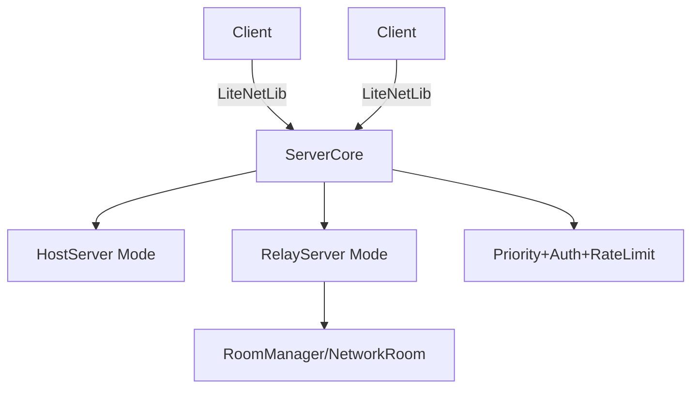

# 技术设计: 抽取 ServerCore + 双模式服务器（Host/Relay）

## 技术方案
### 核心技术
- C# / LiteNetLib / System.Text.Json
- 复用现有：`PlayerSession`、`NetworkMessage`、`MessagePriorities`、`NatTraversal`、`NetworkRoom`

### 实现要点
1. **抽公共内核（ServerCore）**
   - 统一：`EventBasedNetListener` 事件注册、连接鉴权、Peer 生命周期、心跳与超时剔除。
   - 提供：
     - `Start/Stop/Poll`（或后台线程 `RunLoop`）
     - `Send(peer, messageType, payload)` / `Broadcast(scope, ...)`
     - `OnPeerConnected/OnPeerDisconnected/OnMessageReceived` 事件钩子

2. **统一消息编解码与兼容层**
   - 统一内部消息模型：`NetworkMessage { Type, Payload, SenderPlayerId, ... }`。
   - 保持对现有两种编码的兼容：
     - `NetworkServer` 风格：先读 `messageType`，再按类型读 JSON 或字段。
     - `RelayServer` 风格：`messageType + jsonPayload`。
   - 建议新增 `IServerMessageCodec`（可插拔），并在迁移期保留 legacy codec。

3. **消息分发管线：优先级队列 + 权限检查 + 限流**
   - 以 `MessagePriorities.GetPriority(type)` 为默认优先级来源。
   - 每个 Peer/房间维度可配置队列上限与丢弃策略（Low 丢弃优先）。
   - 敏感消息必须通过权限检查（房间 Host/管理员）。

4. **两种模式（Mode）
   - Host 模式（HostServer）
     - “单隐式房间”：复用房间广播/权限模型但不暴露多房间 API。
     - 对外兼容：继续产出 `PlayerListUpdate/PlayerJoined/HostChanged/GetSelf_REQUEST/UpdatePlayerLocation` 等消息语义。
   - Relay 模式（RelayServer）
     - 多房间：按 `roomId` 作用域广播；房主语义为 `NetworkRoom.HostPlayerId`。
     - 补齐 Host 模式依赖消息：在“加入房间/离开房间/房主变更/位置更新”等节点广播 `PlayerListUpdate`、响应 `GetSelf_REQUEST`。

5. **断线重连（Server 支撑）**
   - 服务端维护 `playerId -> session` 的可恢复索引与短期状态缓存（如最后心跳、房间归属、必要游戏状态索引）。
   - 通过 `ReconnectToken` 完成身份恢复（与 `ReconnectionManager` 的 token 机制对齐）。

6. **NAT/打洞协助**
   - Relay 模式负责 NAT 信息收集/分发、候选端点交换、token 校验；Host 模式可选支持 UPnP 映射与本地端点暴露。
   - 复用 `NatTraversal` 的 NAT 信息结构，并通过消息类型明确传输边界。

## 架构设计

## 架构决策 ADR
### ADR-202601091556: 抽取 ServerCore 作为 Host/Relay 共用底座
**上下文:** `NetworkServer` 与 `RelayServer` 产生能力分叉且协议不一致，导致维护成本与兼容风险上升。
**决策:** 提取 `ServerCore` 统一底层网络与分发；在其上保留 Host/Relay 两种模式；高级能力（房间/中继/重连/打洞/权限/优先级）模块化下沉。
**理由:** 复用率高、可渐进迁移、能保留 Host 模式语义并让 Relay 模式补齐兼容消息。
**替代方案:** 直接把 `RelayServer` 高级能力“搬进”`NetworkServer`（拒绝原因：耦合与复杂度失控，难以维护）。
**影响:** 需要对 server 侧的连接/房间抽象进行一次清理（尤其是 `NetworkConnection` 的 client/server 混用）。

## 安全与性能
- 安全：限制入站消息大小与频率；校验消息类型白名单；敏感操作按房间/Host 权限校验；避免把任意 JSON 反序列化成 `object` 并下沉到游戏逻辑。
- 性能：优先单线程驱动；必要时采用“收包线程 -> 入队 -> 主线程消费”模型，避免大范围 `lock`。

## 测试与验证
- 编译：`dotnet build .\networkplugin\NetWorkPlugin.csproj -c Debug --no-restore`
- 手动联机验证：
  - Host 模式：2 人局域网直连，验证 PlayerListUpdate/HostChanged/UpdatePlayerLocation。
  - Relay 模式：创建房间/加入房间/踢人/断线重连基础流程。
