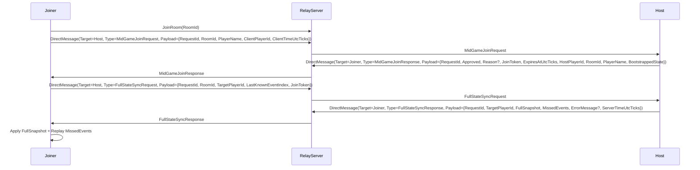

# 技术设计: MidGameJoinManager TODO 落地

## 技术方案
### 核心技术
- `INetworkClient.OnGameEventReceived`：订阅网络事件（参照 `ReconnectionManager.Initialize()` 的用法）。
- Relay `DirectMessage`：点对点发送（参照 `networkplugin/Network/Server/RelayServer.cs` 的 `HandleDirectMessage` 协议）。
- `ReconnectionManager`（可选复用）：用于 Host 侧生成 FullSnapshot 与 MissedEvents。
- `SynchronizationManager`（按需接入）：用于 Joiner 侧“落地快照/回放事件”。若接入成本过高，允许先做最小落地（仅快照/关键事件），以跑通为主。

### 实现要点
- MidGameJoin 采用“房间内旁观者”模型：Joiner 先 `JoinRoom` 成为房间成员（不等价于进入对局），然后通过 `DirectMessage` 与 Host 完成申请/批准/同步。
- 请求/响应均携带 `RequestId/JoinToken/TargetPlayerId` 等关联字段，避免广播噪音与误消费。
- 事件追赶索引不追求“统一标准”，按 Mod 可用优先：先用 `ReconnectionManager.GetMissedEvents()` 的参数语义跑通；必要时在实现中写日志辅助定位。

### TODO 清单（来自 `MidGameJoinManager.cs`）
- `Initialize()`：订阅 `GameStarted` / `PlayerJoined`（建议统一用 `INetworkClient.OnGameEventReceived` 订阅，并同时兼容 `NetworkMessageTypes.OnGameStart`）。
- `RequestJoin()`：从 Relay 获取房间信息（优先策略：Joiner 先 `JoinRoom`，再从 `NetworkManager`/玩家列表推导 Host；兜底再走 `GetRoomList`）。
- `ApproveJoin()`：补齐批准逻辑（Host 校验、超时清理、生成 `BootstrappedState`、回包 Joiner）。
- `ExecuteJoin()`：补齐完整加入流程（快速落地 → FullSync → 进入对局/通知 → 追赶回放）。
- `CalculateGameProgress()`：实现进度计算（建议基于 `FullStateSnapshot.GameState` 的 `CurrentAct/CurrentFloor/GamePhase/TurnCount`）。
- `GenerateStartingCards/GenerateStartingExhibits/GenerateStartingPotions()`：按进度生成补偿（受 `EnableCompensation` 控制）。
- `ApplyCatchUpEvents()`：实现事件回放（消费 `MissedEvents`，避免回放 FullSync 控制消息）。
- Stub methods（需要落地或改造签名）：
  - `GetRoomInfo/JoinRoom/RequestFullStateSync/NotifyHostOfJoinRequest/NotifyPlayersOfNewPlayer/GetRoomGameState/GetMissedEvents/ReplayEvent`

## 架构设计

## 架构决策 ADR
（Mod 标准：不写 ADR，按最小可用推进。）

## API设计
### `DirectMessage` 外层
- `eventType`: `"DirectMessage"`
- `payload`:
  - `TargetPlayerId`: string
  - `Type`: string（内层消息类型，如 `MidGameJoinRequest` / `FullStateSyncRequest`）
  - `Payload`: object（内层载荷）

### `MidGameJoinRequest`（内层）
- `RequestId`: string
- `RoomId`: string
- `PlayerName`: string
- `ClientPlayerId`: string（必填）
- `ClientTimeUtcTicks`: long（可选；用于诊断）

### `MidGameJoinResponse`（内层）
- `RequestId`: string
- `Approved`: bool
- `Reason`: string（拒绝原因）
- `JoinToken`: string（批准时返回）
- `ExpiresAtUtcTicks`: long（JoinToken 过期时间）
- `HostPlayerId`: string（Host 的 PlayerId）
- `RoomId`: string
- `PlayerName`: string
- `BootstrappedState`: `PlayerBootstrappedState`（批准时返回）

### `FullStateSyncRequest`（内层）
- `RequestId`: string
- `RoomId`: string
- `TargetPlayerId`: string（Joiner 的 PlayerId）
- `LastKnownEventIndex`: long（Joiner 已知的最后事件索引；首次可为 0）      
- `JoinToken`: string（Host 侧会消费并校验；避免被非批准玩家滥用 FullSync）

### `FullStateSyncResponse`（内层）
- `RequestId`: string
- `TargetPlayerId`: string
- `FullSnapshot`: `FullStateSnapshot`
- `MissedEvents`: `List<GameEvent>`
- `ErrorMessage`: string（可选；失败/拒绝原因）
- `ServerTimeUtcTicks`: long

## 数据模型
无持久化；仅在 `MidGameJoinManager` 内维护：
- `_pendingRequests`：Host 端待批准请求
- `_approvedJoins`：Joiner 端 JoinToken → ApprovedJoin 的短期映射（用于 `ExecuteJoin`）
- `Room/Host` 快照缓存：用于 GetRoomInfo/Host定位/游戏是否已开始

## 安全与性能
- **威胁模型说明:** 局域网/虚拟局域网联机 Mod 场景为主，不以“对抗性安全”作为设计目标。
- **最小健壮性:** 空值校验 + 超时清理（`JoinRequestTimeoutMinutes`）+ Host-only 校验（主要是避免误触/误消费）。
- **最小性能:** `CatchUpBatchSize` 分批回放；回放失败允许降级；关键路径加日志便于调试。

## 测试与部署
- **测试(手工/烟测):**
  1. Joiner 加入已开局房间：能申请 → Host 批准 → Joiner 收到快照后能进入可操作状态（以“能玩”为准）。
  2. 批准失败（Host 拒绝/不可用）：
     - 将 Host 侧 `AllowMidGameJoin=false` 或让 Joiner 在未收到 `PlayerListUpdate` 前直接请求。
     - 预期：Joiner 侧收到 `MidGameJoinResponse(Approved=false, Reason=...)` 或直接 `RequestJoin` 返回 Denied；日志包含 “Join denied”/“Host not found”。
  3. FullSync 失败降级：
     - 让 Host 不响应 `FullStateSyncRequest`（例如 Host 未初始化/未成为 Host），或网络不通导致 Joiner 超时。
     - 预期：Joiner 侧 `ExecuteJoin` 返回 Failed，并给出 `FullStateSyncResponse timeout` 等可诊断错误。
  4. 回放失败降级（尽力回放）：
     - 在回放过程中若订阅者抛异常导致注入失败（或出现多次回放异常）。
     - 预期：Joiner 侧出现 “Replay failed … degraded to snapshot-only” 日志，但不中断后续流程（以“能跑通/可诊断”为准）。
- **部署:** 无额外部署步骤；仅插件代码更新。
