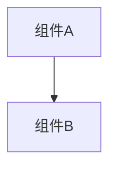

# 变更提案: battle_report_forwarder

## 元信息
```yaml
类型: 修复
方案类型: implementation
优先级: P0
状态: 已完成
创建: 2026-01-22
```

---

## 1. 需求

### 背景
在 `networkplugin/Patch/BattleController_Patch.cs` 中，客户端会发送 `BattlePlayer*Report` 事件上报给 Host。
但 Host 侧之前缺少一个统一的“接收 Report 并转发为 Broadcast”的补丁，导致其他客户端不会收到该玩家的战斗事件。

### 目标
在 Host 侧接收 `BattlePlayer*Report`，将其转发为 `BattlePlayer*Broadcast` 广播给其他客户端，使所有客户端获得一致的战斗事件流。

### 约束条件
```yaml
时间约束: {如有}
性能约束: {如有}
兼容性约束: {如有}
业务约束: {如有}
```

### 验收标准
- [x] Host 能订阅网络层 `OnGameEventReceived` 并捕获 `BattlePlayer*Report`。
- [x] Host 将 `BattlePlayer*Report` 映射为对应 `BattlePlayer*Broadcast` 并 `SendGameEventData` 转发。
- [x] 不转发 `*Broadcast`（避免循环）。
- [x] `dotnet build networkplugin/NetWorkPlugin.csproj -c Release` 通过。

---

## 2. 方案

### 技术方案
新增补丁 `networkplugin/Patch/Network/BattleReportForwardPatch.cs`：
- 在 `GameDirector.Update`（字符串反射定位，避免编译期类型依赖）中 EnsureSubscribe；
- Host 侧监听 `INetworkClient.OnGameEventReceived`；
- 仅对 `BattlePlayer*Report` 进行转发：`Report -> Broadcast`，payload 原样透传。

### 影响范围
```yaml
涉及模块:
  - networkplugin/Patch/Network: 新增 Host 侧事件转发补丁
  - networkplugin/Patch: BattleController 的 TODO 注释改为 NOTE 指向实现
预计变更文件: 2
```

### 风险评估
| 风险 | 等级 | 应对 |
|------|------|------|
| 重复转发（同一事件多次收到） | 中 | 基于 `EventType|PlayerId|TargetId + Timestamp` 做轻量去重，并限制缓存大小 |
| 转发循环（Host 再次转发 Broadcast） | 高 | 只处理 `*Report`，忽略 `*Broadcast` |

---

## 3. 技术设计（可选）

> 涉及架构变更、API设计、数据模型变更时填写

### 架构设计


### API设计
#### {METHOD} {路径}
- **请求**: {结构}
- **响应**: {结构}

### 数据模型
| 字段 | 类型 | 说明 |
|------|------|------|
| {字段} | {类型} | {说明} |

---

## 4. 核心场景

> 执行完成后同步到对应模块文档

### 场景: {场景名称}
**模块**: NetworkPlugin Host 侧事件转发
**条件**: 当前实例为 Host；收到 `BattlePlayer*Report`。
**行为**: 将 eventType 映射为 `BattlePlayer*Broadcast`，payload 原样转发。
**结果**: 非 Host 的其他客户端能收到 `*Broadcast` 并按现有接收逻辑落地。

---

## 5. 技术决策

> 本方案涉及的技术决策，归档后成为决策的唯一完整记录

### battle_report_forwarder#D001: {决策标题}
**日期**: 2026-01-22
**状态**: ✅采纳
**背景**: Host 侧需要将客户端上报的 Report 统一转发为 Broadcast，否则其他客户端无法收到事件。
**选项分析**:
| 选项 | 优点 | 缺点 |
|------|------|------|
| A: 在网络层/服务器核心转发 | 语义更正统 | 需要改动更深的 Server/Core，风险更大 |
| B: Harmony 补丁监听 OnGameEventReceived 并转发 | 改动局部、易回滚、与现有同步补丁一致 | 需要谨慎避免重复订阅/循环 |
**决策**: 选择方案 B
**理由**: 与现有 `EndTurnSyncPatch` 等补丁的订阅方式一致，影响面最小且易验证。
**影响**: 新增 `BattleReportForwardPatch`，并在 BattleController 的 TODO 处指向实现。
