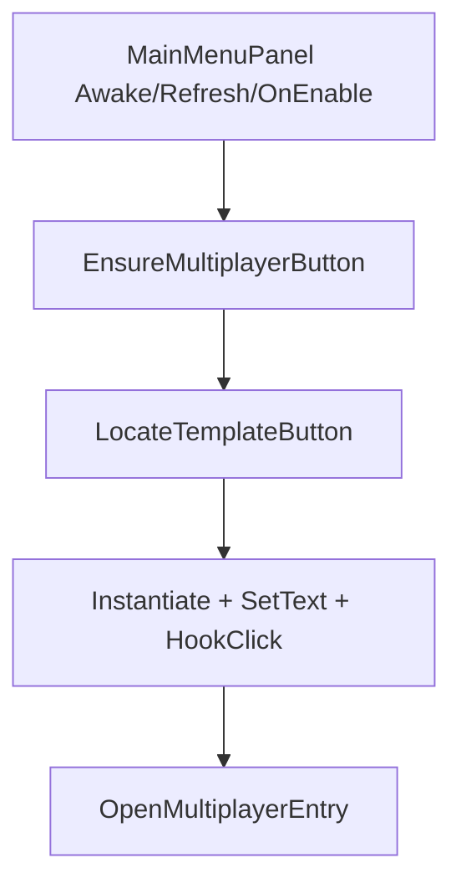

# 变更提案: mainmenu-mp-entry

## 元信息
```yaml
类型: 修复
方案类型: implementation
优先级: P0
状态: 草稿
创建: 2026-01-22
```

---

## 1. 需求

### 背景
networkplugin 作为多人联机 mod 已确认被 BepInEx 加载，但主界面缺少“多人游戏/多人联机”入口，导致用户无法从主菜单进入联机流程。

仓库中已存在主菜单入口补丁 `MainMenuMultiplayerEntryPatch`，因此更可能是：
- UI 注入逻辑未命中当前版本的 `MainMenuPanel`（字段名/层级变化导致模板按钮获取失败）；或
- 注入时机不稳定（Awake/RefreshProfile 之外的时机才初始化按钮）。

### 目标
1) 在主界面“新游戏/设置”等同级按钮区域增加一个默认可见的“多人游戏”按钮，样式与现有主菜单按钮一致（通过克隆模板按钮实现）。
2) 点击“多人游戏”后进入联机入口流程：先选择“做房主/加入房主”（当前可先用弹窗确认/取消承载，后续再扩展为完整面板）。
3) 入口注入具备版本鲁棒性：当 `MainMenuPanel` 的私有字段名变化时仍能找到可用模板按钮，至少能够降级为“在按钮组里找到一个看起来像主菜单按钮的 Button 并克隆”。

### 约束条件
```yaml
时间约束: 无
性能约束: 仅主菜单初始化时执行一次查找与克隆，要求低开销
兼容性约束: 不要求兼容所有游戏版本，但尽量避免对私有字段名硬依赖
业务约束: 多人入口默认可见；联网更细的限制/配置后续再做
```

### 验收标准
- [ ] 启动游戏进入主菜单后，在“新游戏/继续/设置”等同级位置出现“多人游戏”按钮
- [ ] 点击“多人游戏”会出现联机方式选择（做房主/加入房主），且不会破坏原有主菜单交互
- [ ] 当无法定位模板按钮时，日志会输出明确的原因（便于排查），且不会导致主菜单崩溃

---

## 2. 方案

### 技术方案
现状：仓库已存在 `networkplugin/Patch/UI/MainMenuMultiplayerEntryPatch.cs`，其当前实现通过 `Traverse(panel).Field("newGameButton")` 获取模板按钮并克隆。

本次修复方向：让“模板按钮定位”更鲁棒，并在必要时扩展补丁注入时机。

1) 模板按钮定位策略（从强到弱降级）：
- 优先：继续尝试从 `MainMenuPanel` 的已知字段获取按钮（`newGameButton` / `restoreGameButton` / `settingsButton` 等，按实际代码确认）。
- 次选：反射扫描 `MainMenuPanel` 的所有 `Button` 字段，找到第一个非空且位于同一按钮组父节点下的按钮作为模板。
- 兜底：从 `panel.gameObject` 的子节点中 `GetComponentsInChildren<Button>(true)` 查找“看起来像主菜单按钮”的候选（具备 `TextMeshProUGUI` 文本、可交互、在同一父节点下），并选取最合理一个。

2) 注入时机：
- 保留现有 `Awake` 与 `RefreshProfile` 后置注入；
- 如仍不出现，补充 `OnEnable` 或 `Show`/`Open` 类方法的后置（以 `MainMenuPanel` 实际实现为准），确保在 UI 完全构建后再尝试注入。

3) 点击行为：
- 保持现有“弹窗选择 Host/Join”的最小可用路径（确认=房主，取消=加入）。
- 后续要做完整 UI（房主/加入面板、输入房间号/列表）可以在此基础上迭代。

### 影响范围
```yaml
涉及模块:
  - Patch/UI: 主菜单入口注入逻辑（模板按钮定位与注入时机）
  - UI: （可选）后续扩展为完整面板时新增 UI 面板与组件
预计变更文件: 2-5
```

### 风险评估
| 风险 | 等级 | 应对 |
|------|------|------|
| 主菜单 UI 结构与预期不一致导致无法找到模板按钮 | 中 | 多级降级策略 + 详细日志，保证“不崩溃但可诊断” |
| 重复创建按钮导致主菜单出现多个“多人游戏”按钮 | 低 | 使用唯一名称 `NetworkPlugin_MultiplayerButton` + 若已存在则复用/更新 |
| 注入时机过早导致按钮被后续 UI 刷新覆盖/隐藏 | 中 | 在 RefreshProfile/OnEnable 等时机重复 Ensure，并在刷新后强制 SetActive(true) |

---

## 3. 技术设计（可选）

> 涉及架构变更、API设计、数据模型变更时填写

### 架构设计


### API设计
本改动不引入对外 API，仅为 UI 注入与交互补丁。

### 数据模型
本改动不新增数据模型。

---

## 4. 核心场景

> 执行完成后同步到对应模块文档

### 场景: 主菜单显示多人入口
**模块**: Patch/UI
**条件**: 进入主菜单（`MainMenuPanel` 创建/显示/刷新）
**行为**: 注入逻辑定位模板按钮并克隆出“多人游戏”按钮
**结果**: 按钮默认可见且可点击；异常情况下不影响主菜单，且日志可定位失败原因

### 场景: 点击多人入口选择联机方式
**模块**: Patch/UI
**条件**: 主菜单点击“多人游戏”
**行为**: 弹出选择对话框；确认=房主、取消=加入（当前最小实现）
**结果**: 进入对应联机启动/连接流程；若已连接则提示断开/关闭

---

## 5. 技术决策

> 本方案涉及的技术决策，归档后成为决策的唯一完整记录

### mainmenu-mp-entry#D001: 主菜单模板按钮定位采用“分层降级”策略
**日期**: 2026-01-22
**状态**: ✅采纳 / ❌废弃 / ⏸搁置
**背景**: 不同版本的 `MainMenuPanel` 私有字段名/层级可能变化；仅依赖 `newGameButton` 容易导致入口消失。
**选项分析**:
| 选项 | 优点 | 缺点 |
|------|------|------|
| A: 固定字段名（现状） | 实现最简单 | 字段变化即失效，入口直接消失 |
| B: 分层降级定位（推荐） | 兼容性更好，失败可诊断 | 代码稍复杂，需要写清晰日志 |
**决策**: 选择方案 B
**理由**: 入口缺失是阻断性问题，优先保证“可见 + 可诊断”。
**影响**: 仅影响 `networkplugin/Patch/UI/MainMenuMultiplayerEntryPatch.cs` 的按钮定位逻辑与日志输出。
