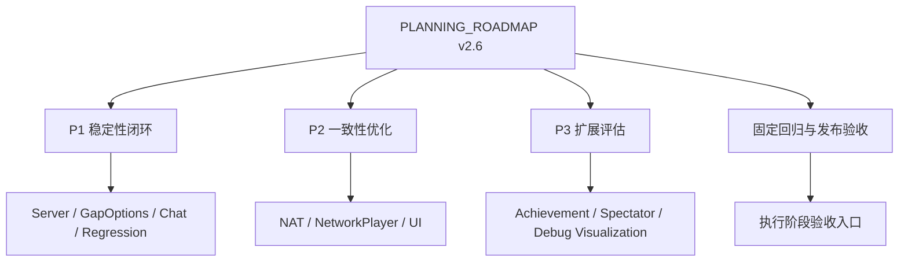

# 变更提案: networkplugin-roadmap-open-items

## 元信息
```yaml
类型: 规划提取 / 重构 / 回归治理 / 架构收敛
方案类型: implementation
优先级: P1-P3
状态: 设计完成（待执行）
创建: 2026-03-06
来源任务书: networkplugin/PLANNING_ROADMAP.md v2.6
方案包名称: 202603061435_networkplugin-roadmap-open-items
```

---

## 1. 需求

### 背景
`networkplugin/PLANNING_ROADMAP.md` 已在 2026-03-06 更新到 v2.6，但文档中的未完成事项仍分散在多个区域：

- P1 / P2 / P3 优先级章节
- “关键 TODO 清单”中的本周 / 短期 / 中期目标
- “进行中关键项”与“风险与技术债”章节
- 若干带有“部分完成 / 待完善 / 未开始 / 待规划”状态的模块描述

如果直接按路线图逐段执行，容易出现以下问题：

- 同一事项在多个章节重复出现，实施时重复建任务
- 已废弃项与待实施项混杂，导致方案边界不清
- 架构收敛、功能回归、体验优化、扩展评估混在一起，难以排优先级
- 后续 `~exec` 缺少一个聚合后的执行入口

### 目标
把 `PLANNING_ROADMAP.md` 中**仍然有效且尚未完成**的内容提取为一个单一 `implementation` 方案包，形成后续可直接执行的任务基线，具体目标如下：

1. 把路线图中所有未完成项做一次去重汇总。
2. 保留路线图的优先级语义（P1 → P2 → P3），但转换为可执行任务结构。
3. 明确哪些项是“实际开发任务”、哪些项是“回归验证任务”、哪些项是“评估/立项任务”。
4. 明确排除已废弃项，避免后续误把废弃方向重新拉回实施范围。

### 约束条件
```yaml
时间约束: 本次仅提取与整理方案包，不进入开发实施
性能约束: 无运行时变更，本次只生成文档型交付物
兼容性约束: 必须保留现有路线图结论，不回退到旧版本完成度口径
业务约束:
  - 只从 networkplugin/PLANNING_ROADMAP.md 提取
  - 提取范围为全部未完成内容
  - 方案包类型固定为 implementation
  - 已明确废弃的 SaveSync bytes 联机同步不纳入执行任务
```

### 验收标准
- [ ] 方案包完整覆盖路线图中所有仍有效的未完成事项，且不遗漏 P1 / P2 / P3 关键项。
- [ ] 任务已去重，不再重复抄录“本周 / 短期 / 中期”中与优先级章节语义相同的条目。
- [ ] 已废弃项与待实施项边界清晰，避免把 `EnableSaveLoadSync` 旧方向重新纳入执行范围。
- [ ] `tasks.md` 中的任务可作为后续 `~exec` 的执行清单使用。

---

## 2. 方案

### 技术方案
采用“**路线图提取 → 去重归类 → 执行化落盘**”的整理方式：

1. 以 `PLANNING_ROADMAP.md v2.6` 为唯一来源，提取所有未完成事项。
2. 将来源内容分为四类：
   - P1 稳定性闭环
   - P2 体验与一致性优化
   - P3 扩展评估
   - 跨模块固定回归与发布验收
3. 将“关键 TODO 清单”视为优先级章节的重复表述，仅吸收其时间语义，不重复生成同义任务。
4. 将“风险与技术债”作为任务设计依据，而不是单独复制为执行项。
5. 将最终结果写入单一方案包，供后续开发阶段按模块推进。

### 影响范围
```yaml
涉及模块:
  - Network/Server: Host 路由、系统消息、FullSync/RoomState 边界收敛
  - Patch/Network: GapOptions、RemoteCardUse、Exhibit、ToolCard 等同步链路
  - Chat: ChatMessage / ChatConsole 口径统一与兼容清理
  - UI: NetworkStatusIndicator、OtherPlayersOverlay、ShopTradeIconPatch 相关回归
  - Network/Utils: NAT 策略与可观测输出口径统一
  - Network/NetworkPlayer: legacy 字段命名与运行时边界整理
  - 验收流程: 固定回归脚本、发布前验收清单
预计变更文件: 15-30（按执行批次拆分）
```

### 风险评估
| 风险 | 等级 | 应对 |
|------|------|------|
| `NetworkServer` 仍是大而全入口，收敛时容易牵动路由与会话逻辑 | 高 | 在方案执行时优先拆边界、后做行为替换，并绑定固定回归用例 |
| `RemoteCardUsePatch` 仍保留 reverse patch stub，真实运行风险高于普通文档技术债 | 高 | 将远端出牌链路纳入 P1 回归闭环，不与一般 UI/体验项混排 |
| `GapOptionsSyncPatch` 已启用但缺少双端实机验证，存在“记录已同步但表现未生效”风险 | 高 | 把功能回归与表现回归拆成显式任务 |
| NAT 状态源存在 `NatTraversal` 与 `NetworkStatusIndicator` 双口径漂移 | 中 | 在 P2 中先统一状态源，再统一展示文案 |
| 路线图多处重复清单若不去重，会导致后续执行时重复计入进度 | 中 | 本方案显式以优先级章节为主、关键 TODO 为时间索引，不重复立项 |

---

## 3. 技术设计（可选）

### 架构设计


### 数据模型
| 字段 | 类型 | 说明 |
|------|------|------|
| source_document | string | 来源任务书，固定为 `networkplugin/PLANNING_ROADMAP.md` |
| source_version | string | 来源文档版本，当前为 `v2.6` |
| task_group | string | 任务归类（P1/P2/P3/Regression） |
| task_kind | string | 任务类型（implementation/regression/evaluation） |
| dedup_rule | string | 去重规则，标注该任务如何从重复清单中收束而来 |

---

## 4. 核心场景

### 场景: 从路线图生成统一执行入口
**模块**: `helloagents/plan/202603061435_networkplugin-roadmap-open-items/`
**条件**: 路线图已包含多个未完成章节，但尚无统一执行包
**行为**: 将 P1/P2/P3 与固定回归项提取、去重并整理为单一 `implementation` 方案包
**结果**: 后续开发可以直接基于该方案包推进，而不是继续在路线图中手工抄任务

### 场景: 排除废弃方向，保留真实待办
**模块**: `networkplugin/PLANNING_ROADMAP.md`
**条件**: 文档同时存在“未落地”和“已废弃”表述
**行为**: 对 `EnableSaveLoadSync` / bytes 同步方向只保留背景说明，不转成执行任务
**结果**: 后续执行聚焦真实待办，不在错误方向消耗开发量

### 场景: 为后续 `~exec` 提供分层任务清单
**模块**: `tasks.md`
**条件**: 路线图项数量多，且跨架构、回归、体验、扩展评估多个维度
**行为**: 按优先级和任务性质拆组，明确依赖和验证方式
**结果**: 后续可以分批执行，不必一次吞下全部 backlog

---

## 5. 技术决策

### networkplugin-roadmap-open-items#D001: 以优先级章节为主源，关键 TODO 清单只做补充索引
**日期**: 2026-03-06
**状态**: ✅采纳
**背景**: `PLANNING_ROADMAP.md` 同时存在 P1/P2/P3 与“本周/短期/中期”两套待办表达，语义高度重复。
**选项分析**:
| 选项 | 优点 | 缺点 |
|------|------|------|
| A: 同时原样抄录所有章节 | 不会漏项 | 重复任务过多，后续执行统计失真 |
| B: 以 P1/P2/P3 为主，关键 TODO 只补时间语义 | 结构清晰，便于执行 | 需要人工判断重复项 |
**决策**: 选择方案 B
**理由**: 优先级章节已经是 v2.6 的最新归纳结果，关键 TODO 清单主要提供时间顺序，不应再重复立项。
**影响**: 影响 `tasks.md` 的任务组织方式和任务数量统计口径。

### networkplugin-roadmap-open-items#D002: 废弃项不转为执行任务，只保留为背景边界
**日期**: 2026-03-06
**状态**: ✅采纳
**背景**: 路线图中 `SaveSync bytes 联机同步` 被明确标记为 Deprecated/已废弃，如果直接提取为任务会污染执行范围。
**选项分析**:
| 选项 | 优点 | 缺点 |
|------|------|------|
| A: 所有未完成/未实现项全部进任务 | 提取最机械、最完整 | 会把废弃方向重新拉回实施范围 |
| B: 仅把仍有效的未完成项转任务，废弃项写入背景 | 范围更准确 | 需要额外做边界判断 |
**决策**: 选择方案 B
**理由**: 本方案包面向后续实施，必须以“仍然值得做”为前提，而不是把历史废弃方向重新激活。
**影响**: `tasks.md` 中不包含 SaveSync bytes 同步任务。

### networkplugin-roadmap-open-items#D003: 将固定回归作为独立任务组，而不是散落到各模块尾注
**日期**: 2026-03-06
**状态**: ✅采纳
**背景**: 路线图多处提到双端回归、发布前验收、功能链路复测，如果继续挂在各模块尾部，后续 `~exec` 时容易漏跑。
**选项分析**:
| 选项 | 优点 | 缺点 |
|------|------|------|
| A: 回归任务附着在每个模块项下 | 模块就地闭环 | 跨模块链路（重连/交易/GapOptions）不易统一排期 |
| B: 把固定回归抽成独立任务组 | 回归入口清晰，便于发布前统一执行 | 需要额外维护模块依赖 |
**决策**: 选择方案 B
**理由**: 本 backlog 中存在明显的跨模块链路回归，独立成组更适合后续执行与复盘。
**影响**: `tasks.md` 中单独保留“固定回归与发布验收”任务组。
