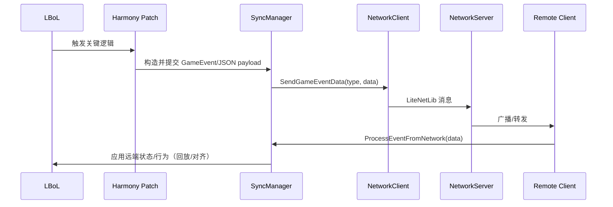
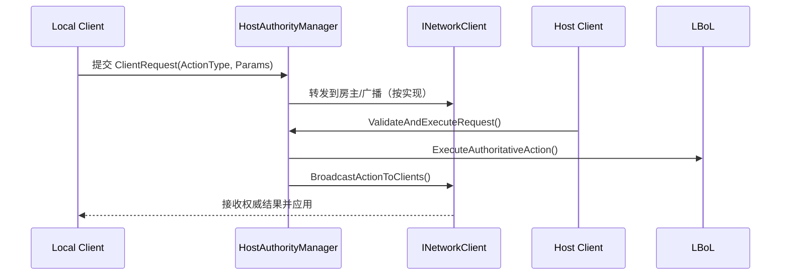
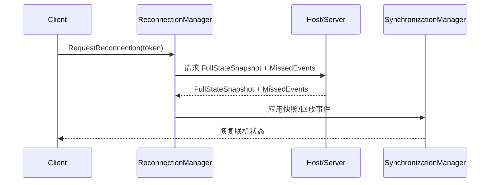
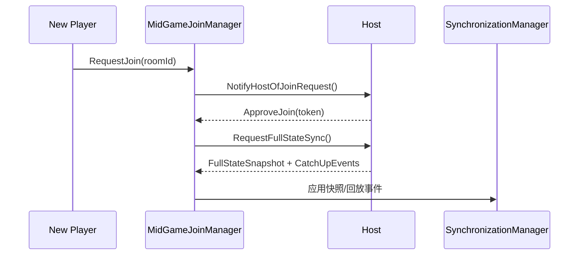

# 架构设计

## 总体架构

```mermaid
flowchart TD
    Plugin[Plugin.cs (BepInEx)] --> DI[DI Container]
    DI --> NetClient[INetworkClient / NetworkClient]
    DI --> NetMgr[INetworkManager / NetworkManager]
    DI --> SyncMgr[ISynchronizationManager / SynchronizationManager]
    DI --> Authority[HostAuthorityManager]
    DI --> Reconn[ReconnectionManager]
    DI --> Join[MidGameJoinManager]

    SyncMgr --> Patches[Harmony Patches (Patch/*)]
    Patches --> Game[LBoL Runtime]

    NetClient <--> Server[NetworkServer / RelayServer]
```

## 技术栈
- 网络：LiteNetLib（客户端/服务器/中继）
- 序列化：`System.Text.Json`（多处以 JSON 字符串作为 payload）
- 运行时补丁：HarmonyX
- 插件框架：BepInEx
- DI：Microsoft.Extensions.DependencyInjection

## 核心流程：事件同步



## 核心流程：房主权威（可选路径）
> 适用于“需要房主仲裁”的敏感操作（例如关键回合推进、交易/复活/存档等）。



## 核心流程：全量同步 / 重连
> 用于断线重连或状态漂移时的“对齐”。



## 核心流程：中途加入（MidGameJoin）
> 用于“战斗/局内”新玩家加入的追赶（Catch-up）与 AI 代打等策略（按配置开关启用）。



## 重大架构决策（索引）
- ADR 建议记录在每个变更方案包的 `how.md` 中，并在此处维护索引。

